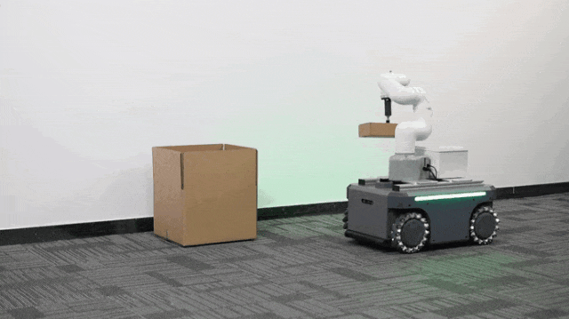
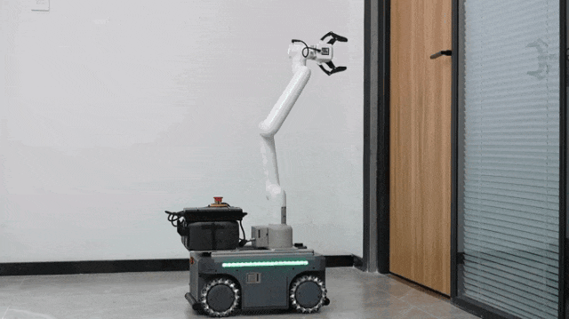

## 1.2 应用场景
myAGV Pro作为智能移动平台的核心载体，通过灵活搭载不同规格的机械臂（从轻量化协作臂到重型工业臂），结合感知系统与AI算法，覆盖  具身智能训练  与  固定场景自动化作业  两大方向，为智能制造、物流、服务机器人等领域提供端到端解决方案。

- 物流分拣训练场：myCobot320+吸泵机械臂构建快递分拣环境，支持抓取-装载动作的强  化学习数据采集与策略验证

- 家居服务仿真环境：myArm M750机械臂模拟脏衣物收纳任务，提供触觉反馈与视觉识别的多模态训练数据集

- 智能办公交互实验：myCobot Pro630机械臂+力控夹爪+视觉系统复现CMU开门任务，支持基于物理交互的模仿学习算法调优

---

[← 上一页](1.1-ProductIntroduction.md) | [下一章 →](../2-ProductFeature/README.md) 
