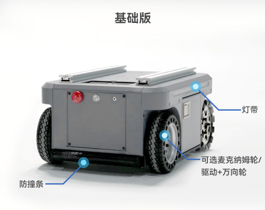

## 2.1 基础版

| 参数类别 (Parameter) | 详细信息(Details)                                                               |
|------------------|-----------------------------------------------------------------------------|
| 产品尺寸             | 530*360*245mm                                                               |
| 自重               | 40KG                                                                        |
| 最大载重             | 50KG                                                                        |
| 运动模式             | 	全向/定向可选                                                                    |
| 通讯方式             | 	RS232                                                                      |
| 速度(满载测试)         | 	1.5m/s                                                                     |
| 最小转弯半径           | 	0m（原地自转）                                                                   |
| 最大爬坡角度           | 	10°                                                                        |
| 电池	              | 24V 20AH 磷酸铁锂                                                               |
| 续航时间             | 	5-6h（空载 1m/s条件下）                                                           |
| 充电时长             | 	5-6h                                                                       |
| 悬挂形式             | 	摇摆臂独⽴悬挂                                                                    |
| 适用场地             | 	室内                                                                         |
| 防护等级             | 	IP22                                                                       |
| 工作温度             | 	-10-40℃                                                                    |
| 对外接口             | 	DC4017充电口、XT60 24V5A供电口*1、XT30 12V5A供电口*1、USB-C串口*1、INPUT IO*6、OUTPUT IO*6 |
---

[← 产品特性页](/README.md) | [下一页 →](./2.2-VisualNavigationEdition.md)
