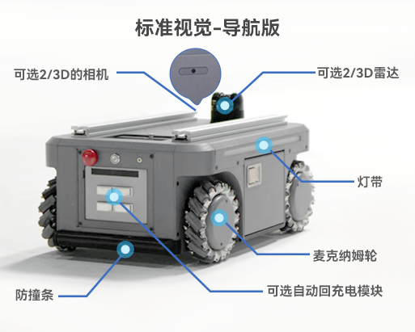

## 2.2 视觉-导航版

| 参数类别 (Parameter) | 详细信息(Details)                                                                                   |
|------------------|-------------------------------------------------------------------------------------------------|
| 产品尺寸	            | 530*360*245mm                                                                                   |
| 自重               | 	40KG                                                                                           |
| 最大载重             | 	50KG                                                                                           |
| 运动模式	            | 全向系统转向                                                                                          |
| 通讯方式             | 	RS232                                                                                          |
| 速度(满载测试)         | 	1.5m/s                                                                                         |
| 最小转弯半径	          | 0m（原地自转）                                                                                        |
| 最大爬坡角度           | 	10°                                                                                            |
| 电池               | 24V 20AH 磷酸铁锂                                                                                   |
| 续航时间             | 	5-6h（空载 1m/s条件下）                                                                               |
| 充电时长             | 	5-6h                                                                                           |
| 悬挂形式             | 	摇摆臂独⽴悬挂                                                                                        |
| 适用场地             | 	室内                                                                                             |
| 防护等级             | 	IP22                                                                                           |
| 工作温度             | 	-10-40℃                                                                                        |
| 对外接口             | 	DC4017充电口、XT60 24V5A供电口*1、XT30 12V5A供电口*1、USB-C串口*1、网口*1、HDMI*1、INPUT IO*6 、OUTPUT*6 、USB3.0*2 |

### 对外接口说明  

| 接口类型        | 规格                                                                        | 功能描述 |
|-------------|---------------------------------------------------------------------------|------|
| DC4017充电口 	 | 直径4.0mm/长度17mm	连接25.55V 2.8A充电适配器，为24V 20Ah磷酸铁锂电池充电（红灯=充电中，绿灯常亮=充满）。      |
| XT60供电口     | 	24V 5A	为外部设备（如myCobot320、mrArm M750、Mercury A1机械臂）提供稳定直流电源，支持最大120W功率输出。 |
| XT30供电口     | 	12V 5A	为低电压设备（如Jetson Orin Nano ）供电，兼容常见12V电子模块。                         |
| USB-C串口     | 	USB3.0协议	高速数据传输，支持灯带控制指令发送、传感器数据采集（如相机/Radar）                            |
| 网口（RJ45）    | 	千兆以太网	高速网络通信，用于视觉/雷达数据传输（如2D/3D相机图像、点云数据）、远程监控或ROS节点互联                   |
| HDMI        | 	标准HDMI 接口	输出调试画面（如系统实时图像），支持外接显示器实时监控。                                   |
| INPUT IO    | 	6路数字输入	接收外部信号（如安全光幕触发信号）                                                 |
| OUTPUT      | 	6路数字输出	控制外部设备（如指示灯、蜂鸣器、继电器）                                              |
| USB3.0 	    | 2个标准接口	扩展高速外设（如3D相机、固态硬盘），满足大容量数据存储与实时传输需求。                               |

---

[← 上一页](2.1-BasicEdition.md) | [下一页 →](2.3-StructuralDrawing.md)
