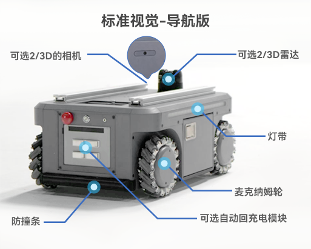
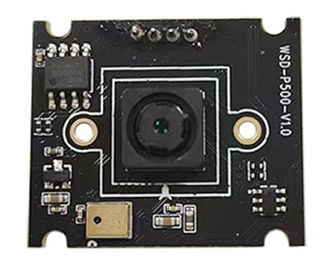
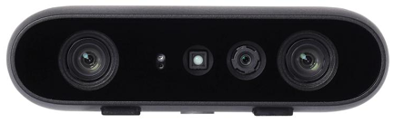

## 2.2 视觉-导航版

| 参数类别 (Parameter) | 详细信息(Details)                                                                                   |
|------------------|-------------------------------------------------------------------------------------------------|
| 产品尺寸	            | 530*360*245mm                                                                                   |
| 自重               | 	40KG                                                                                           |
| 最大载重             | 	50KG                                                                                           |
| 运动模式	            | 全向系统转向                                                                                          |
| 通讯方式             | 	RS232                                                                                          |
| 速度(满载测试)         | 	1.5m/s                                                                                         |
| 最小转弯半径	          | 0m（原地自转）                                                                                        |
| 最大爬坡角度           | 	10°                                                                                            |
| 电池               | 24V 20AH 磷酸铁锂                                                                                   |
| 续航时间             | 	5-6h（空载 1m/s条件下）                                                                               |
| 充电时长             | 	5-6h                                                                                           |
| 悬挂形式             | 	摇摆臂独⽴悬挂                                                                                        |
| 适用场地             | 	室内                                                                                             |
| 防护等级             | 	IP22                                                                                           |
| 工作温度             | 	-10-40℃                                                                                        |
| 对外接口             | 	DC4017充电口、XT60 24V5A供电口*1、XT30 12V5A供电口*1、USB-C串口*1、网口*1、HDMI*1、INPUT IO*6 、OUTPUT*6 、USB3.0*2 |

### 对外接口说明  

| 接口类型        | 规格              | 功能描述                                                              |
|-------------|-----------------|-------------------------------------------------------------------|
| DC4017充电口 	 | 直径4.0mm/长度17mm	 | 连接25.55V 2.8A充电适配器，为24V 20Ah磷酸铁锂电池充电（红灯=充电中，绿灯常亮=充满）。             |
| XT60供电口     | 	24V 5A	        | 为外部设备（如myCobot320、mrArm M750、Mercury A1机械臂）提供稳定直流电源，支持最大120W功率输出。 |
| XT30供电口     | 	12V 5A	        | 为低电压设备（如Jetson Orin Nano ）供电，兼容常见12V电子模块。                         |
| USB-C串口     | 	USB3.0协议	      | 高速数据传输，支持灯带控制指令发送、传感器数据采集（如相机/Radar）                              |
| 网口（RJ45）    | 	千兆以太网	         | 高速网络通信，用于视觉/雷达数据传输（如2D/3D相机图像、点云数据）、远程监控或ROS节点互联                  |
| HDMI        | 	标准HDMI 接口	     | 输出调试画面（如系统实时图像），支持外接显示器实时监控。                                      |
| INPUT IO    | 	6路数字输入	        | 接收外部信号（如安全光幕触发信号）                                                 |
| OUTPUT      | 	6路数字输出	        | 控制外部设备（如指示灯、蜂鸣器、继电器）                                              |
| USB3.0 	    | 2个标准接口	         | 扩展高速外设（如3D相机、固态硬盘），满足大容量数据存储与实时传输需求。                              |

---

### 激光雷达及相机产品规格（可选配）

### N10 Plus 激光雷达技术规格(选配)

| 参数 | 规格 |
|------|------|
| 型号 | N10 Plus |
| 类型 | 近距离 |
| 扫描角度 | 360° |
| 发射重频 | 5.4KHz |
| 角度分辨率 | 0.4° ~0.8° |
| 扫描频率 | 6Hz~12Hz |
| 测量精度 | ±3cm@70% |
| 光源 | 905nm 激光 |
| 量程 | 0m~15m@70% |
| 数据内容 | 角度、距离、强度 |
| 电源 | 5VDC (4.75V~5.25V) |
| 环境温度 | 工作：-10℃~40℃，存储：-30℃~70℃ |
| 抗环境光 | ＞60K Lux |
| 驱动方式 | 内置无刷电机 |
| 通信接口 | 标准异步串口（波特率：460800 bps） |
| 外形尺寸 | Φ52*36.1mm |
| 重量 | 约60g |
| 防护等级 | IPX-4 |
| 回波数量 | 支持双回波 |
---

### Unilidar_L2 激光雷达技术规格(选配)

| 参数 | 规格 |
|------|------|
| 型号 | L2 |
| 激光等级 | 905nm |
| 人眼安全等级 | Class 1(IEC60825-1:2014) 人眼安全 |
| 最大量程 | 30M (@90% 反射率) 15M (@10% 反射率) |
| 距离精度 | 0.05m |
| FOV | 360°*90°/360°*30°可选择配置 |
| 系统频率 | 128000 点/秒 |
| 有效频率 | 64000 点/秒 |
| 扫描方式 | 无线圈无刷旋转扫描 |
| 4D信息 | 3D坐标 + 10 反射强度信息 |
| 高频时钟频率 | 5.5GHz可调频系统 |
| 发射时钟频率 | - MHz |
| 通信接口 | ENET UDP/TCP TL UART |
| 通信波特率 | 4000000 bps(TTL UART) |
| 测距精度 | ±2.5cm |
| 角分辨率 | 0.2° |
| 距离分辨率 | 4.5mm |
| IMU采样率 | 1KHz |
| IMU上报频率 | 500Hz |
| 室芯驱动频率 | 3 轴陀螺仪 + 3 轴加速度 |
| LED 灯控制频率 | 60° |
| LED灯环频率 | 5.5GHz |
| 抗强光能力 | 100KLux |
| 工作环境温度 | -10°C~50°C |
| 存储环境温度 | -20°C~60°C |
| 防护等级 | IP54 |
| 功率 | 10W (环境温度 25°C) |
| 工作电压 | 12V DC |
| 尺寸 | 75 (直径) ×75 (高) ×63 (宽) mm |
| 重量 | 235g |
---

# 单目相机技术规格（选配）

| 项目 (Items) | 参数 (Parameters) |
|-------------|------------------|
| 图像感光元件 (Image Sensor) | 1/4 inch cmos |
| 像素数量 (Image pixels) | 500 万像素 |
| 最佳聚焦 (Object Size) | 1.5m 1.1-4m |
| 输出格式 (Video output) | MJPG/YUY2 |
| 聚焦 (Focus) | 定焦 |
| 镜头类型 | 低失真镜头,平行光镜头,定焦 |
| 视场角 (Field of view) | - |
| 镜头像素 (Lens pixel current) | <10 uA |
| 工作电流 (working current) | <360 mA |
| 储存温度 (Storage Temperature) | -20℃ to +75℃ |
| 工作温度 (Working Temperature) | -20℃ to +70℃ |
| 信噪比 (SNR max) | >40dB |
| 白平衡 (White balance) | 自动(auto), 手动(manual) |
| 摄像头控制 (camera control) | 亮度、饱和度、对比度、锐化、色调、清晰度、伽马、逆光 补偿 |
| 曝光 (exposure) | 自动(auto), 手动(manual) |
| 数字接口 (Digital interface) | 4-pin 2.0 间距(2.0mm Spacing/4-pin pitch) |
| 数据传输 (Data transfer rates) | 480Mb/S |
| 工作电压 (Operating voltage) | DC5V |
| 数据接口 (Disconnect) | USB2.0 |
| 系统兼容 (system compatibility) | Win XP, Win 7/8/10, EmbLinux, Android 2.2, iOS, Linux with UVC driver 等系统 |
| Warranty(质保期) | 1 years |
| MJPG分辨率 | YUY分辨率 |
| 2592@1944@30fps | 2592@1944@1fps |
| 2560@1440@30fps | 2560@1440@6fps |
| 2048@1536@30fps | 2048@1536@1fps |
| 1920@1080@30fps | 1920@1080@7fps |
| 1600@1200@30fps | 1600@1200@fps |
| 1280@960@30fps | 1280@960@1fps |
| 1280@720@30fps | 1280@720@1fps |
| 1024@768@30fps | 1024@768@10fps |
| 800@600@30fps | 800@600@10fps |
| 640@360@30fps | 640@360@30fps |
| 640@480@30fps | 640@480@30fps |
| 352@288@30fps | 352@288@30fps |
| 320@240@30fps | 320@240@30fps |
| 176@144@30fps | 176@144@30fps |
---

# Gemini 2 相机技术规格（选配）

| 参数类别 | 参数名称 | Gemini 2 |
|---------|---------|----------|
| **基本参数** | 名称 | Gemini 2 |
| | 适用场景 | 室内/半室外 |
| | 深度测量范围 | 0.15m ~ 10m |
| | 理想工作范围 | 0.2m ~ 5m |
| | 相机驱动 | UVC |
| | SDK | Orbbec SDK |
| | 相机原理 | 主动双目结构光 |
| | 基线 | 50mm |
| **深度参数** | 深度测量精度@2m | < 2% (1280 x 800 @ 2m & 81% ROI) |
| | 深度工作模式 | Unbinned Dense Default - 深度密度高 Unbinned Sparse Default - 平衡深度密度和功耗 Binned Sparse Default - 小功耗,低延迟,高帧率 |
| | 深度图像分辨率@帧率 | 1280 x 800@30fps 640 x 400@60fps |
| | 深度FOV | H91°/ V66°/ D101° ± 3° @2m |
| | 深度传感器技术 | 全局快门 |
| **红外参数** | 红外相机分辨率@帧率 | 1280 x 800@30fps 640 x 400@60fps |
| | 红外图像FOV | H94°/ V68°/ D104° ± 3° |
| **彩色参数** | 彩色图像分辨率@帧率 | 1920 x 1080@30fps 1280 x 720@60fps 640 x 360@60fps 640 x 360@60fps |
| | 彩色图像FOV | 16:9 H86°/ V55°/ D94° ± 3° 4:3 H63°/ V50°/ D75 ± 3° |
| | 彩色传感器技术 | 卷帘快门 |
| **功能参数** | D2C后深度图像FOV | 16:9 H86°/ V55°/ D94±3° @2m 4:3 H63°/ V50°/ D75±3° @2m |
| | LDP | 支持 9440nm 测量距离: 1mm ~ 4000mm |
| | IMU | 6轴 三轴陀螺加速度 + 三轴角速度 |
| | IR图案AE功能 | 支持 |
| | UVC | 支持 |
| | RGB功能 | 支持 |
| **电气参数** | 数据传输接口 | USB 3.0 & USB 2.0 |
| | 功耗 | 典型平均< 2.5W 峰值平均< 2.5W 最大峰值< 7.0W |
| | 供电电压 | DC 5V ±1.5A |
| | 工作温度 | 0℃ ~ 40℃ |
| | 工作湿度 | < 95 %RH（非凝结） |
| | 存储温度 | -20℃ ~ 60℃ |
| **物理参数** | 多功能SB接口 | 8-Pin |
| | 数据及供电接口 | Type-C |
| | 相机尺寸 | L90 x W25 x D30 mm ± 0.5mm |
| | 设备重量 | 97g ± 3g |
| | 防水防尘 | 基础防尘 |
| | 相机安装方式 | 底部安装: 1 x 1/4-20unc 螺孔 背面安装: 2 x M3 螺孔 |
| **其他** | 质保情况 | 整体散热 |
| | 认证 | Class 1, RoHS, FCC, CE, Reach, KC |
| | 使用寿命 | 3年 |
---

[← 上一页](2.1-BasicEdition.md) | [下一页 →](2.3-StructuralDrawing.md)
