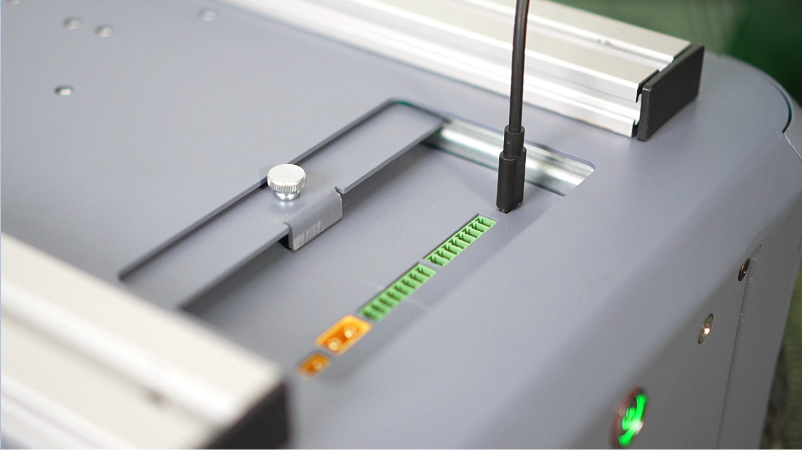

## 4.1 基础版
### 4.1.1 物料清单：
|      名称      | 数量 | 备注 |
|:------------:|:--:|:--:|
| myAGV Pro整机	 | 1  |
|    无线手柄	     | 1  |
|    USB线缆	    | 1  |
|    扳手工具	     | 1  |
|    产品画册	     | 1  |


### 4.1.2 快速体验
需要在您的电脑上安装`python`环境，并安装`pymycobot`库, 安装方法请参考[python安装及pymycobot](../6-SDKDevelopment/6.1-ApplicationBasePython/README.md), 在配置好环境之后您可以执行一下步骤:

1. 将`myAGV Pro`放置在水平平面上，将`myAGV Pro`的急停拨开后摁下电源启动键，启动`myAGV Pro`
2. 使用`TYPE-C`线将`myAGV Pro`与Windows连接起来
    
3. 打开PC的设备管理器，找到`myAGV Pro`的`USB`设备
       
4. 在Windows任意目录下新建`example.py`文件，并输入以下代码
    ```python
    import time
    from pymycobot import MyAGVPro
    
    
    def main():
        agv = MyAGVPro("COM28", debug=True)
        if agv.is_power_on() != 1:
            agv.power_on()
    
        agv.move_forward(0.1)
        time.sleep(2)
        agv.stop()
    
        agv.move_backward(0.1)
        time.sleep(2)
        agv.stop()
    
        agv.turn_left(0.1)
        time.sleep(2)
        agv.stop()
        time.sleep(1)
    
        agv.turn_right(0.2)
        time.sleep(2)
        agv.stop()
    
    
    if __name__ == '__main__':
        main()
    ```

5. 在命令行中执行`python example.py`，即可看到`myAGV Pro`开始移动


---

[← 首次安装使用页](README.md) | [下一页 →](4.2-NavigationVisualEdition.md)
