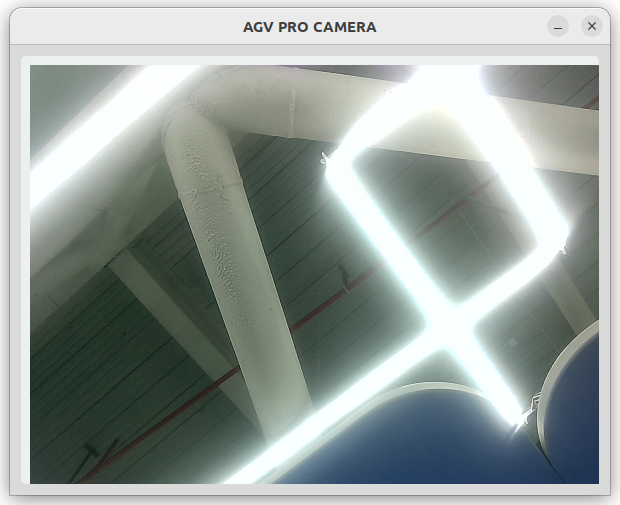
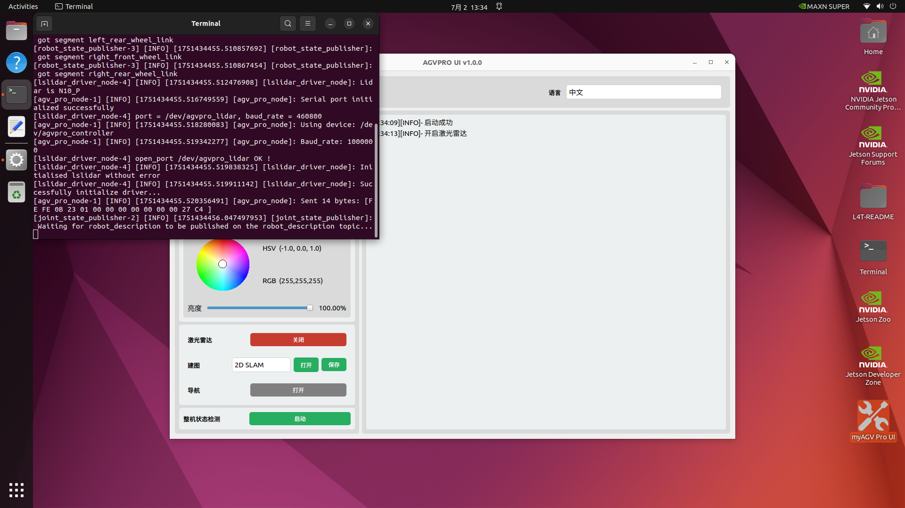
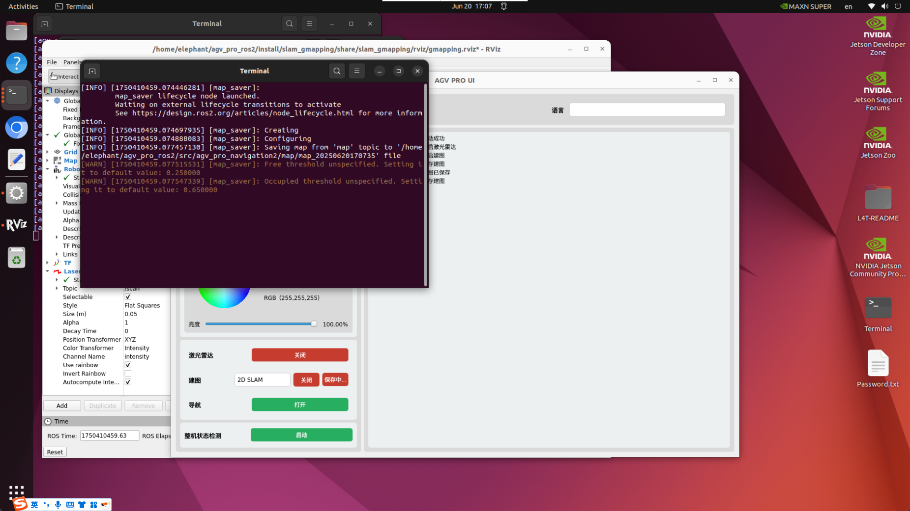
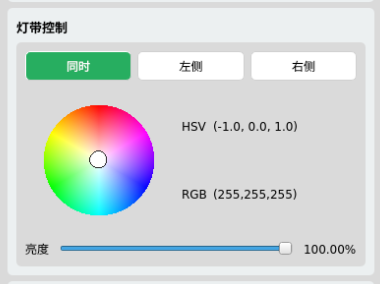

## 4.2 导航-视觉版

### 4.2.1 物料清单

| 标准视觉-导航版本	   | 数量 |
|--------------|----|
| myAGV Pro整机	 | 1  |
| 无线手柄	        | 1  |
| HDMI线缆	      | 1  |
| 扳手工具	        | 1  |
| 产品画册	        | 1  |

### 4.2.2 系统介绍
系统介绍

版本说明

系统界面介绍

### 4.2.3 快速体验
AGVPRO_UI是一款可视化UI软件, 内置在jetson orin nano系统中，用于客户快速体验myAGV Pro基础电机控制、传感器控制等项目。
  
### 1. 电量检测

开启电池电量检测时, 日志栏每隔1S实时显示电池电压及电压百分比。

### 2. 基本控制

支持通过键盘、手柄控制小车进行移动。

#### 2.1 键盘控制

当选择`键盘控制`时, 点击`ON`按钮, 可以通过键盘控制小车进行移动。其按键功能如下表所示。

| 按键 | 方向        |
|----|-----------|
| i  | 向前移动      |
| ,  | 向后移动      |
| j  | 向左移动      |
| i  | 向右移动      |
| u  | 逆时针旋转     |
| o  | 顺时针旋转     |
| k  | 停止        |
| m  | 顺时针反向旋转   |
| .  | 逆时针反向旋转   |
| q  | 提高线速度和角速度 |
| z  | 降低线速度和角速度 |

> 注意: 目前只支持在激光雷达启动时使用, 激光雷达关闭时, 支持支手柄控制。

#### 2.2 手柄控制

当选择`手柄控制`时, 点击`ON`按钮, 可以通过手柄控制小车进行移动。其按键功能如下表所示。

| 热键        | 方向   | 热键    | 方向            |
|-----------|------|-------|---------------|
| `L1`      | 速度增加 | `L2`  | 速度减小          |
| `R1`      | 小车左旋 | `R2`  | 小车右旋          |
| `Startup` | 小车复位 | `摇杆2` | 控制小车前、后、左、右移动 |

> 注意: 复位键用于恢复小车速度, 小车运动控制为按下运动，松开即停止。只能在激光雷达关闭时使用(激光雷达启动时，使用键盘控制), 手柄支持新的亚博手柄，旧的不支持。

### 3. 2D/3D摄像头

下拉标签选择2D相机或3D相机，点击ON按钮启动对应相机的实时相机画面

> 注意: 3D相机需要连接3D相机，2D相机需要连接2D相机。

### 4. ROS2雷达建图导航

#### 4.1 激光雷达：

点击ON按钮，激光雷达里程计启动。 点击OFF按钮，激光雷达里程计关闭。

#### 4.2 雷达建图：

##### 4.2.1 2D建图：

启动2D建图时, 需要先确认激光雷达是否启动，若未启动，请先启动激光雷达。选择`2D SLAM`建图模式, 点击`ON`按钮，启动2D建图RVIZ仿真界面，可通过开启`键盘控制`来控制小车进行建图。
 

##### 4.2.3 建图保存：
点击`Save Map`按钮，保存当前建图数据，保存路径为`~/agv_pro_ros2/src/agv_pro_navigation2/map/`。

> 注意: 保存地图时，请确保激光雷达、建图已启动, 则无法保存建图。

#### 4.3 雷达导航(暂不支持)：
### 5. 灯带控制

实时控制小车两侧灯带，通过拖动色盘调整小车颜色, 通过拖动滑块调整小车两侧灯带亮度。并在侧边实时显示当前颜色的HSV/RGB色值。

### 6. 整机检测功能

点击ON按钮，启动整机检测功能，日志栏实时打印检测项目信息, 主要检测项目如下:

1. 版本读取
    1. 系统版本
    2. 固件版本
    3. pymycobot版本信息
   
2. 电机状态检测
    1. 读取电机使能状态
    2. 读取当前通讯模式
    3. 读取当前电机温度
    4. 读取当前电机力矩
    5. 读取当前电机悬空向前变速低中高速度信息
   
3. 防撞条状态检测(暂不支持)
4. 急停状态检测 
   > 实时读取急停状态，当急停状态切换时显示急停状态信息

> 注意: 在开始整机检测功能之前，请让小车四个轮子悬空，避免出现意外。

### 7. 多语言
点击`Language`选项框，切换语言，目前支持中文和英文。

---

[← 上一页](4.1-ProductStandardList.md) | [下一页 →](4.3-CompositeVersion.md)
