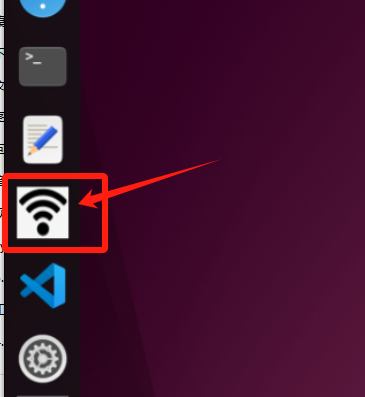
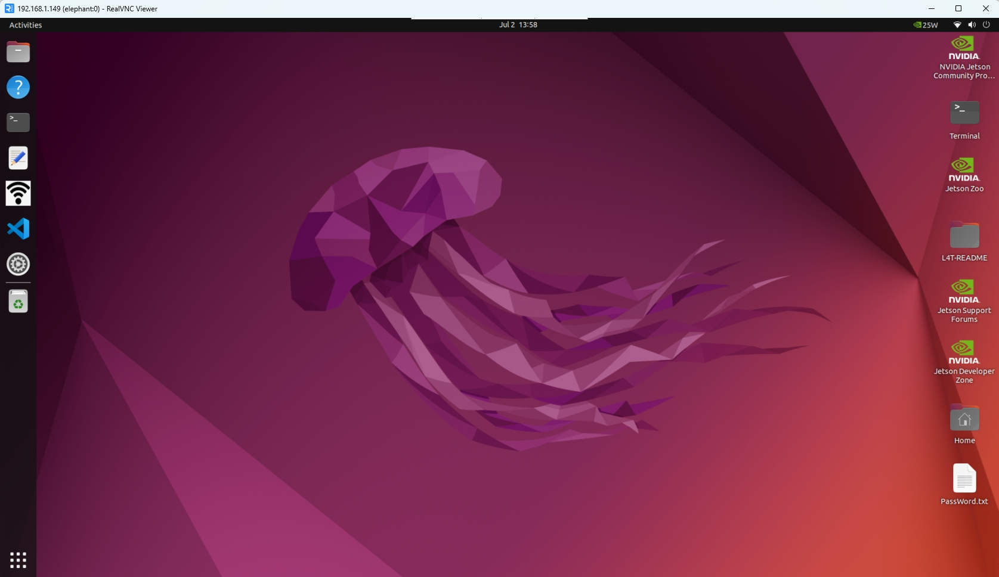
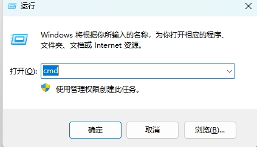
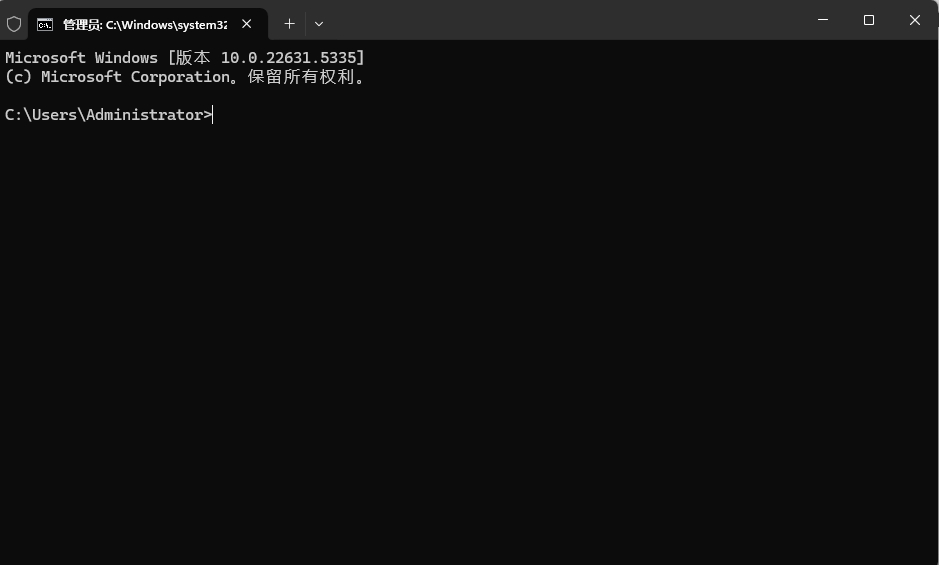
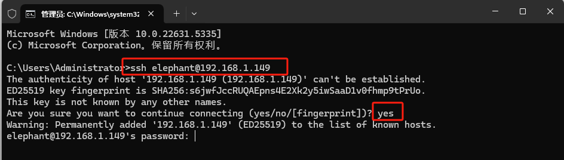
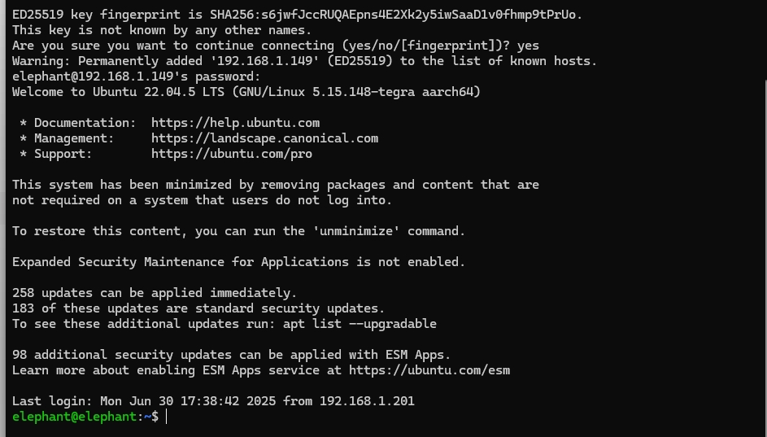
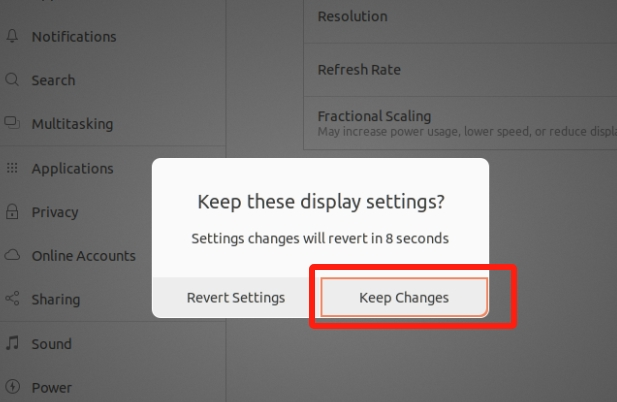
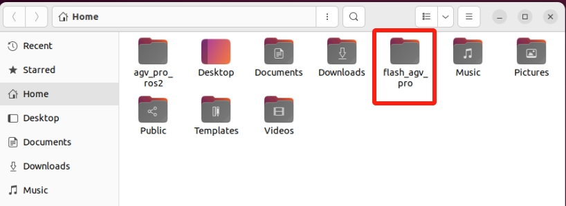
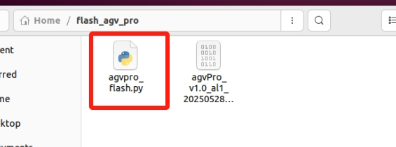

## 系统基础功能说明  

### 机器人系统介绍

- **系统简介**
  
  - Ubuntu是个人桌面操作系统中使用最广泛的linux操作系统。对于初学者来说，熟悉linux环境或一些嵌入式硬件操作系统是一个很好的选择。这里机器人系统使用 **Jetson Orin Nano Ubuntu 22.04 aarch64** 系统

    <!--  -->

    

- **系统功能简介**
  
    

  - **①**：系统控制台终端，用于相关命令输入。  
  
  - **②**：普通文本编辑器。
  
  - **③**：WiFi-热点开关，点击即可打开/关闭WiFi或者热点功能。热点打开后名称为**ElephantRobotics_AGVPro_AP_XXXX**  （系统开机默认启动热点功能）
    
  - **④**：`Visual Studio Code` IDE集成开发工具，用于编辑文本、代码。  
  
  - **⑤**：`PassWord.txt` 系统相关密码说明。
  

### 系统密码说明

- **开机账户密码 & VNC 连接密码 & SSH 连接密码 & 管理员账户密码 & 热点连接密码**
  
  - 统一为：**Elephant**
  
- **如何定义新的密码**
  
  - 更改账户密码
  
    - 使用快捷键 `ctrl + alt + T` 打开终端
    
    - 输入 `passwd`进行账户密码修改
    
    - 输入新密码两次即可
    
  - 更改VNC连接密码
  
    - 使用快捷键 `ctrl + alt + T` 打开终端
    
    - 输入 `x11vnc -storepasswd`进行账户密码修改
    
    - 输入新密码两次即可
    
  - 更改SSH连接密码
  
    - SSH远程连接输入的就是管理员账户密码，无需单独修改
    
  - 更改管理员账户密码
  
    - 使用快捷键 `ctrl + alt + T` 打开终端
    
    - 输入 `sudo passwd`进行账户密码修改
    
    - 输入新密码两次即可
    
    

### VNC

- **VNC 功能介绍**
  
  - 是一款远程控制的软件，一般用于远程解决电脑故障或软件调试
  
- **VNC端口说明**
  
  - 机械臂与PC连接在同一WiFi下，机械臂IP地址即为端口，端口默认是5900
  
- **连接VNC**
  
  - 连接的方式有两种，第一种方式需要外接显示器对系统进行一些操作，具体步骤如下：
  
    先点击 侧边栏工具 **"WiFi"** 图标 关闭默认热点。

    

    点击 系统右上角

    

    

    选择 **"Wi-Fi-Settings"**，等待显示当前可用的WiFi

    

    单击需要连接的WiFi，输入WiFi密码进行连接即可。

    连接成功后，点击 **"设置图标"**，查询机器人系统当前IP地址

    

    如示例所示，**“192.168.1.149”** 即为机器人系统当前IP地址

    

    将您的电脑和机器人系统的WiFi连接到同一个WiFi下，打开VNC viewer软件，输入这个IP地址（以上方的案例举例则为输入**192.168.1.149**）然后回车，密码是Elephant，用户名默认是不填的，成功连接示例如下：

    
    
  - 第二种方式不需要连接显示屏，但需要在HDMI口连接虚拟DP诱骗器，避免远程连接的桌面黑屏。直接用PC连接Ubuntu系统热点进行远程控制，但是此连接方式并不具备网络冲浪的功能，只能远程操控机器人系统，具体步骤如下：
  
    PC选择连接Ubuntu系统热点**ElephantRobotics_AGVPro_AP_XXXX**，输入密码**Elephant**
  
    
  
    打开VNC viewer软件，输入这个IP地址 **10.42.0.1** ，然后回车，密码是Elephant，用户名默认是不填的，成功连接示例如下：
  
    
  
- **如何提高流畅性**
  
  - 远程连接流畅性取决于所连WiFi的流畅性，建议连接稳定的WiFi进行远程控制
  
  
### SSH

- **SSH 功能介绍**  
  
  - 简单说，SSH是一种网络协议，用于计算机之间的加密登录。如果一个用户从本地计算机，使用SSH协议登录另一台远程计算机，我们就可以认为，这种登录是安全的，即使被中途截获，密码也不会泄露。
  
- **SSH端口说明**
  
  - 默认端口22，无需更改
  
- **SSH 首次连接**
  
  - 按照 **VNC方法**  确认机器人系统IP地址
    
  - 在个人电脑按下 `win + R` 打开运行界面，在输入框输入 `cmd`

    

  - 输入完毕后点击确认，即可打开shell界面
    
    

  - 输入 `ssh elephant@IP地址` ，然后回车（IP地址以机器人系统显示为准，图中仅为示例）
    
    

  - 输入密码 `Elephant`，（输入过程是不显示密码的，输完按回车键即可）
    
    

  - 如上图所示，已成功远程ssh连接机械臂
  
- **如何提高流畅性**
  
  - 远程连接流畅性取决于所连WiFi的流畅性，建议连接稳定的WiFi进行远程控制
  
### 系统分辨率切换

- 点击屏幕右上角图标，选择 **Settings**，进入系统控制面板
  
  

- 选择 **Displays**，进入分辨率选择页面
  
  
  
- 切换选择分辨率
  
  
  
- 点击 **Apply** 查看显示效果，如果符合，则点击 **Keep Changes**

  

  

### Python

- **机器人系统python简介**
  
  系统内置安装**Python 3.10.12** ，无需自行安装
  
  已安装Python依赖：
  
  
  | Package | Version|
  | :------: | :------: |
  | pymycobot | 3.9.9 |
  | pyserial | 3.5 |
  | esptool | 4.7.0|
  | ros2pkg | 0.18.12 |
  
- **初次使用python**
  
  在终端中输入

    ```python
    python3
    ```

    即可进入python的编译环境。

    出现 `>>> `标志后即代表进入了python的环境。

    可在输入框中尝试此代码：

    ```python
    print ("Hello World!")
    ```

    此时终端会反馈回`Hello World`字样

    可以在终端输入`pip list`来查看目前已经有的python的包

- **运行机器人案例代码**
  
  具体案例代码可查看Python章节，直接将案例中代码复制下来即可使用
  
### ROS2

系统内置安装**ROS2 Humble** 版本 ，无需自行安装。具体案例使用可查看 [ROS2开发章节](../6-SDKDevelopment/6.2-ApplicationBaseROS2/6.2.1-ROS2_Introduction.md)。

### 固件烧录

AGV Pro高级版系统内置 **固件烧录脚本**，用于更新和烧录新版本固件，烧录方法如下：

1. 打开`flash_agv_pro`文件夹。

    

2. 打开 `agvpro_flash.py`脚本。

   

3. 编辑 `agvpro_flash.py`脚本，把这里的固件脚本名称替换成需要更新的固件脚本名称，修改完后保存。

   

4. 使用快捷键 `ctrl + alt + T` 打开终端。

    

5. 输入下面命令执行烧录脚本。

    ```bash
    cd ~/flash_agv_pro/
    python3 agvpro_flash.py
    ```

    