# 系统镜像更新说明

>> **注意**： **镜像更新需要将机器内部的系统主控板拆卸出来，将系统主控板背面的SSD固态硬盘取出来进行更新。非特殊情况下，请不要自行拆机更新镜像！！！**

>> 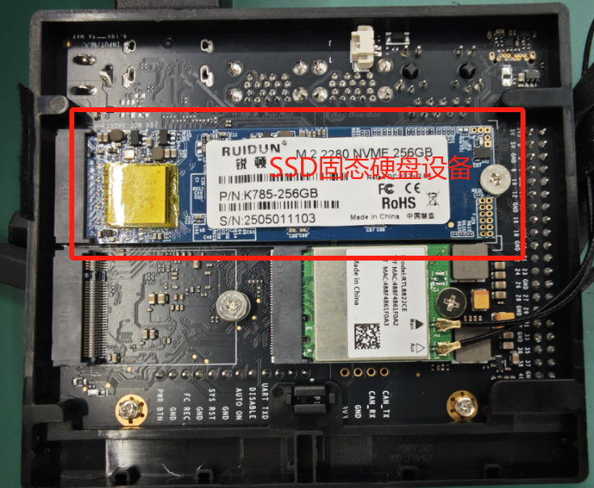

这里主要介绍更新镜像的烧录方法。

## 1 镜像下载地址

[点击下载>>](https://download.elephantrobotics.com/Product_software/iMage-ISO/myAGV%20Pro/myAGVPro_v1.0.0_250716.zip)

## 2 镜像烧录步骤

**设备环境** ： PC Window系统、SSD固态硬盘设备、USB Type-C线、SSD转接器（M.2 NVMe固态硬盘盒）

1. 安装格式化软件 `DiskGenius`, [点击下载安装>>](https://www.diskgenius.com/dyna_download/?software=DGEngSetup6011645.exe)

2. 将系统主控板上的SSD通过转接器接入电脑，连接电脑以后可能会出现很多个要求格式化的弹窗，全部取消即可。

3. 打开DiskGenius软件，找到SSD设备（默认是238G大小），鼠标右键，选择”删除所有分区“

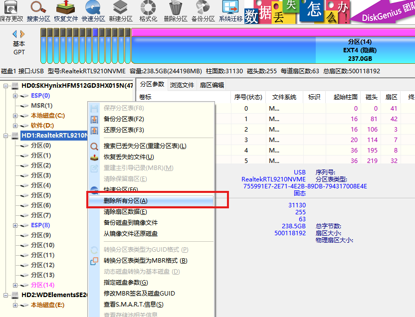

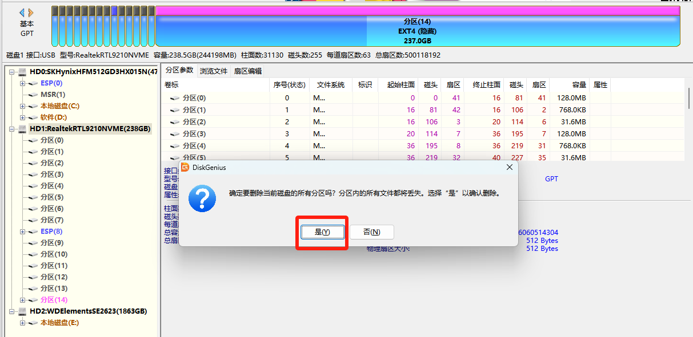

4. 删除所有分区以后，同样选中SSD设备（默认是238G），点击“建立新分区”

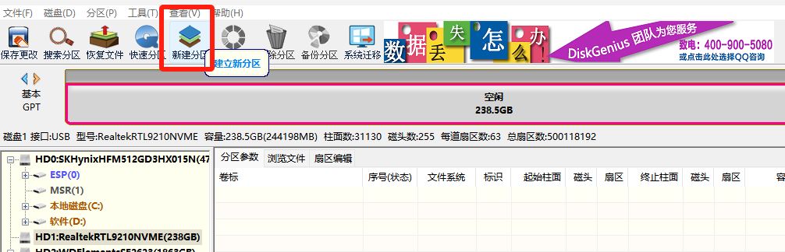

默认即可，点击“取消”

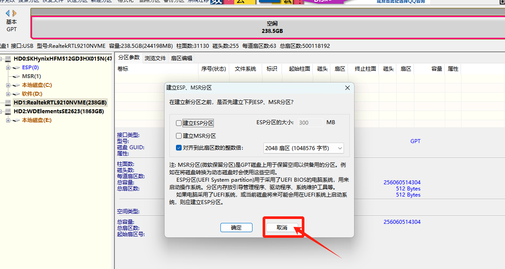

默认即可，不修改任何内容，点击“确定”

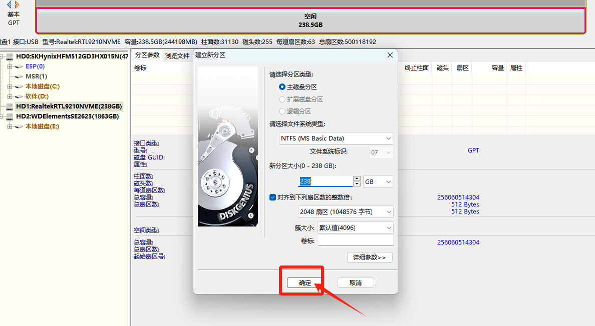

5. 同样选中SSD设备（默认238G），点击“保存更改”

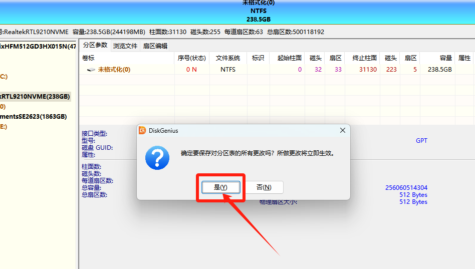

6. 等待完成上述步骤，格式化完成。

7. 安装烧录工具：`balenaEtcher` , [点击下载安装>>](https://github.com/balena-io/etcher/releases/download/v2.1.2/balenaEtcher-2.1.2.Setup.exe)

8. 开始烧录，打开烧录工具-balenaEtcher，选择`Flash from file`镜像文件选择对应的系统镜像文件

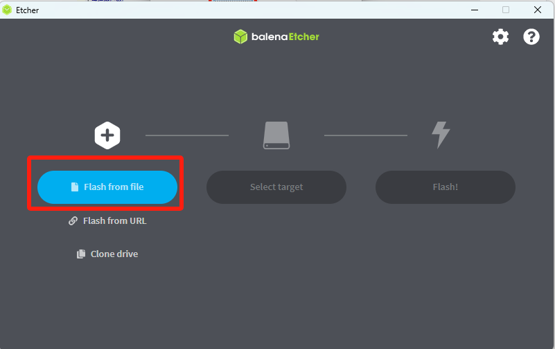

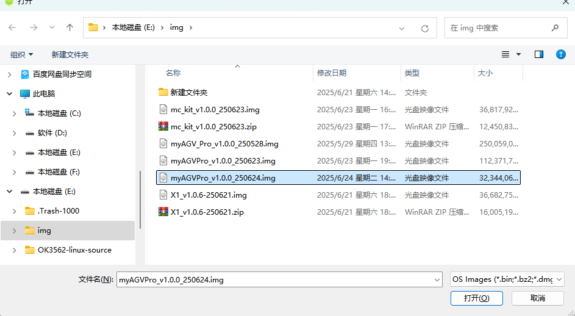

9. 选择目标磁盘，即刚才格式化过的SSD盘

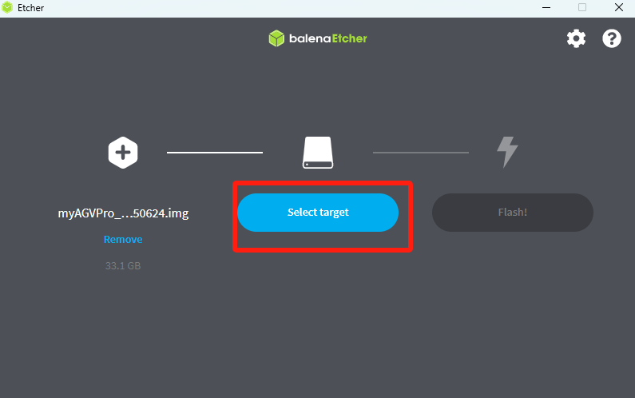

10. 选择`Flash!`

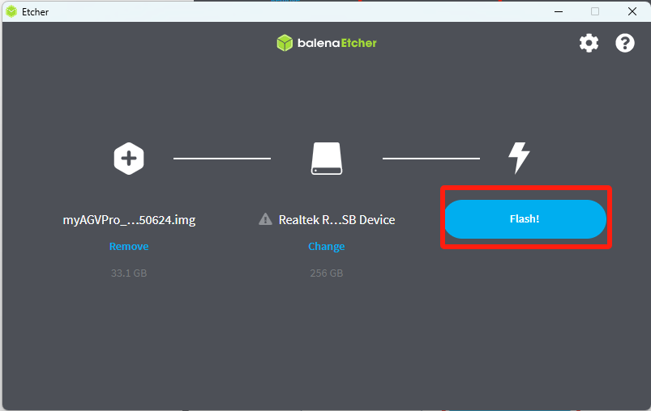

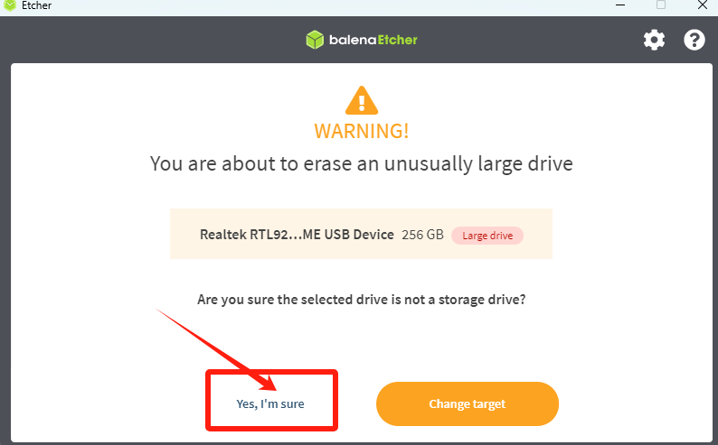

11. 等待烧录进度100%会提示烧录完成。之后将SSD安装回主控板即可。

## 3 验证镜像

NVME固态硬盘（SSD设备）烧录镜像之后，将其装回主控板，连接HDMI显示屏、连接开发板电源适配器（19V供电），然后进行开机，开机成功后的系统桌面如下：

若想验证系统版本号，可以打开一个控制台终端执行：cat /etc/version指令，终端会输出系统版本号，比如：v1.0.0_250716
