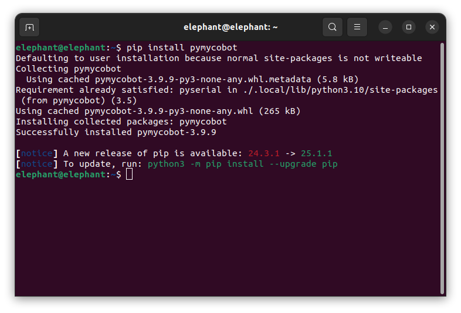

# 配置

> pymycobot 是一个 Python 软件包，用于与 myAGV Pro 进行串行通信。它支持 Python2、Python3.5 及更高版本。使用 pymycobot 之前，请确保构建了 Python 环境。按照以下步骤安装 Python。

## 1 下载和安装 Python

目前，Python 有两个版本：2.x "和 "3.x"。这两个版本互不兼容。本节以版本 `3.x` 为例，因为它越来越受欢迎。

### 1.1 安装 Python

Jetson Nano 版本自带 Ubuntu 22.04.5 LTS 系统和内置 Python 开发环境，因此无需构建和管理。

## 2 准备工作

在终端中输入以下命令, 以确保能使用最新的功能

```shell
pip install pymycobot --upgrade
```



## 3 简单演示

### 3.1 创建`example.py`文件
在myAGV Pro系统中使用vim创建`example.py`文件
```shell
vim example.py
```
### 3.2 输入以下代码
```python
#!/usr/bin/env python
# -*- coding: UTF-8 -*-

from pymycobot import MyAGVPro
import time

agv_pro = MyAGVPro('/dev/ttyACM0', debug=True)

# 以0.5m/s的速度向前移动
agv_pro.move_forward(0.5)

# 等待2s
time.sleep(2)

# 停止移动
agv_pro.stop()

# 以0.5m/s的速度向右平移
agv_pro.move_right_lateral(0.5)

# 等待2s
time.sleep(2)

# 停止移动
agv_pro.stop()

# 以0.5m/s的速度向右旋转
agv_pro.turn_right(0.5)

# 等待2s
time.sleep(1)

# 停止移动
agv_pro.stop()

```

### 3.3 运行示例文件：

```
python example.py
```

默认情况下，此脚本会控制myAGV Pro向前移动两秒后向右平移两秒，再向右旋转1s, 然后停止移动。 

---

[← 上一页](README.md) | [下一页 →](6.1.2-API.md)
