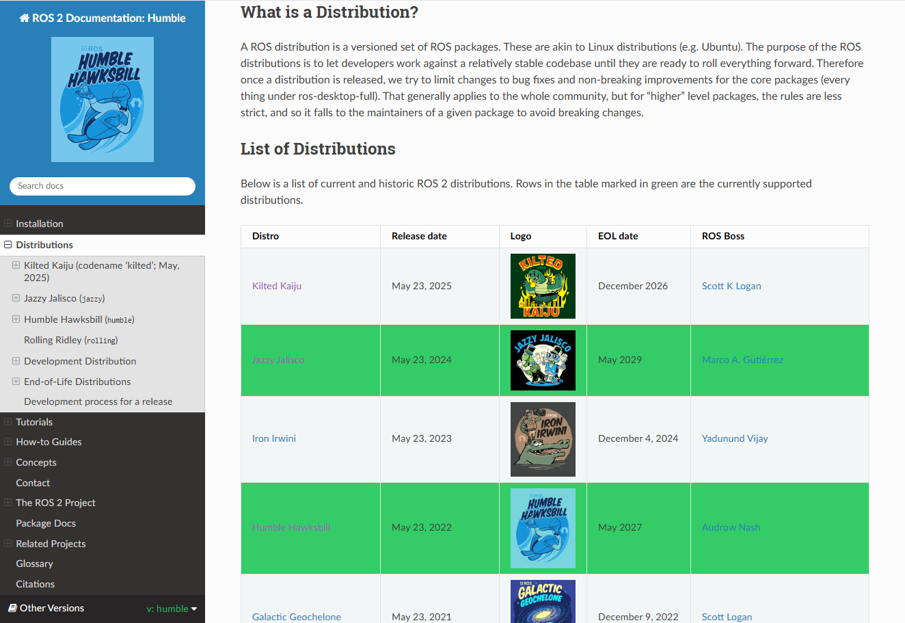
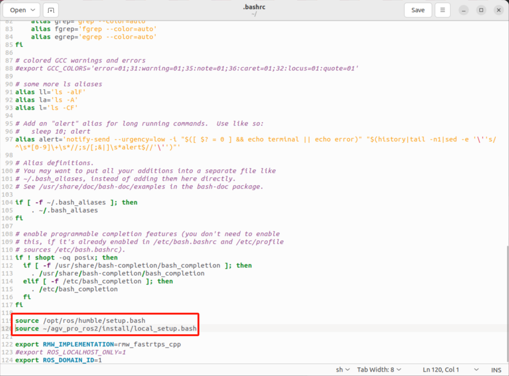
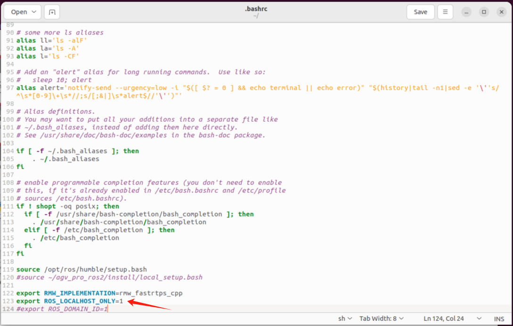

# ROS2 

AGV Pro 基于 Jetson Orin Nano Super 平台开发，搭载 Ubuntu 22.04 LTS 操作系统，并运行 ROS 2 Humble 版本。


[ROS 2 Humble](https://docs.ros.org/en/humble/index.html) 是官方推荐用于 Ubuntu 22.04 的稳定版本，具备更好的实时性支持、DDS 中间件通信、组件化架构等优势。



Humble Hawksbill 是 ROS 2 的第八个正式发行版本，发布于 2022 年 5 月，并将获得长期支持（LTS）至 2027 年 5 月。Humble 支持如下关键特性，适用于移动机器人开发：

- **Nav2 框架**：用于路径规划、定位（AMCL、SLAM）、控制等模块
- **Sensor integration**：支持 LiDAR、IMU、GPS、Camera 的高效集成
- **rclcpp/rclpy**：同时支持 C++ 与 Python 开发
- **ros2 launch**：支持基于 YAML/param 文件的参数化启动
- **ros2 bag**：支持记录与回放传感器数据
- **实时性支持**：结合 PREEMPT-RT，可实现一定程度的控制实时性

ROS 2 与 Jetson 硬件的集成也可结合 [Isaac ROS](https://github.com/NVIDIA-ISAAC-ROS/isaac_ros_visual_slam) 或 [ros_deep_learning](https://github.com/dusty-nv/ros_deep_learning) 等 NVIDIA 提供的加速包来实现高效感知任务。

AGV Pro ROS2源码功能包存放[github-humble](https://github.com/elephantrobotics/agv_pro_ros2)分支中，使用git进行管理。

## AGV Pro ROS2代码

AGV Pro 发货时会将ROS2源码进行编译好再发货，通过git更新代码需要执行下面指令。

```
cd ~/myagv_ros2/src

git pull

cd ..

colcon build
```

如果是第一次编译安装AGV Pro ROS2工作空间源码，需要执行下面指令：

创建工作空间并克隆AGV Pro ROS2源码。

```
git clone https://github.com/elephantrobotics/agv_pro_ros2.git agv_pro_ros2/src
```

安装依赖项

```
cd ~/agv_pro_ros2

rosdep install --from-paths src --ignore-src -r -y
```

构建工作区（jetson orin nano Super第一次编译源码大概需要花费30min左右）

```
cd ~/agv_pro_ros2

colcon build
```

设置工作区

```
source ~/agv_pro_ros2/install/local_setup.bash
```

> 注意事项-1

在使用终端启动launch文件时，切记需要`source ~/agv_pro_ros2/install/local_setup.bash`

例如：启动AGV Pro 激光雷达和底层通信的launch

```
source ~/agv_pro_ros2/install/local_setup.bash
ros2 launch agv_pro_bringup agv_pro_bringup.launch.py
```

也可以通过在/home目录下，按键ctrl+h，显示隐藏文件.bashrc，在文件末端添加下面指令，以便每次打开终端都会source一遍ros2工作空间的环境变量。



> 注意事项-2

ROS 2用于通信的默认[中间件是DDS](https://docs.ros.org/en/humble/Concepts/Intermediate/About-Domain-ID.html)。在DDS中，具有不同逻辑网络共享物理网络的主要机制称为域ID。相同域上的ROS 2节点可以自由发现并互相发送消息，而不同域上的ROS 2节点不能。所有ROS 2节点默认使用域ID 0。为了避免在同一网络上运行ROS 2的不同组计算机之间的干扰，应为每个组设置不同的域ID。

例如你有两台AGV Pro，在同一局域网内，为避免之间数据干扰，应为每个组设置不同的域ID。

```
AGV Pro1  export ROS_DOMAIN_ID=1
AGV Pro2  export ROS_DOMAIN_ID=2
```

或者设置环境变量将通信限制为仅本地主机。

```
AGV Pro1  export ROS_LOCALHOST_ONLY=1
AGV Pro2  export ROS_LOCALHOST_ONLY=1
```



---

[← 上一章](../6.2-ApplicationBaseROS1/6.2.8-Rtabmap.md) | [下一节 →](6.2.2-Real-time_Mapping_with_Gmapping.md)
