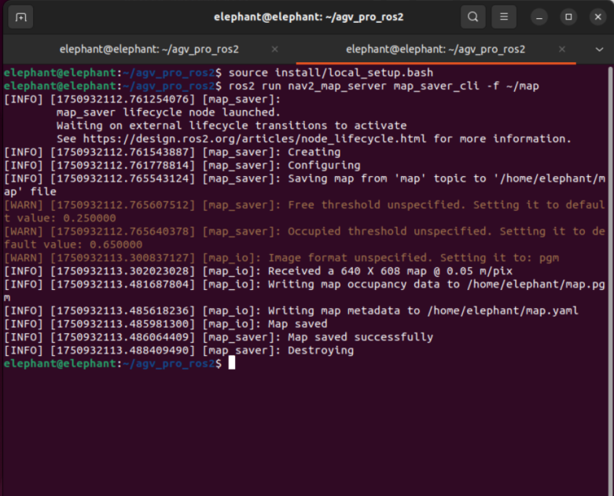
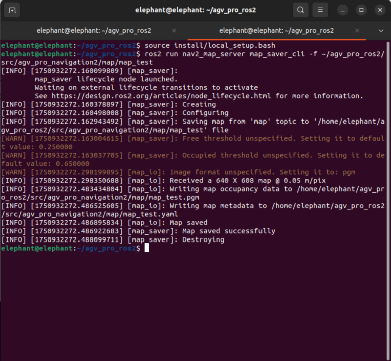
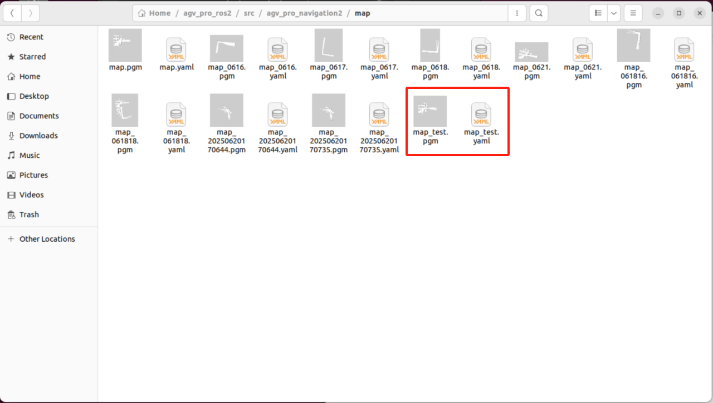
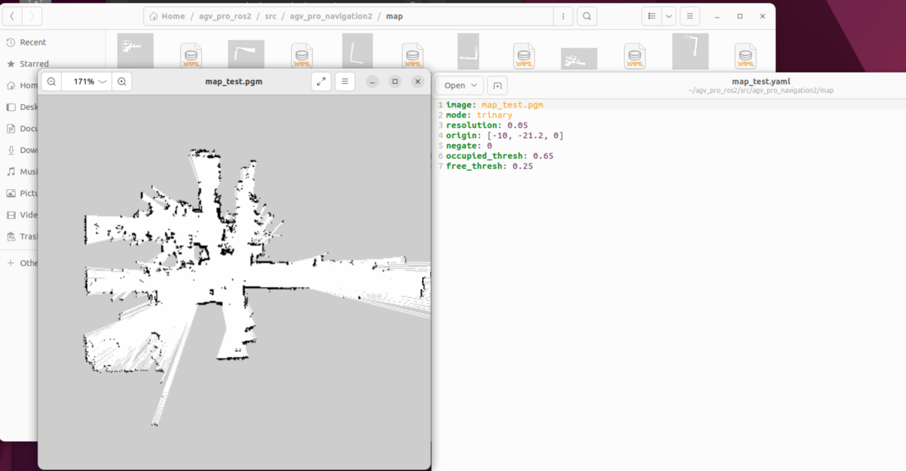

# 使用 Gmapping 实时建图

按下键盘Ctrl+Alt+T，打开第一个终端，输入指令

```
ros2 launch agv_pro_bringup agv_pro_bringup.launch.py
```


按下键盘Ctrl+Alt+T，打开第二个终端，输入指令

```
ros2 launch slam_gmapping slam_gmapping.launch.py
```

此时会打开一个rviz界面


按下键盘Ctrl+Alt+T，打开第三个终端，输入指令

```
ros2 run teleop_twist_keyboard teleop_twist_keyboard
```

确保鼠标点击选中该终端，这样键盘控制才能控制AGV Pro。


> 注意事项：
> 1.为了避免造成机器损坏，运动前确保AGV Pro不会撞到其他物体
> 2.在运动过程中，AGV Pro ros2的键盘控制需要按下键盘'k'才能让AGV Pro停止运动。

```
---------------------------
Moving around:
   u    i    o
   j    k    l
   m    ,    .

For Holonomic mode (strafing), hold down the shift key:
---------------------------
   U    I    O
   J    K    L
   M    <    >

t : up (+z)
b : down (-z)

anything else : stop

q/z : increase/decrease max speeds by 10%
w/x : increase/decrease only linear speed by 10%
e/c : increase/decrease only angular speed by 10%

CTRL-C to quit

currently:	speed 0.25	turn 0.5 
```

| 按键 | 按键描述           |
| :--- | :----------------- |
| i    | 向前移动           |
| ,    | 向后移动           |
| j    | 原地逆时针旋转     |
| l    | 原地顺时针旋转     |
| u    | 左转弯前进         |
| o    | 右转弯前进         |
| k    | 停止移动           |
| m    | 左转弯后退         |
| .    | 右转弯后退         |
| I    | 向前移动           |
| <    | 向后移动           |
| J    | 向左平移           |
| L    | 向右平移           |
| U    | 向左45°斜向前行    |
| O    | 向右45°斜向前行    |
| M    | 向左45°斜向后退    |
| >    | 向右45°斜向后退    |
| q    | 提高线速度和角速度 |
| z    | 降低线速度和角速度 |
| w    | 提高线速度         |
| x    | 降低线速度         |
| e    | 增加角速度         |
| c    | 降低角速度         |

建议在gmapping建图时，键盘控制时**将线速度设为 0.25，角速度设为 0.45**，在建图的同时，您可以在RVIZ空间中观察到，随着AGV Pro的移动，我们的地图逐渐被构造。


构建完你需要的地图，就按下键盘Ctrl+Alt+T，打开第四个终端，输入指令

```
ros2 run nav2_map_server map_saver_cli -f ~/map
```



-f 参数后面可以加上路径和地图文件名称，给地图参数文件增加后缀名

> 注意：后缀名的文件夹路径要写正确，不然会报错

```
ros2 run nav2_map_server map_saver_cli -f ~/agv_pro_ros2/src/agv_pro_navigation2/map/map_test
```





这样我们就会在当前路径下，生成map_test.yaml和map_test.pgm的地图参数文件，增加后缀这样做的好处就是便于管理自己需要的地图，避免出现覆盖掉之前辛苦建好的地图文件。

保存后可在/home/elephant/agv_pro_ros2/src/agv_pro_navigation2/map路径下查看所保存地图的图片形式，为 pgm 格式。



---

[← 上一页](6.2.1-ROS2_Introduction.md) | [下一页 →](6.2.3-Navigation2.md)
