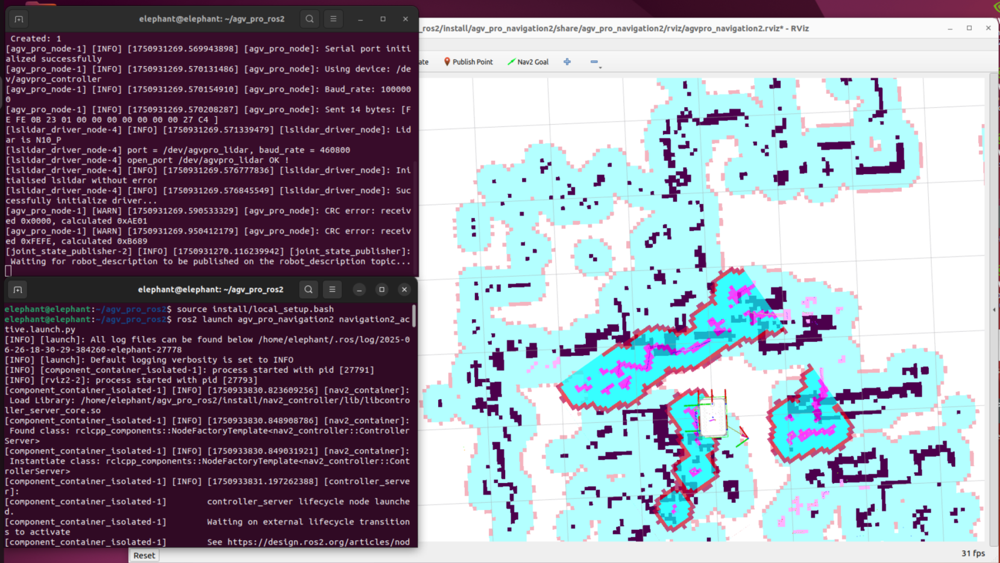
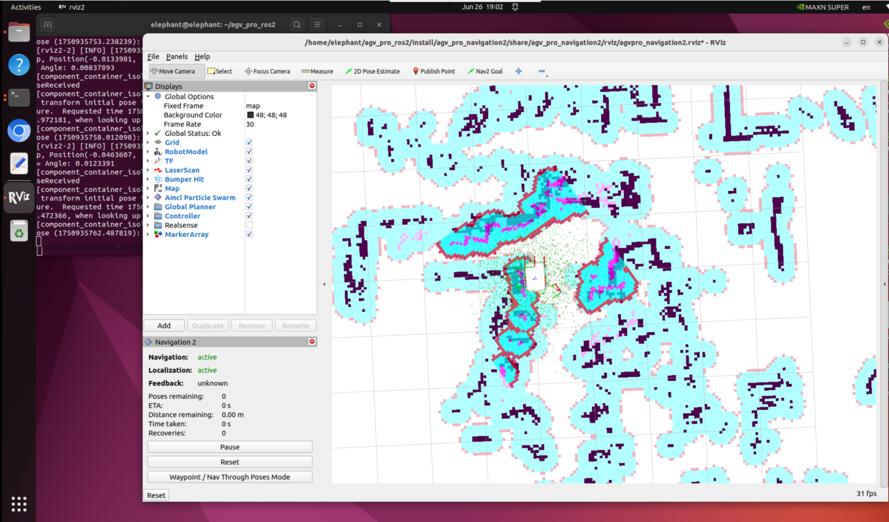
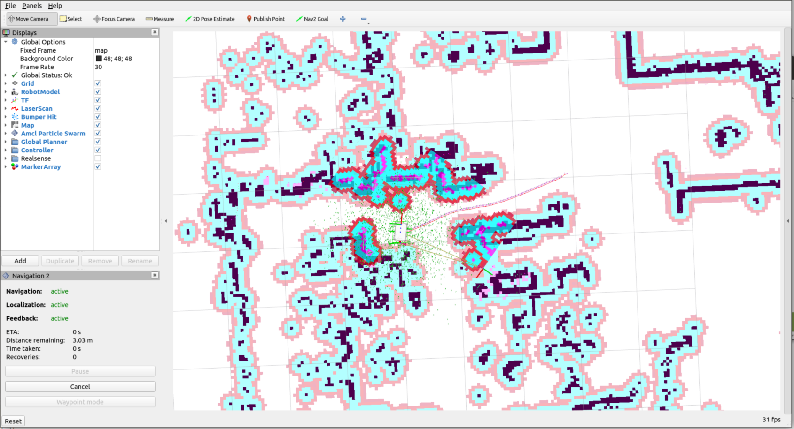
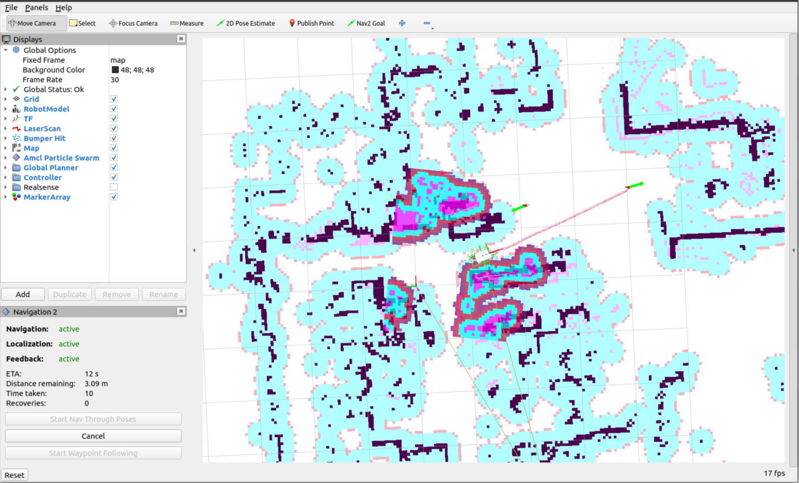

# Nav2

接下来将介绍和使用[Nav2导航](https://docs.nav2.org/)。


Nav2 是 ROS Navigation Stack 的继任者，部署了为移动和表面机器人技术提供动力的相同类型的技术。该项目允许移动机器人在复杂的环境中导航，以使用几乎任何类别的机器人运动学完成用户定义的应用任务。它不仅可以从 A 点移动到 B 点，还可以具有中间姿势，并表示其他类型的任务，例如对象跟踪、完整覆盖导航等。

## 启动AGVPro底层通信+激光雷达

按下键盘Ctrl+Alt+T，打开第一个终端，输入指令

```
ros2 launch agv_pro_bringup agv_pro_bringup.launch.py
```


## 启动Nav2

按下键盘Ctrl+Alt+T，打开第二个终端，输入指令

```
ros2 launch myagv_navigation2 navigation2_active.launch.py
```

这将启动一个rviz



首先，在地图上找到机器人的位置。检查您的机器人在地图中的位置。

在 RViz 中设置机器人的姿势。单击 2D Pose Estimate 按钮，并在地图上指出机器人的位置。绿色箭头的方向是 AGVPro的朝前方向。


然后3D 模型会移动到该位置。观察激光雷达跟地图障碍物是否匹配，估计位置中的小误差是可以容忍的。



在地图上选择一个要导航的目标位置。使用Nav2 Goal按钮发送目标位置和目标方向。


Nav2就会规划路径并发送运动指令，完成导航。



> 路径点跟随

点击rviz2左下框的Waypoint/Nav Through Poses Mode，切换成路径点跟随模式


点击Nav2 Goal 发布两个导航点


点击左下角的Start Waypoint Following，然后就会依次按顺序进行导航。



导航到第一个点位后，继续导航到第二点位


## 更改起始导航地图

在6.2.2章节中，使用slam算法创建空间地图，并获得了一组地图文件，即位于 ~/myagv_ros2/src/myagv_navigation2/map 目录下的 **map.pgm 和 map.yaml**，我们就是基于这两个地图文件的基础上进行导航的。下面将介绍nav2如何加载其他地图。


方法一：修改launch.py文件

找到`agv_pro_ros2/agv_pro_navigation2/launch/navigation2_active.launch.py`文件，将第二十行的`'map.yaml'`改成你需要的加载的地图文件，然后通过`colcon build`编译。

```python
import os

from ament_index_python.packages import get_package_share_directory

from launch import LaunchDescription
from launch.substitutions import LaunchConfiguration
from launch.actions import DeclareLaunchArgument,IncludeLaunchDescription
from launch.conditions import IfCondition
from launch.launch_description_sources import PythonLaunchDescriptionSource
from launch_ros.actions import Node

def generate_launch_description():
    use_sim_time = LaunchConfiguration('use_sim_time', default='false')
    use_rviz = LaunchConfiguration('use_rviz', default='true')
    map_dir = LaunchConfiguration(
        'map',
        default=os.path.join(
            get_package_share_directory('agv_pro_navigation2'),
            'map',
            'map.yaml'))

    param_file_name = 'agvpro.yaml'
    param_dir = LaunchConfiguration(
        'params_file',
        default=os.path.join(
            get_package_share_directory('agv_pro_navigation2'),
            'param',
            param_file_name))

    nav2_launch_file_dir = os.path.join(get_package_share_directory('nav2_bringup'), 'launch')

    rviz_config_dir = os.path.join(
        get_package_share_directory('agv_pro_navigation2'),
        'rviz',
        'agvpro_navigation2.rviz')

    return LaunchDescription([
        DeclareLaunchArgument(
            'map',
            default_value=map_dir,
            description='Full path to map file to load'),
    
        DeclareLaunchArgument(
            'params_file',
            default_value=param_dir,
            description='Full path to param file to load'),

        IncludeLaunchDescription(
            PythonLaunchDescriptionSource([nav2_launch_file_dir, '/bringup_launch.py']),
            launch_arguments={
                'map': map_dir,
                'params_file': param_dir}.items(),
        ),

        Node(
            package='rviz2',
            executable='rviz2',
            name='rviz2',
            arguments=['-d', rviz_config_dir],
            parameters=[{'use_sim_time': use_sim_time}],
            condition=IfCondition(use_rviz),
            output='screen'),
    ])
```

方法二：启动launch时增加map的参数

在启动`ros2 launch agv_pro_navigation2 navigation2_active.launch.py`时，增加`map:=`参数。关于launch这部分写法，可以[参考该链接](https://docs.ros.org/en/galactic/Tutorials/Intermediate/Launch/Using-Substitutions.html)。

```
ros2 launch agv_pro_navigation2 navigation2_active.launch.py map:=~/agv_pro_ros2/src/agv_pro_navigation2/map/map_demo.yaml
```

## nav2性能调优指导

nav2导航框架提供大量的可调参数，不同场景下导航参数的优化侧重点不同，用户可以根据[nav2提供的指导](https://docs.nav2.org/tuning/index.html)，调整参数以获得最佳导航性能。

下面是AGV Pro的默认的nav2参数

```yaml
amcl:
  ros__parameters:
    use_sim_time: False
    alpha1: 0.4
    alpha2: 0.3
    alpha3: 0.1
    alpha4: 0.1
    alpha5: 0.1
    base_frame_id: "base_footprint"
    beam_skip_distance: 0.5
    beam_skip_error_threshold: 0.9
    beam_skip_threshold: 0.3
    do_beamskip: false
    global_frame_id: "map"
    lambda_short: 0.1
    laser_likelihood_max_dist: 2.0
    laser_max_range: 100.0
    laser_min_range: -1.0
    laser_model_type: "likelihood_field"
    max_beams: 60
    max_particles: 2000
    min_particles: 500
    odom_frame_id: "odom"
    pf_err: 0.05
    pf_z: 0.99
    recovery_alpha_fast: 0.0
    recovery_alpha_slow: 0.0
    resample_interval: 2
    robot_model_type: "nav2_amcl::OmniMotionModel"
    save_pose_rate: 0.5
    sigma_hit: 0.02
    tf_broadcast: true
    transform_tolerance: 0.3
    update_min_a: 0.06
    update_min_d: 0.025
    z_hit: 0.7
    z_max: 0.001
    z_rand: 0.059
    z_short: 0.24

    # Initial Pose
    set_initial_pose: True
    initial_pose.x: 0.0
    initial_pose.y: 0.0
    initial_pose.z: 0.0
    initial_pose.yaw: 0.0

amcl_map_client:
  ros__parameters:
    use_sim_time: False

amcl_rclcpp_node:
  ros__parameters:
    use_sim_time: False

bt_navigator:
  ros__parameters:
    use_sim_time: False
    global_frame: map
    robot_base_frame: base_footprint
    odom_topic: /odom
    bt_loop_duration: 10
    default_server_timeout: 20
    enable_groot_monitoring: True
    groot_zmq_publisher_port: 1666
    groot_zmq_server_port: 1667
    # 'default_nav_through_poses_bt_xml' and 'default_nav_to_pose_bt_xml' are use defaults:
    # nav2_bt_navigator/navigate_to_pose_w_replanning_and_recovery.xml
    # nav2_bt_navigator/navigate_through_poses_w_replanning_and_recovery.xml
    # They can be set here or via a RewrittenYaml remap from a parent launch file to Nav2.
    plugin_lib_names:
    - nav2_compute_path_to_pose_action_bt_node
    - nav2_compute_path_through_poses_action_bt_node
    - nav2_follow_path_action_bt_node
    - nav2_back_up_action_bt_node
    - nav2_spin_action_bt_node
    - nav2_wait_action_bt_node
    - nav2_clear_costmap_service_bt_node
    - nav2_is_stuck_condition_bt_node
    - nav2_goal_reached_condition_bt_node
    - nav2_goal_updated_condition_bt_node
    - nav2_initial_pose_received_condition_bt_node
    - nav2_reinitialize_global_localization_service_bt_node
    - nav2_rate_controller_bt_node
    - nav2_distance_controller_bt_node
    - nav2_speed_controller_bt_node
    - nav2_truncate_path_action_bt_node
    - nav2_goal_updater_node_bt_node
    - nav2_recovery_node_bt_node
    - nav2_pipeline_sequence_bt_node
    - nav2_round_robin_node_bt_node
    - nav2_transform_available_condition_bt_node
    - nav2_time_expired_condition_bt_node
    - nav2_distance_traveled_condition_bt_node
    - nav2_single_trigger_bt_node
    - nav2_goal_updated_controller_bt_node
    - nav2_is_battery_low_condition_bt_node
    - nav2_navigate_through_poses_action_bt_node
    - nav2_navigate_to_pose_action_bt_node
    - nav2_remove_passed_goals_action_bt_node
    - nav2_planner_selector_bt_node
    - nav2_controller_selector_bt_node
    - nav2_goal_checker_selector_bt_node

bt_navigator_rclcpp_node:
  ros__parameters:
    use_sim_time: False

controller_server:
  ros__parameters:
    use_sim_time: False
    controller_frequency: 5.0
    min_x_velocity_threshold: 0.001
    min_y_velocity_threshold: 0.5
    min_theta_velocity_threshold: 0.001
    failure_tolerance: 3.0
    progress_checker_plugin: "progress_checker"
    goal_checker_plugins: ["general_goal_checker"] # "precise_goal_checker"
    controller_plugins: ["FollowPath"]

    # Progress checker parameters
    progress_checker:
      plugin: "nav2_controller::SimpleProgressChecker"
      required_movement_radius: 0.5
      movement_time_allowance: 10.0
    # Goal checker parameters
    #precise_goal_checker:
    #  plugin: "nav2_controller::SimpleGoalChecker"
    #  xy_goal_tolerance: 0.25
    #  yaw_goal_tolerance: 0.25
    #  stateful: True
    general_goal_checker:
      stateful: True
      plugin: "nav2_controller::SimpleGoalChecker"
      xy_goal_tolerance: 0.25
      yaw_goal_tolerance: 0.25
    # DWB parameters
    FollowPath:
      plugin: "dwb_core::DWBLocalPlanner"
      debug_trajectory_details: True
      min_vel_x: 0.0
      min_vel_y: 0.0
      max_vel_x: 0.26
      max_vel_y: 0.0
      max_vel_theta: 0.5
      min_speed_xy: 0.0
      max_speed_xy: 0.26
      min_speed_theta: 0.0
      # Add high threshold velocity for turtlebot 3 issue.
      # https://github.com/ROBOTIS-GIT/turtlebot3_simulations/issues/75
      acc_lim_x: 2.5
      acc_lim_y: 0.0
      acc_lim_theta: 0.25
      decel_lim_x: -2.5
      decel_lim_y: 0.0
      decel_lim_theta: -0.25
      vx_samples: 20
      vy_samples: 5
      vtheta_samples: 20
      sim_time: 1.7
      linear_granularity: 0.05
      angular_granularity: 0.025
      transform_tolerance: 0.1
      xy_goal_tolerance: 0.25
      trans_stopped_velocity: 0.1
      short_circuit_trajectory_evaluation: True
      stateful: True
      critics: ["RotateToGoal", "Oscillation", "BaseObstacle", "GoalAlign", "PathAlign", "PathDist", "GoalDist"]
      BaseObstacle.scale: 0.02
      PathAlign.scale: 32.0
      PathAlign.forward_point_distance: 0.1
      GoalAlign.scale: 24.0
      GoalAlign.forward_point_distance: 0.1
      PathDist.scale: 32.0
      GoalDist.scale: 24.0
      RotateToGoal.scale: 32.0
      RotateToGoal.slowing_factor: 5.0
      RotateToGoal.lookahead_time: -1.0
      
controller_server_rclcpp_node:
  ros__parameters:
    use_sim_time: False

local_costmap:
  local_costmap:
    ros__parameters:
      update_frequency: 5.0
      publish_frequency: 2.0
      global_frame: odom
      robot_base_frame: base_footprint
      use_sim_time: False
      rolling_window: true
      width: 3
      height: 3
      resolution: 0.05
      footprint: "[[0.26, 0.18], [0.26, -0.18], [-0.26, -0.18], [-0.26, 0.18]]"
      plugins: ["voxel_layer", "inflation_layer"]
      inflation_layer:
        plugin: "nav2_costmap_2d::InflationLayer"
        cost_scaling_factor: 5.0
        inflation_radius: 0.25
      voxel_layer:
        plugin: "nav2_costmap_2d::VoxelLayer"
        enabled: True
        publish_voxel_map: True
        origin_z: 0.0
        z_resolution: 0.05
        z_voxels: 16
        max_obstacle_height: 2.0
        mark_threshold: 0
        observation_sources: scan
        scan:
          topic: /scan
          max_obstacle_height: 2.0
          clearing: True
          marking: True
          data_type: "LaserScan"
          raytrace_max_range: 3.0
          raytrace_min_range: 0.0
          obstacle_max_range: 2.5
          obstacle_min_range: 0.0
      static_layer:
        map_subscribe_transient_local: True
      always_send_full_costmap: True
  local_costmap_client:
    ros__parameters:
      use_sim_time: False
  local_costmap_rclcpp_node:
    ros__parameters:
      use_sim_time: False

global_costmap:
  global_costmap:
    ros__parameters:
      update_frequency: 0.3
      publish_frequency: 0.3
      global_frame: map
      robot_base_frame: base_footprint
      use_sim_time: False
      robot_radius: 0.22
      resolution: 0.05
      track_unknown_space: true
      plugins: ["static_layer", "obstacle_layer", "inflation_layer"]
      obstacle_layer:
        plugin: "nav2_costmap_2d::ObstacleLayer"
        enabled: True
        observation_sources: scan
        scan:
          topic: /scan
          max_obstacle_height: 2.0
          clearing: True
          marking: True
          data_type: "LaserScan"
          raytrace_max_range: 3.0
          raytrace_min_range: 0.0
          obstacle_max_range: 2.5
          obstacle_min_range: 0.0
      static_layer:
        plugin: "nav2_costmap_2d::StaticLayer"
        map_subscribe_transient_local: True
      inflation_layer:
        plugin: "nav2_costmap_2d::InflationLayer"
        cost_scaling_factor: 5.0
        inflation_radius: 0.25
      always_send_full_costmap: True
  global_costmap_client:
    ros__parameters:
      use_sim_time: False
  global_costmap_rclcpp_node:
    ros__parameters:
      use_sim_time: False

map_server:
  ros__parameters:
    use_sim_time: False
    yaml_filename: "turtlebot3_world.yaml"

map_saver:
  ros__parameters:
    use_sim_time: False
    save_map_timeout: 5.0
    free_thresh_default: 0.25
    occupied_thresh_default: 0.65
    map_subscribe_transient_local: True

planner_server:
  ros__parameters:
    expected_planner_frequency: 1.0
    use_sim_time: False
    planner_plugins: ["GridBased"]
    GridBased:
      plugin: "nav2_navfn_planner/NavfnPlanner"
      tolerance: 2.0
      use_astar: false
      allow_unknown: true

planner_server_rclcpp_node:
  ros__parameters:
    use_sim_time: False

recoveries_server:
  ros__parameters:
    costmap_topic: local_costmap/costmap_raw
    footprint_topic: local_costmap/published_footprint
    cycle_frequency: 10.0
    recovery_plugins: ["spin", "backup", "wait"]
    spin:
      plugin: "nav2_recoveries/Spin"
    backup:
      plugin: "nav2_recoveries/BackUp"
    wait:
      plugin: "nav2_recoveries/Wait"
    global_frame: odom
    robot_base_frame: base_footprint
    transform_timeout: 0.1
    use_sim_time: False
    simulate_ahead_time: 2.0
    max_rotational_vel: 1.0
    min_rotational_vel: 0.4
    rotational_acc_lim: 3.2

robot_state_publisher:
  ros__parameters:
    use_sim_time: False

waypoint_follower:
  ros__parameters:
    loop_rate: 20
    stop_on_failure: false
    waypoint_task_executor_plugin: "wait_at_waypoint"   
    wait_at_waypoint:
      plugin: "nav2_waypoint_follower::WaitAtWaypoint"
      enabled: True
      waypoint_pause_duration: 200
```

---

[← 上一页](6.2.2-Real-time_Mapping_with_Gmapping.md) | [下一页 →](6.2.4-multi_control.md)
