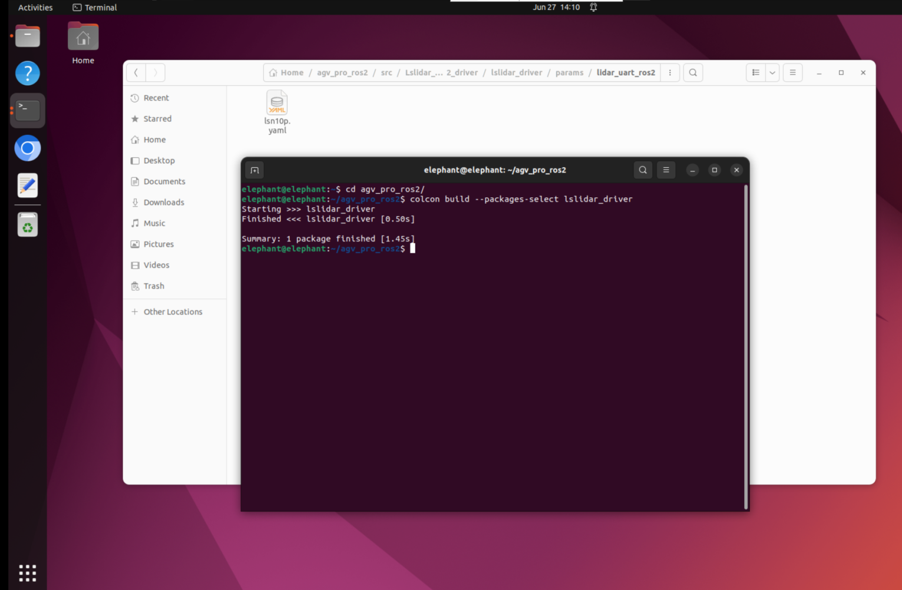

# 多机控制

在使用多机控制前需要配置ros2多机通信功能。

下面以两台AGV Pro为例。在正式运行前，先确保两台机器和笔记本电脑能够互相通信。既同一局域网内。

> 注意事项
>1.电脑需要装Ubuntu 22.04、ros2
>2.如果使用虚拟机，则需要设置虚拟机的网络配置，电脑虚拟机设置-网络适配器-网络连接-桥接模式：直接连接物理网络

```
电脑    192.168.123.68
AGV Pro1  192.168.123.3
AGV Pro2  192.168.123.42
```

三台设备设置~/.bashrc 文件，添加下面两个参数，设置

```
export RMW_IMPLEMENTATION=rmw_fastrtps_cpp
export ROS_DOMAIN_ID=1
```

三台设备即可在ros2下进行多机通信。关于ros2 dds通信中间件的更多信息，可以查看[此处](https://docs.ros.org/en/humble/Concepts/Intermediate/About-Domain-ID.html)。

## 启动多机控制

1.修改`~/agv_pro_ros2/src/Lslidar_ROS2_driver/lslidar_driver/params/lidar_uart_ros2/lsn10p.yaml`文件，增加`agv_pro1:`


注意缩进格式

```yaml
agv_pro1:
  lslidar_driver_node:
    ros__parameters:
      frame_id: laser_link                                    #激光坐标
      group_ip: 224.1.1.2
      add_multicast: false
      device_ip: 192.168.1.200                   	            #雷达源IP
      device_ip_difop: 192.168.1.102                          #雷达目的ip
      msop_port: 2368                                         #雷达目的端口号
      difop_port: 2369                                        #雷达源端口号
      lidar_name: N10_P                                       #雷达选择:M10 M10_P M10_PLUS M10_GPS N10 L10 N10_P
      angle_disable_min: 0.0                                  #角度裁剪开始值
      angle_disable_max: 0.0                                  #角度裁剪结束值
      min_range: 0.2                                          #雷达接收距离最小值
      max_range: 200.0                                        #雷达接收距离最大值
      use_gps_ts: false                                       #雷达是否使用GPS授时
      scan_topic: /scan                                       #设置激光数据topic名称
      interface_selection: serial                             #接口选择:net 为网口,serial 为串口。
      serial_port_: /dev/agvpro_lidar                         #串口连接时的串口号
      high_reflection: false                                  #M10_P雷达需填写该值,若不确定，请联系技术支持。
      compensation: false				            #M10系列是否使用角度补偿功能
      pubScan: true                                           #是否发布scan话题
      pubPointCloud2: false                                   #是否发布pointcloud2话题
      pointcloud_topic: /lslidar_point_cloud                  #设置激光数据topic名称
  #    pcap: /home/ls/1.pcap                                  #雷达是否使用pcap包读取功能
  #    in_file_name: /home/ls/1.txt                           #雷达是否使用txt文件读取功能

```

例如

```
第一台AGV Pro，就改成agv_pro1:
第二台AGV Pro，就改成agv_pro2:
```

2.然后执行下面指令，编译激光雷达功能包，编译后记得source工作空间

```
cd agv_pro_ros2/
colcon build --packages-select lslidar_driver
source ~/agv_pro_ros2/install/local_setup.bash
```



3.启动里程计和激光雷达节点

在启动时`agv_pro_bringup.launch.py`，增加`namespace:=`参数，区分AGV Pro

```
第一台AGV Pro，启动指令：ros2 launch agv_pro_bringup agv_pro_bringup.launch.py namespace:=agv_pro1
第二台AGV Pro，启动指令：ros2 launch agv_pro_bringup agv_pro_bringup.launch.py namespace:=agv_pro2
```


4.电脑启动键盘控制节点

电脑需要下载键盘功能包

```
sudo apt-get install ros-humble-teleop-twist-keyboard
```

启动键盘控制节点

```
ros2 run teleop_twist_keyboard teleop_twist_keyboard
```


确保鼠标点击选中该终端，这样键盘控制才能控制AGV Pro。


> 注意事项：
> 1.为了避免造成机器损坏，运动前确保AGV Pro不会撞到其他物体
> 2.在运动过程中，AGV Pro ros2的键盘控制需要按下键盘'k'才能让AGV Pro停止运动。

```
---------------------------
Moving around:
   u    i    o
   j    k    l
   m    ,    .

For Holonomic mode (strafing), hold down the shift key:
---------------------------
   U    I    O
   J    K    L
   M    <    >

t : up (+z)
b : down (-z)

anything else : stop

q/z : increase/decrease max speeds by 10%
w/x : increase/decrease only linear speed by 10%
e/c : increase/decrease only angular speed by 10%

CTRL-C to quit

currently:	speed 0.25	turn 0.5 
```

| 按键 | 按键描述           |
| :--- | :----------------- |
| i    | 向前移动           |
| ,    | 向后移动           |
| j    | 原地逆时针旋转     |
| l    | 原地顺时针旋转     |
| u    | 左转弯前进         |
| o    | 右转弯前进         |
| k    | 停止移动           |
| m    | 左转弯后退         |
| .    | 右转弯后退         |
| I    | 向前移动           |
| <    | 向后移动           |
| J    | 向左平移           |
| L    | 向右平移           |
| U    | 向左45°斜向前行    |
| O    | 向右45°斜向前行    |
| M    | 向左45°斜向后退    |
| >    | 向右45°斜向后退    |
| q    | 提高线速度和角速度 |
| z    | 降低线速度和角速度 |
| w    | 提高线速度         |
| x    | 降低线速度         |
| e    | 增加角速度         |
| c    | 降低角速度         |

同时可以终端输入`rqt_graph`查看节点信息，在同一局域网内，agv_pro1和agv_pro2同时接收笔记本发布`/cmd_vel`话题，实现多机控制功能。


---

[← 上一页](6.2.3-Navigation2.md) | [下一页 →](6.2.5-Gazebo.md)