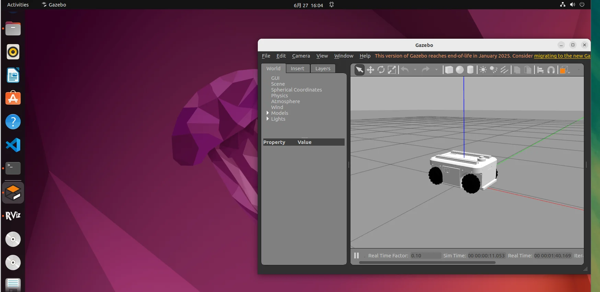

# Gazebo仿真

1.启动Gazebo仿真

```
ros2 launch agv_pro_description agv_pro_gazebo.launch.py
```

2.使用键盘节点，控制仿真小车

```
ros2 run teleop_twist_keyboard teleop_twist_keyboard
```

```
---------------------------
Moving around:
   u    i    o
   j    k    l
   m    ,    .

For Holonomic mode (strafing), hold down the shift key:
---------------------------
   U    I    O
   J    K    L
   M    <    >

t : up (+z)
b : down (-z)

anything else : stop

q/z : increase/decrease max speeds by 10%
w/x : increase/decrease only linear speed by 10%
e/c : increase/decrease only angular speed by 10%

CTRL-C to quit

currently:	speed 0.25	turn 0.5 
```

| 按键 | 按键描述           |
| :--- | :----------------- |
| i    | 向前移动           |
| ,    | 向后移动           |
| j    | 原地逆时针旋转     |
| l    | 原地顺时针旋转     |
| u    | 左转弯前进         |
| o    | 右转弯前进         |
| k    | 停止移动           |
| m    | 左转弯后退         |
| .    | 右转弯后退         |
| I    | 向前移动           |
| <    | 向后移动           |
| J    | 向左平移           |
| L    | 向右平移           |
| U    | 向左45°斜向前行    |
| O    | 向右45°斜向前行    |
| M    | 向左45°斜向后退    |
| >    | 向右45°斜向后退    |
| q    | 提高线速度和角速度 |
| z    | 降低线速度和角速度 |
| w    | 提高线速度         |
| x    | 降低线速度         |
| e    | 增加角速度         |
| c    | 降低角速度         |



---

[← 上一页](6.2.4-multi_control.md) | [下一页 →](6.2.6-Real_Time_Mapping_with_Point_lio.md)