# POINT_LIO_ROS2----AGV_PRO基于Unilidar_L2激光雷达的3DSLAM及NAV2导航方案

## 运行建图及录制rosbag所需的各节点:

- 在`~/agv_pro_ros2/`下打开第一个终端：

```bash
source ./install/setup.bash
ros2 launch agv_pro_bringup agv_pro_bringup.launch.py
# agv_pro驱动节点
```

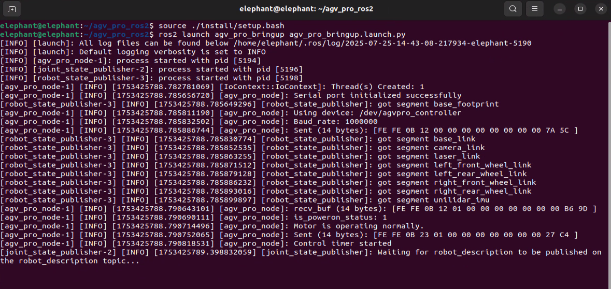

- 在`~/agv_pro_ros2/`下打开第二个终端：

```bash
source ./install/setup.bash
ros2 launch unitree_lidar_ros2 launch.py
# unilidar驱动节点
```

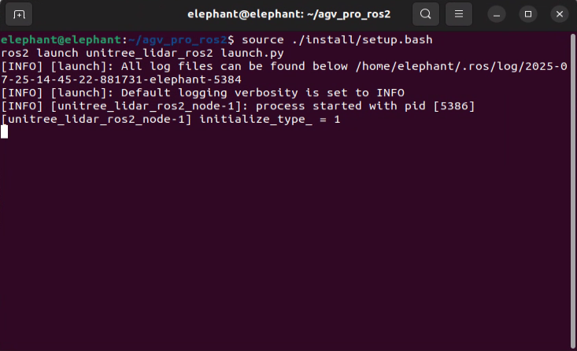

- 在`~/agv_pro_ros2/`下打开第三个终端：

```bash
source ./install/setup.bash
ros2 launch point_lio mapping_unilidar_l2.launch.py
# slam建图节点
```


此指令会启动rviz2可视化界面，显示激光雷达点云数据和建图效果。

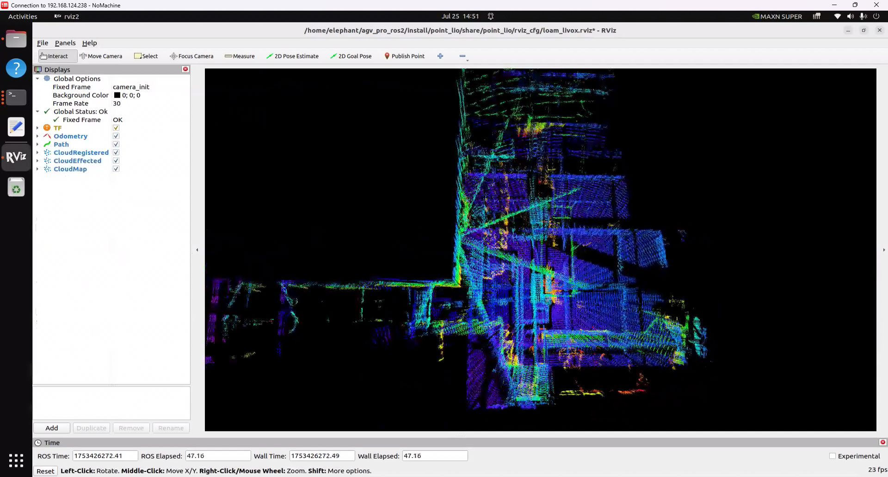

- 在`~/agv_pro_ros2/`下打开第四个终端：

```bash
source ./install/setup.bash
ros2 run teletop_twist_keyboard teletop_twist_keyboard
# 键盘控制节点
```

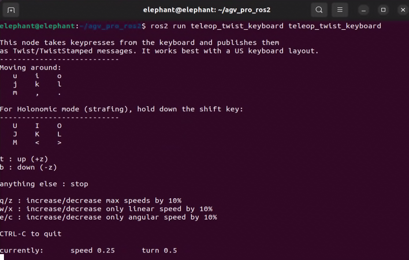

注：默认情况下，建图效果输出的点云数据仅暂时显示在rviz2中，在30秒后，建图完成的点云数据会消失，仅保留小车当下状态实时扫描的点云数据及小车的里程计路径。若需要长时间保存建图完成的点云数据以观察地图效果，可在rviz2中左侧面板中设置`CloudRegistered`的`Decay Time`由30变为`30000`或任意无穷大的数值,这样扫描建图完成的点云会在rviz2中长时间保留。

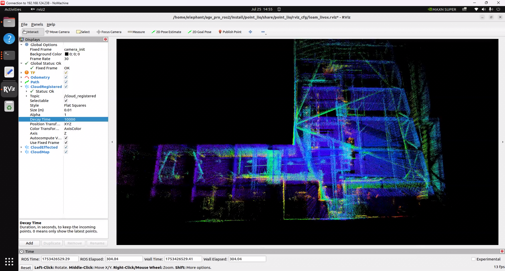


建图结束后按`Ctrl+C`结束各终端，pcd地图文件自动保存至`point_lio_ros2/PCD`文件夹内。

## 打开pcd地图

进入PCD保存的文件夹`~/agv_pro_ros2/src/point_lio_ros2/PCD`中打开终端，然后输入以下指令打开地图：


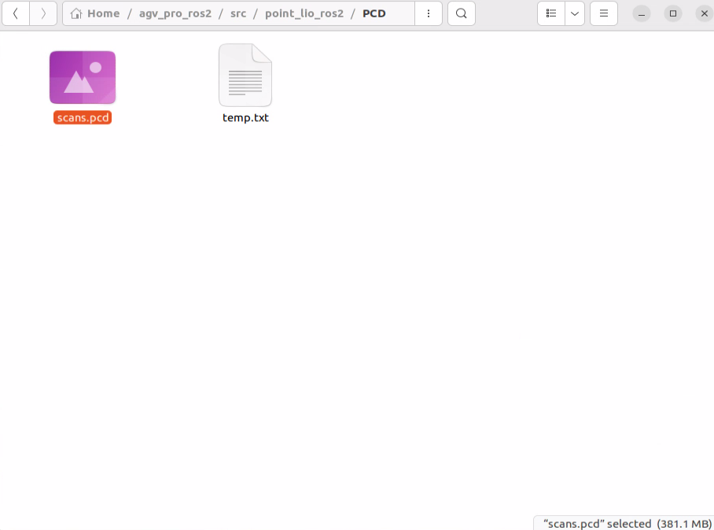

```bash
pcl_viewer scans.pcd
```


- 注意：如果提示`pcl_viewer: command not found`，请先安装pcl_viewer。操作如下:

```bash
sudo apt update
sudo apt install libpcl-dev pcl-tools
```

成功打开scans.pcd后，scans.pcd地图会显示在窗口中,可以使用鼠标和键盘进行交互操作。


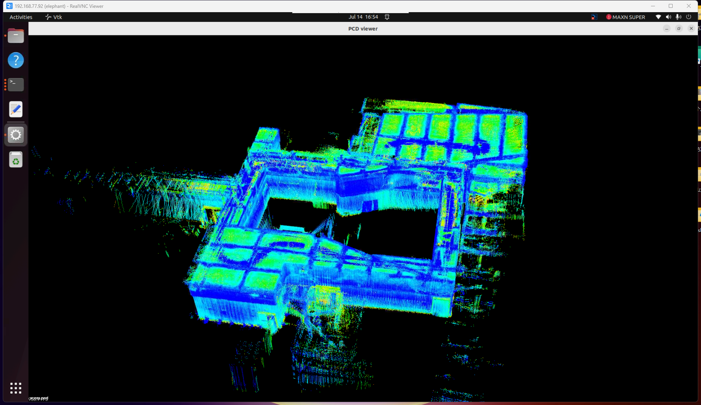

- 提示：pcl_viewer 基本功能按键说明

视图控制
| 按键       | 功能描述                     |
|------------|-----------------------------|
| 鼠标左键拖动 | 旋转视角                    |
| 鼠标右键拖动 | 平移视角                    |
| 鼠标滚轮     | 缩放视图                    |
| `r`        | 重置视角到初始状态            |
| `f`        | 进入/退出全屏模式             |

显示设置
| 按键       | 功能描述                     |
|------------|-----------------------------|
| `+`        | 增大点的大小                 |
| `-`        | 减小点的大小                 |
| `b`        | 切换背景色(黑/白)            |
| `c`        | 显示/隐藏点云颜色            |
| `s`        | 切换表面渲染模式             |

点云操作
| 按键       | 功能描述                      |
|------------|------------------------------|
| `1`        | 为所有点随机分配RGB颜色        |
| `2`        | 根据点的X坐标值映射为渐变色    |
| `3`        | 根据点的Y坐标值映射为渐变色    |
| `4`        | 根据点的Z坐标值（高度）映射为渐变色|
| `5`        | 根据点云强度映射为渐变色       |
| `u`        | 更新点云显示                  |
| `j`        | 保存当前视图为截图            |

## pcd点云地图转换为pgm栅格地图

- 在`~/agv_pro_ros2/`下打开终端：

```bash
source ./install/setup.bash
ros2 launch pcd2pgm pcd2pgm.launch.py
```

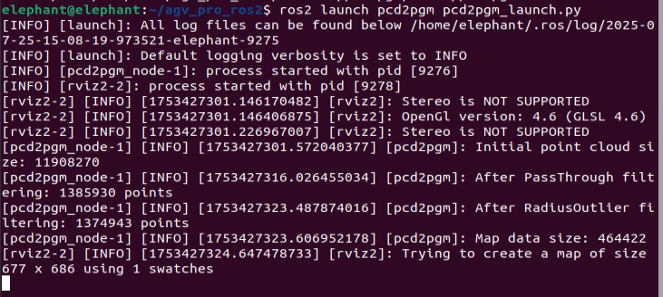

此指令将运行pcd转换为pgm栅格地图节点,运行后将在rviz2下展示出三维点云过滤后的效果及转化为的栅格地图

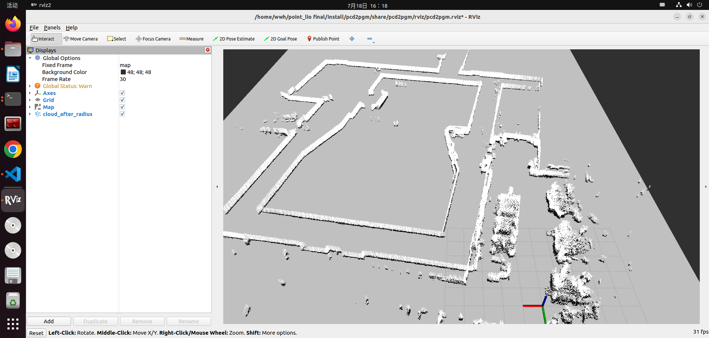

- 打开第二个终端，执行如下指令保存地图：

```bash
ros2 run nav2_map_server map_saver_cli -f <YOUR_MAP_NAME>
# 保存地图节点至当前终端所在的文件夹，<YOUR_MAP_NAME>改为你想保存的地图名称
```

- 例如：

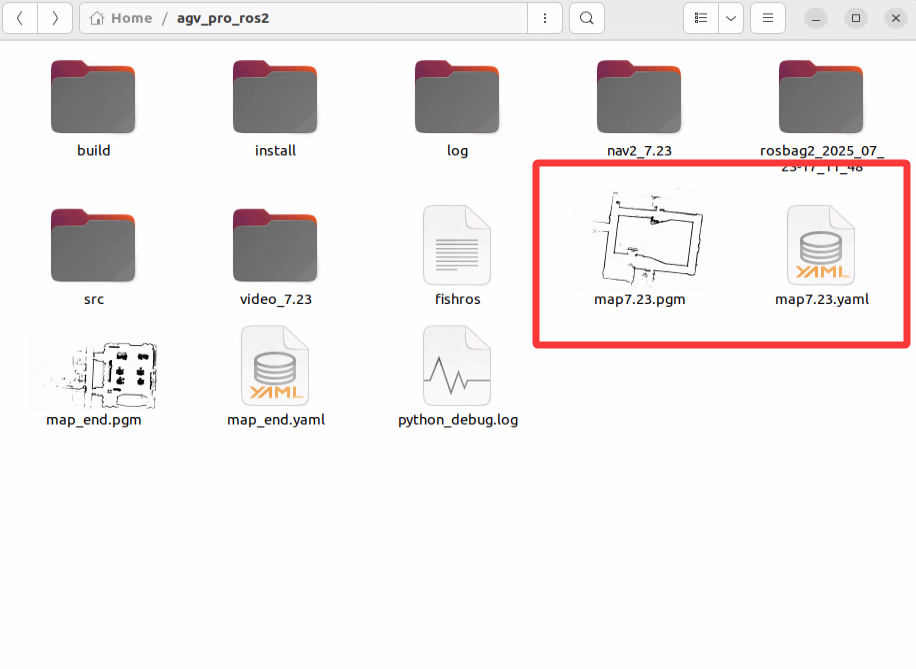

为方便文件管理，可以将地图文件存放到导航功能包的地图文件夹中保存。

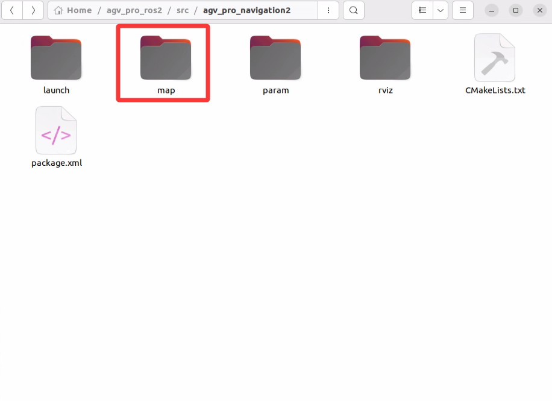

## 导航功能配置与使用

- 首先需要修改导航需要加载的地图文件路径，打开`~/agv_pro_ros2/agv_pro_navigation/launch/navigation2_active.launch.py`文件，找到以下配置：

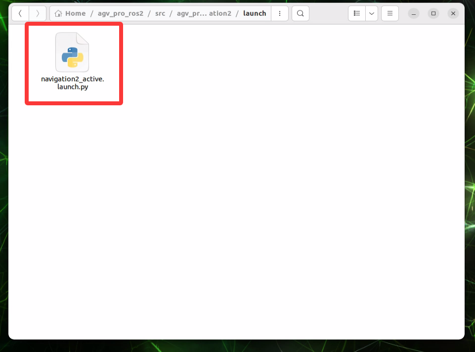

```yaml
def generate_launch_description():
    use_sim_time = LaunchConfiguration('use_sim_time', default='false')
    use_rviz = LaunchConfiguration('use_rviz', default='true')
    map_dir = LaunchConfiguration(
        'map',
        default=os.path.join(
            get_package_share_directory('agv_pro_navigation2'),  # 修改此处的文件夹为你保存地图的文件夹
            'map',            # 修改此处的文件夹为你保存地图的文件夹
            'map_end.yaml'))  # 修改此处的地图文件名称为你保存的地图文件名称
```

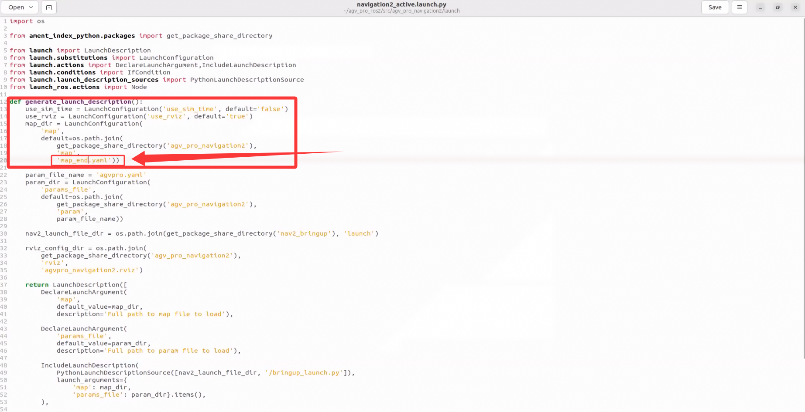

- 然后保存文件并重新编译工作空间，打开终端执行如下指令：

```bash
cd ~/agv_pro_ros2/
colcon build --packages-select agv_pro_navigation
source install/setup.bash
```

- 然后可以进行导航建图功能的使用，在`~/agv_pro_ros2/`下打开第一个终端执行如下指令：

```bash
source ./install/setup.bash
ros2 launch agv_pro_bringup agv_pro_bringup.launch.py
# agv_pro驱动节点
```

- 在`~/agv_pro_ros2/`下打开第二个终端执行如下指令：

```bash
source ./install/setup.bash
ros2 launch unitree_lidar_ros2 launch.py 
# unilidar驱动节点
```

- 在`~/agv_pro_ros2/`下打开第三个终端：

```bash
source ./install/setup.bash
ros2 launch pointcloud_to_laserscan pointcloud_to_laserscan_launch.py 
# 3D点云转化为2D点云节点
```

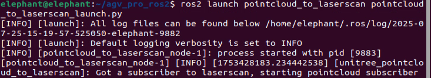

- 在`~/agv_pro_ros2/`下打开第四个终端：

```bash
source ./install/setup.bash
ros2 launch agv_pro_navigation2 navigation2_active.launch.py
# 导航节点
``` 

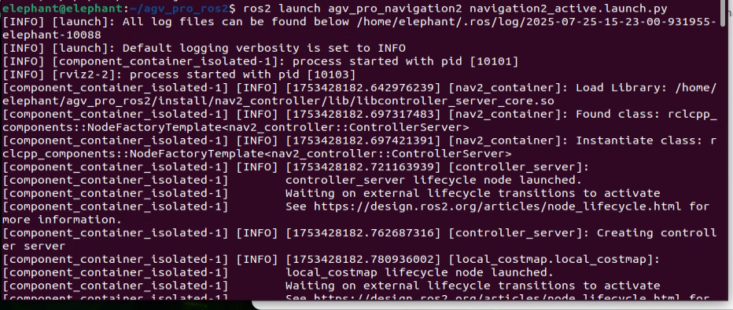


这个节点运行后，会打开rviz2并加载好导航相关内容，看到类似如下画面即表明导航功能已准备就绪。

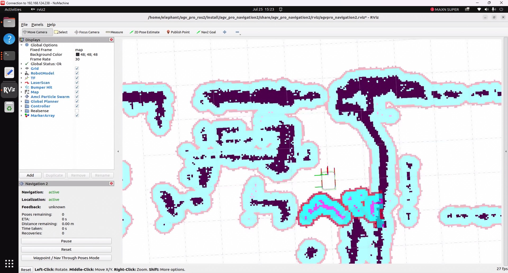

导航功能的使用与使用手册[6.2.3-Navigation2.md](6.2.3-Navigation2.md) 部分类似，可以参考相关内容进行操作。


[← 上一页](6.2.5-Gazebo.md) | 