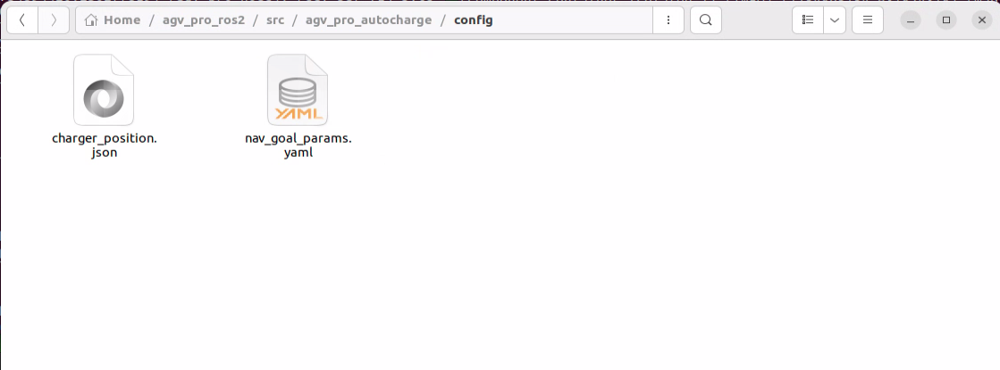
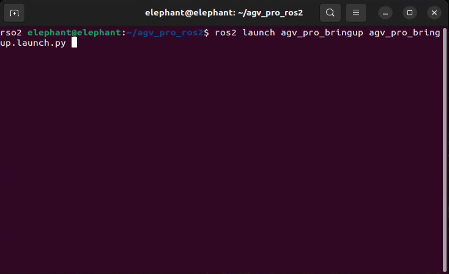
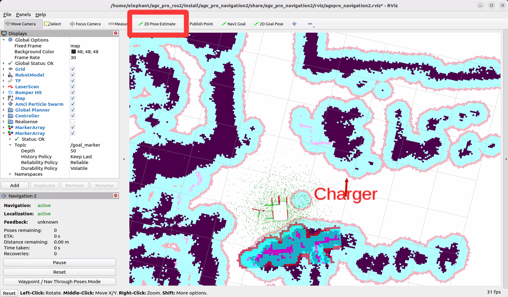
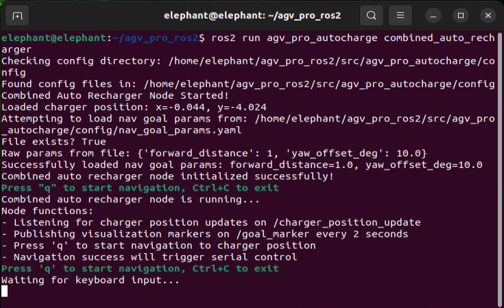
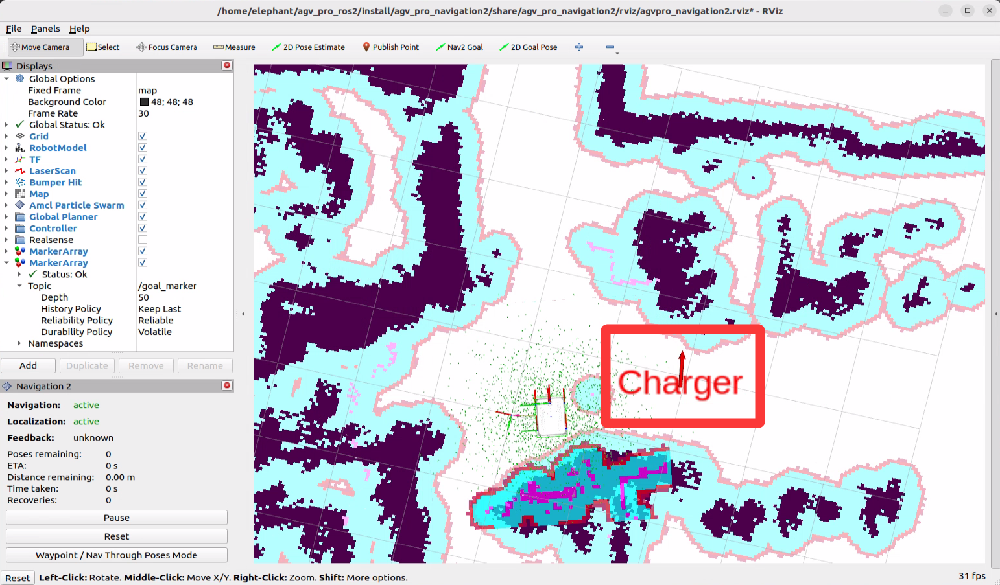
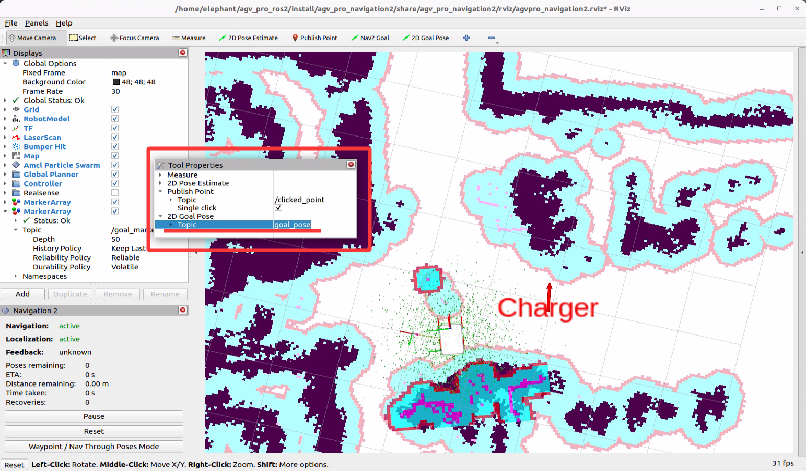

# AGVPRO自动回充导航功能使用手册

## 1.概述

AGVPRO的自动回充功能采用远距离NAV2导航＋近距离基于红外线收发传感器的串口控制实现AGVPRO自动导航至充电桩目标点并对接入充电桩充电口实现充电。

## 2.充电桩位置管理，NAV2导航相对位置设置

- 充电桩位置管理：充电桩位置保存至软件包目录的`config/charger_position.json`文件中，位置更新通过订阅`/charger_position_update`话题实现。

json文件中保存的位置信息为充电桩位置，最新的charger位置会持续发布到`/goal_marker`话题中并可视化，位置信息采用四元数表示如下：

```json
{
  "p_x": -0.04373347759246826,
  "p_y": -4.024151802062988,
  "orien_z": 0.09378381732290733,
  "orien_w": 0.9955925851513477
}
```

- NAV2导航位置设置：可以调整nav2导航的目标点相对于充电桩的位置及姿态，使小车到达目标位置及姿态后再转为串口控制。

- 导航点与充电桩的相对位置参数设置可以在config/nav_goal_params.yaml文件中进行配置，默认值如下：

```yaml
# 导航参数配置
forward_distance: 1  # 距离充电桩前方1米
yaw_offset_deg: 10.0   # 顺时针旋转10度
```



## 3.功能使用

- 1.打开第一个终端，运行如下指令启动小车底盘驱动

```bash
ros2 launch agv_pro_bringup agv_pro_bringup.launch.py 
```



- 2.打开第二个终端，运行如下指令驱动3D激光雷达

```bash
ros2 launch unitree_lidar_ros2 launch.py
```


- 3.打开第三个终端，运行如下指令转雷达点云信息为nav2导航所需的/laser_scan

```bash
ros2 launch pointcloud_to_laserscan pointcloud_to_laserscan.launch.py
```


- 4.打开第四个终端，运行如下指令启动导航节点

```bash
ros2 launch agv_pro_navigation2 navigation2_active.launch.py
```


运行此指令会打开rviz2，首先使用`2D Pose Estimate`调整小车rviz2中的初始位置至实际位置。



- 5.打开第五个终端，运行如下指令自动回充控制节点

```bash
ros2 run agv_pro_autocharge combined_auto_recharger
```



运行此指令后会看到充电桩的默认位置已经可视化到rviz2中。



注意：rviz2中会显示默认的充电桩位置，需要根据实际情况调整rviz2中的充电桩位置。具体操作方法如下：

首先在rviz2菜单栏找到`2D Goal Pose`工具,鼠标右键打开下拉菜单，选择`Tool Properties`打开自定义界面


在打开的自定义界面下，找到`2D Goal Pose`发布的Topic,默认发布话题为`/goal_pose`



- 通过修改此话题，手动输入`/charger_position_update`，再在rviz2地图中按`2D Goal Pose`布置箭头来发布话题（方法同`2D Pose Estimate`更新小车初始位置类似），这样便可以更新充电桩位置。


- 之后`charger`位置会更新至`2D Goal Pose`发布的位置，最新的充电桩位置`charger`会持续发布到`/goal_marker`话题中，rviz2会自动更新显示。


- 最新的充电桩位置会自动保存至json文件下，下次运行此程序会默认加载最后一次设置的位置。

再确定好充电桩位置及需要导航的相对位置后，就可以按下`q`开始自动回充。按下`q`键后小车会开始导航。


自动回充会经历两个过程：
1. 导航到充电桩位置。
2. 到达充电桩位置后，切换到串口控制对接充电桩。

同时终端输出如下：


小车完成自动回充，即车后方充电口与充电桩对接成功后，回充程序会自动退出。

[← 上一页](6.2.7-Real_Time_Mapping_with_FAST_LIO.md) 