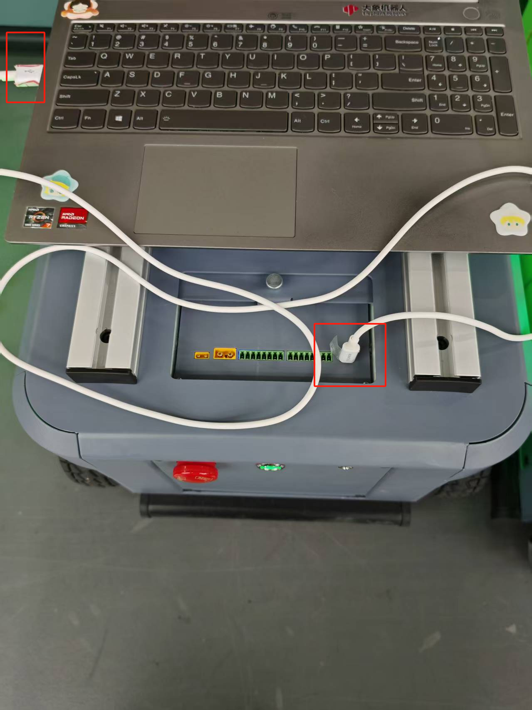

# 串口通信协议

## 1 支持机型
标配版、高配版MyAGVPro

## 2 USB通信设置
* 波特率: 1000000
* 数据位: 8
* 奇偶校验位: none
* 停止位: 1<br>
* 主线接口：

  标配版：PC与主控通信，USB Type-C连接PC与AGVPro，如下图所示：<br>
  
  高配版：Jetson Orin Nano与主控通信，无需额外接线<br>

通信频率：95%接口，串口通信频率100HZ<br>

## 3 协议的发送和接收格式
发送和接收都以十六进制表示。每条命令应包含 5 个部分，如下所示:<br>
1 帧头：0xFE 0xFE<br>
2 有效长度:固定为0x0B<br>
3 功能码：0 ~ 0x53<br>
4 数据位：固定8字节，不足补0<br>
5 帧尾： crc16-modbus，高字节在前<br>

## 4 协议解释
设置接口除启动机器外，默认返回1，byte1为1，表示接收到指令。<br>
| **类型** | **数据**    | **字节** | **功能**                     |
| :------- | :--------- | :------- | :--------------------------- |
| 指令框架 |  开始位：   0 | 1        | 起始帧识别，0XFE             |
|          | 开始位：   1 | 1        | 起始帧识别，0XFE             |
|          | 位数据长度 | 1        | 长度固定为8 |
|          | 指令位     | 1        | 取决于不同的命令             |
| 指令框架 | 数据       | 8     | 命令与数据，取决于不同的命令 |
| 结束框架 | 结束位：   0  | 1        | 停止位，crc16_modbus 高字节 |
|          | 结束位：  1  | 1        | 停止位，crc16_modbus 低字节 |

## 5 单一指令说明

### 启动机器
默认通电会自动启动机器，启动机器成功才可以控制AGVPro运动，未启动或者启动失败，可读取版本等信息。<br>
功能码：0x10<br>
示例:<br>
串口发送：byte1-8：0<br>
```
FE FE 0B 10 00 00 00 00 00 00 00 00 1A 45
```
串口返回：返回时间<=2.1s;状态位范围，1-5:<br>

* 1-正常
* 2-急停拍下
* 3-电量过低，低于正常启动值
* 4-can初始化异常
* 5-电机初始化异常<br>

启动成功：
```
FE FE 0B 10 01 00 00 00 00 00 00 00 D6 84
```
发送说明：<br>

| **数据域** | **说明**   | **数据** |
| :--------- | :--------- | :------- |
| Data[0]    | 识别帧     | 0XFE     |
| Data[1]    | 识别帧     | 0XFE     |
| Data[2]    | 数据长度帧 | 0X0B     |
| Data[3]    | 指令帧     | 0X10     |
| Data[4]    | 数据帧     | 0X00     |
| Data[5]    | 数据帧     | 0X00     |
| Data[6]    | 数据帧     | 0X00     |
| Data[7]    | 数据帧     | 0X00     |
| Data[8]    | 数据帧     | 0X00     |
| Data[9]    | 数据帧     | 0X00     |
| Data[10]    | 数据帧     | 0X00     |
| Data[11]    | 数据帧     | 0X00     |
| Data[12]    | 结束帧     | 0X1A    |
| Data[13]    | 结束帧     | 0X45     |

返回说明：<br>
| **数据域** | **说明**   | **数据** |
| :--------- | :--------- | :------- |
| Data[0]    | 识别帧     | 0XFE     |
| Data[1]    | 识别帧     | 0XFE     |
| Data[2]    | 数据长度帧 | 0X0B     |
| Data[3]    | 指令帧     | 0X10     |
| Data[4]    | 数据帧     | 0X01     |
| Data[5]    | 数据帧     | 0X00     |
| Data[6]    | 数据帧     | 0X00     |
| Data[7]    | 数据帧     | 0X00     |
| Data[8]    | 数据帧     | 0X00     |
| Data[9]    | 数据帧     | 0X00     |
| Data[10]    | 数据帧     | 0X00     |
| Data[11]    | 数据帧     | 0X00     |
| Data[12]    | 结束帧     | 0XD6     |
| Data[13]    | 结束帧     | 0X84     |


### 读取主版本号
功能码：0x02<br>
示例:<br>
串口发送：byte1-8：0<br>
```
FE FE 0B 02 00 00 00 00 00 00 00 00 BA 91 
```
串口返回：byte1：版本，需要/10<br>
``` 
FE FE 0B 02 10 00 00 00 00 00 00 00 B6 90
```
此返回，主版本为1.0<br>

### 读取机器状态
功能码：0x05<br>
示例:<br>
串口发送：byte1-8：0<br>
``` 
FE FE 0B 05 00 00 00 00 00 00 00 00 8A B7
```
串口返回：byte1：整机状态；byte2：电池电量，/10；byte3-8：0<br>
整机状态说明：bit0:急停、bit1未上电、bit2防撞条1、bit3防撞条2、bit4 1号电机连接状态、bit5 2号电机连接状态、bit6 3号电机连接状态、bit7 4号电机连接状态（0-正常）<br>
例如：
``` 
FE FE 0B 05 00 F0 00 00 00 00 00 00 85 47
```
此返回，1-4电机正常，电池电压24V<br>

### 机器仅通电
功能码：0x19<br>
仅通电状态下，机器无法运动，可使用接口：启动机器人、查询机器启动状态、读取主版本号、读取机器状态。<br>
示例:<br>
串口发送：byte1-8：0<br>
``` 
FE FE 0B 19 00 00 00 00 00 00 00 00 4A 2F 
```
串口返回：返回时间：<= 2.1s，byte1-8：0<br>
```
FE FE 0B 19 01 00 00 00 00 00 00 00 86 EE
```

### 关闭机器
功能码：0x11<br>
关闭机器后，可用功能与仅通电一致，轮子放松。<br>
示例:<br>
串口发送：byte1-8：0<br>
```
FE FE 0B 11 00 00 00 00 00 00 00 00 E7 1C 
```
串口返回：byte1-8：0<br>
```
FE FE 0B 11 01 00 00 00 00 00 00 00 46 89
```

### 查询机器启动状态
功能码：0x12<br>
示例:<br>
串口发送：byte1-8：0<br>
```
FE FE 0B 12 00 00 00 00 00 00 00 00 7A 5C 
```
串口返回：byte1： 状态0/1，0-启动失败，1-启动成功；byte2-8：0<br>
成功：
```
FE FE 0B 12 01 00 00 00 00 00 00 00 B6 9D
```

### 机器运动
功能码：0x21<br>
前进、后退、左平移、右平移、顺时针旋转、逆时针旋转。<br>
示例:<br>
串口发送：byte1-2：*100,前后，+前-后，1.5m/s，byte3-4：*100,左右，+左-右，1m/s，byte5-6：*100,旋转，+顺时针-逆时针，byte7-8：0<br>
1m/s前进：
```
FE FE 0B 21 00 64 00 00 00 00 00 00 4D 39 
```
0.5m/s右平移：
```
FE FE 0B 21 00 00 FF CE 00 00 00 00 54 61 
```
0.1m/s顺时针旋转：
```
FE FE 0B 21 00 00 00 00 00 0A 00 00 89 3C 
```
串口返回：byte1：1；byte2-8：0<br>
```
FE FE 0B 21 01 00 00 00 00 00 00 00 47 DD
```
数据位全部给0，可停止运动<br>

### 停止运动
功能码：0x22<br>
示例:<br>
串口发送：byte1-8：0<br>
```
FE FE 0B 22 00 00 00 00 00 00 00 00 7B 08 
```
串口返回：byte1：1；byte2-8：0<br>
```
FE FE 0B 22 01 00 00 00 00 00 00 00 B7 C9
```

### 设置自动上发状态
功能码：0x23<br>
示例:<br>
串口发送：byte1：状态0/1，0-关闭；1-开启，默认不开启；2-8：0<br>
开启自动上发：
```
FE FE 0B 23 01 00 00 00 00 00 00 00 27 C4
```
串口返回：byte1：1；byte2-8：0<br>
```
FE FE 0B 23 01 00 00 00 00 00 00 00 27 C4
```

### 获取自动上发状态
功能码：0x24<br>
示例:<br>
串口发送：byte1-8：0<br>
```
FE FE 0B 24 00 00 00 00 00 00 00 00 DB 23 
```
串口返回：byte1：0/1；byte2-8：0<br>
例如：
```
FE FE 0B 24 01 00 00 00 00 00 00 00 17 E2
```

### 自动上发内容说明
功能码：0x25<br>
自动上发频率：20HZ<br>
* byte1-3:线速度，/100<br>
* byte4：整机状态, bit0:急停、bit1未启动机器、bit2防撞条1、bit3防撞条2、bit4 1号电机连接状态、bit5 2号电机连接状态、bit6 3号电机连接状态、bit7 4号电机连接状态（0-正常）<br>
* byte5：电机报错，bit0-1号轮、bit1-2号轮、bit2-3号轮、bit3-4号轮（0-正常），当电机报错时可使用<br>
* byte6：电池电压 /10<br>
* byte7：使能状态，0-使能，如果有轮子掉使能，此状态位置为1<br>
* byte8：0<br>
串口返回例如：
```
FE FE 0B 25 00 00 00 00 00 D2 00 00 4B 2E
```
此返回，电机正常，电池电压21V<br>

### 设置电机使能状态
功能码：0x30<br>
示例:<br>
串口发送：byte1，ID,1-4/254,254表示所有；byte2，状态0/1，0-失能，1-使能；byte3-8：0<br>
1号轮使能：
```
FE FE 0B 30 01 01 00 00 00 00 00 00 D7 0D
```
所有轮子失能：
```
FE FE 0B 30 FE 00 00 00 00 00 00 00 13 52
```
串口返回：byte1：1；byte2-8：0<br>
```
FE FE 0B 30 01 00 00 00 00 00 00 00 17 1D
```

### 读取所有电机状态
功能码：0x31<br>
示例:<br>
串口发送：byte1-8：0<br>
```
FE FE 0B 31 00 00 00 00 00 00 00 00 4B D1
```
串口返回：byte1-4：1-4电机状态；byte2-8：0<br>
电机状态：0-正常；> 0 异常：<br>
* bit1 欠压
* bit2 驱动异常
* bit3 过温
* bit4：磁编码异常
* bit5：过载
* bit6：未标定
例如：
```
FE FE 0B 31 00 00 00 00 00 00 00 00 4B D1
```
此返回，1-4电机正常<br>

### 读取所有电机温度
功能码：0x35<br>
示例:<br>
串口发送：byte1-8：0<br>
```
FE FE 0B 35 00 00 00 00 00 00 00 00 8B E3
```
串口返回：byte1-8：4X2电机温度，/10<br>
例如：
```
FE FE 0B 35 01 2C 01 2C 01 2C 01 2C EA 9F
```
此返回，1-4电机温度：30°<br>

### 读取所有电机转速
功能码：0x36<br>
示例:<br>
串口发送：byte1-8：0<br>
```
FE FE 0B 36 00 00 00 00 00 00 00 00 7B F7
```
串口返回：byte1-8：4X2电机转速，/100，范围：+-44rad/s<br>
例如：
```
FE FE 0B 36 03 F4 03 F4 03 F4 03 F4 86 F3
```
此返回，1-4电机转速：10.12rad/s<br>

### 读取所有电机力矩
功能码：0x37<br>
示例:<br>
串口发送：byte1-8：0<br>
例如：
```
FE FE 0B 37 00 00 00 00 00 00 00 00 EB FA 
```
串口返回：byte1-8：4X2电机力矩，/100，范围：+-17N<br>
例如：
```
FE FE 0B 37 01 2C 01 2C 01 2C 01 2C 8A 86
```
此返回，1-4电机力矩：3N<br>

### 读取所有电机使能情况
功能码：0x38<br>
示例:<br>
串口发送：byte1-8：0<br>
```
FE FE 0B 38 00 00 00 00 00 00 00 00 1B BB
```
串口返回：byte1-4：4X1电机使能情况，0/1，0-失能，1-使能；byte5-8：0<br>
例如：
```
FE FE 0B 38 01 01 01 01 00 00 00 00 06 56
```

### 设置通信模式
功能码：0x32<br>
示例:<br>
串口发送：byte1：模式，0-2，默认0；byte2-8：0<br>
模式：0-串口，1-wifi，2-蓝牙；除串口模式外，其它模式切换后，此条语句无返回为正常现象。<br>
例如：
```
FE FE 0B 32 02 00 00 00 00 00 00 00 62 44 
```
串口返回：设置为蓝牙模式，先返回ASCII码蓝牙地址，ASCII码，帧头：“AGVPro:BLE:MAC:”；帧尾：“;\r\n”<br>
例如：
```
AGVPro:BLE:MAC:0c:8b:95:bd:0a:ce;\r\n
```

### 读取通信模式
功能码：0x33<br>
示例:<br>
串口发送：byte1-8：0<br>
```
FE FE 0B 33 00 00 00 00 00 00 00 00 2B C8 
```
串口返回：byte1：模式，0-2；byte2-8：0<br>
例如：
```
FE FE 0B 33 01 00 00 00 00 00 00 00 E7 09
```

### DIY灯带
可设置左右灯带的颜色、亮度。<br>
功能码：0x34<br>
示例:<br>
串口发送：byte1：左/右灯带；byte2：亮度，0-255；byte3-5：RGB;byte6-8:0<br>
例如：
```
FE FE 0B 34 01 FA FF 00 00 00 00 00 D7 61
```
串口返回：byte1：模式，0-2；byte2-8：0<br>
例如：
```
FE FE 0B 34 01 00 00 00 00 00 00 00 D7 2F
```

### 设置灯带模式
功能码：0x3A<br>
示例:<br>
串口发送：byte1：模式，0/1，0-电量显示，1-DIY；byte2-8：0<br>
例如：
```
FE FE 0B 3A 01 00 00 00 00 00 00 00 B7 63
```
串口返回：byte1：1；byte2-8：0<br>
例如：
```
FE FE 0B 3A 01 00 00 00 00 00 00 00 B7 63
```

### 设置输出引脚状态
功能码：0x40<br>
示例:<br>
串口发送：byte1：引脚号，1-6；byte2：状态，0/1，1-高电平，0-低电平；byte3-8：0<br>
例如：
```
FE FE 0B 40 01 01 00 00 00 00 00 00 15 68 
```
串口返回：byte1：1；byte2-8：0<br>
例如：
```
FE FE 0B 40 01 00 00 00 00 00 00 00 D5 78
```

### 读取输入引脚状态
功能码：0x41<br>
示例:<br>
串口发送：byte1：引脚号，1-6/254,254-急停按钮；byte2-8：0<br>
例如：
```
FE FE 0B 41 01 00 00 00 00 00 00 00 45 75 
```
串口返回：引脚号，1-6；byte2：状态，0/1/255，255-不存在的引脚；byte3-8：0<br>
例如：
```
FE FE 0B 41 01 01 00 00 00 00 00 00 85 65
```

### 读取WIFI账号密码
功能码：0x50<br>
示例:<br>
串口发送：byte1-8：0<br>
```
FE FE 0B 50 00 00 00 00 00 00 00 00 D9 74 
```
串口返回：ASCII码，帧头：“AGVPro:WIFI:”；帧尾：“;\r\n”<br>
固定返回：
```
AGVPro:WIFI:S:ElephantAGVPro-AP2.4G;P:elephant;\r\n
```

### 读取WiFi ip、端口号
功能码：0x51<br>
示例:<br>
串口发送：byte1-8：0<br>
```
FE FE 0B 51 00 00 00 00 00 00 00 00 49 79 
```
串口返回：ASCII码，帧头：“AGVPro:WIFI:”；帧尾：“;\r\n”<br>
固定返回：
```
AGVPro:WIFI:IP:192.168.4.1;PORT:9000;\r\n
```

### 读取蓝牙名称、uuid
功能码：0x52<br>
示例:<br>
串口发送：byte1-8：0<br>
```
FE FE 0B 52 00 00 00 00 00 00 00 00 B9 6D 
```
串口返回：ASCII码，帧头：“AGVPro:BLE::”；帧尾：“;\r\n”<br>
固定返回：
```
AGVPro:BLE::Name:BLE-Elephant-AGVPro;Service_UUID:9a95aa42-ba2f-4bd0-8296-73c0c89c0871;CHAR_UUID:d886e992-a18a-4dc3-9362-2fc15b4b576a;\r\n
```

### 读取蓝牙地址
功能码：0x53<br>
示例:<br>
串口发送：byte1-8：0<br>
```
FE FE 0B 53 00 00 00 00 00 00 00 00 29 60 
```
串口返回：ASCII码，帧头：“AGVPro:BLE:MAC:”；帧尾：“;\r\n”<br>
例如：
```
AGVPro:BLE:MAC:0c:8b:95:bd:0a:ce;\r\n
```
