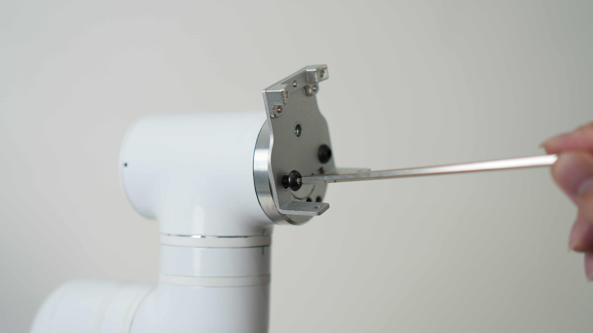
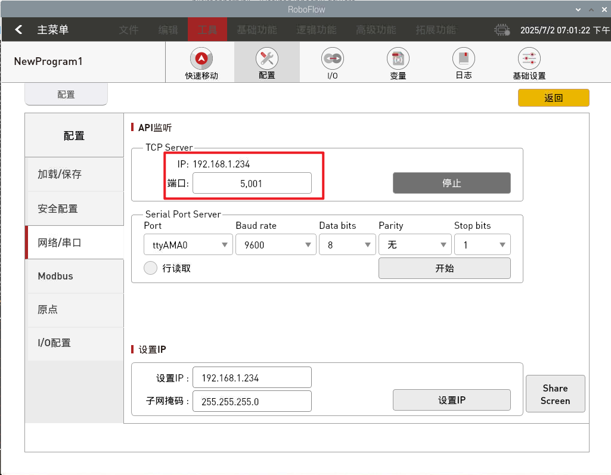

## MCU开门训练


## 1. 硬件部署

### 1.1 硬件清单

| 名称                   | 数量 | 备注 |
|----------------------|----|----|
| 外接固定板                | 2  |    |
| M5滑块螺母               | 8  |    |
| M5*10螺丝              | 8  |    |
| MyCobot Pro630       | 1  |    |
| MyCobot Pro630 电源适配器 | 1  |    |
| 移动电源                 | 1  |    |
| myAGV Pro 导航-视觉版	    | 1  |    |
| 无线手柄	                | 1  |    |
| USB线缆	               | 1  |    |
| 扳手工具	                | 1  |    |
| XT60转接线	             | 1  |    |
| 力控夹爪	                | 1  |    |
| 急停                   | 1  |    |

### 1.2 硬件连接

1. 使用M5*10螺丝将M5滑块螺母固定在外接固定板上
   

2. 将外接固定板连接到myAGVPro上的2040型材
   

3. 将MyCobot Pro630底座与外接固定板上的螺丝孔位对齐
   

4. 将MyCobot Pro630固定在外接固定板上
   

5. 将力控夹爪固定到MyCobot Pro630的夹爪接口上
    1. 固定力控夹爪法兰与末端上
       
    2. 将力控夹爪和法兰连接
       
    3. 使用M8线与力控夹爪连接
       
    4. 将M8线与机械臂连接
       
    5. 成品如下图所示
       

6. 连接急停
   

7. 将电源线连接
   

8. 将移动电源固定在myAGVPro上的2040型材上
    1. 使用M5*10螺丝将M5滑块螺母固定在外接固定板上
       
    2. 将魔术贴分成三条，用于固定移动电源，将其闯入外接固定板的空洞中
       
    3. 将移动电源固定在固定板上
       
    4. 将固定好的移动电源固定在2040型材上
       
    5. 整理线序, 将机械臂电源适配器插头与移动电源连接
       

9. 至此，MyCobot Pro630与myAGV Pro硬件连接完成, 成品如下所示:
   

## 2. 软件部署

### 2.1 MyCobot Pro630使用

请访问[基础功能使用](https://docs.elephantrobotics.com/docs/pro630-cn/5-BasicApplication/5-BasicApplication.html)进行学习

### 2.2 myAGVPro固件烧录

通过访问myAGVPro[如何刻录固件](../5-BasicApplication/5.3-FirmwareUse/5.3.2-HowToBurnFirmware.md)章节进行烧录固件

## 3. 源码下载

将MyCobot Pro630MCU开门训练手柄控制案例源码下载到本地

### 3.1 下载源码

1. 使用git工具将源码下载到本地
   ```shell
   git clone https://github.com/elephantrobotics/pymycobot.git
   ````
2. 使用浏览器访问网址下载源码压缩包
   

- 访问[https://github.com/elephantrobotics/pymycobot.git](https://github.com/elephantrobotics/pymycobot.git)
- 点击`Code`按钮
- 点击`Download ZIP`按钮
- 下载完成后解压到任意文件夹

### 3.2 进入`myAGVPro_Composite_Kit`目录

使用`cd`指令进入`pymycobot/demo/myAGVPro_Composite_Kit`目录下

```shell
cd pymycobot/demo/myAGVPro_Composite_Kit
```

### 3.3 下载依赖

使用`pip`指令下载依赖

```shell
pip install -r requirements.txt
```

### 3.4 修改配置

1. 打开`main.py`文件, 将`COMPOSITE_KIT_TYPE`的值修改成`MyCobotPro630`

    ```python
    ...
    # ##############################################################################################
    # Composite kit configuration
    # ##############################################################################################
    COMPOSITE_KIT_TYPE = "MyCobotPro630"  # MyCobotPro630, MyCobot320, MyArmM750, Undefined
    DEBUG = False
    ...
    ```

2. 配置`MyCobot Pro630`TCP IP和端口, 将`COMPOSITE_KIT_HOST`的修改成MyCobot Pro630的IP地址, 端口默认情况下为5001

   > *注意:* 本案例使用的是MyCobot Pro630远程控制功能, 主要注意以下问题:
   > 1. 确保MyCobot Pro630和myAGvPro在同一局域网下
   > 2. 确保MyCobot Pro630内的roboflow程序已经启动
   > 3. 确保MyCobot Pro630的IP地址和端口号正确

   ```python
   ...
   # ##############################################################################################
   # MyCobot Pro630 Configuration
   # ##############################################################################################
   COMPOSITE_KIT_HOST = "192.168.1.234"
   COMPOSITE_KIT_PORT = 5001
   ...
   ```

    - **如何获取MyCobot Pro630的IP地址**
        1. 可以通过在系统内使用`ip a`命令获取MyCobot Pro630的IP地址
      
           
      
        2. 可以通过roboflow程序获取
      
           

### 3.5 运行源码

使用`python`指令运行源码

```shell
python main.py
```

## 4. 快速体验

myAGVPro+MyCobotPro630手柄控制功能定义如下:


> **注意：** 在程序启动前需要先把手柄的接收器接入myAGV Pro的`USB`口, 程序启动后, 当手柄的接收器断开连接时, 程序会自动退出


