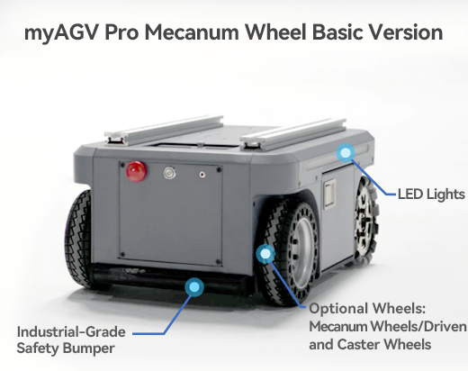

## 2.1 Basic Edition
 

| Parameter                | Details                                     |
|--------------------------|---------------------------------------------|
| Product dimensions       | 530*360*245mm                               |
| dead weight              | 40KG                                        |
| Maximum load             | 50KG                                        |
| Sport mode               | Omnidirectional/directional                 |
| Methods of Communication | RS232                                       |
| Speed (full load test)   | 1.5m/s                                      |
| Minimum turning radius   | 0m（Rotate in place）                         |
| Maximum climbing angle   | 10°                                         |
| battery	                 | 24V 20AH Lithium iron phosphate             |
| Battery life             | 5-6h（No-load 1ms condition）                 |
| Charging time            | 5-6h                                        |
| Suspension form          | The swing arm is independently suspended⽴悬挂 |
| Applicable venues        | indoors                                     |
| Ingress protection       | IP22                                        |
| Operating temperature    | -10-40℃                                     |
| External interfaces      | DC4017 charging port                        |
|                          | XT60 24V5A power supply port * 1            |
|                          | XT30 12V5A power supply port * 1            |
|                          | USB-C serial port * 1                       |
|                          | INPUT IO*6                                  |
|                          | OUTPUT IO*6                                 |
---

[← 产品特性页](/README.md) | [下一页 →](./2.2-VisualNavigationEdition.md)
