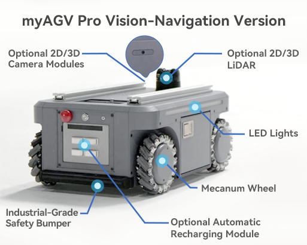

## 2.2 视觉-导航版

 

| Parameter                | Details                                   |
|--------------------------|-------------------------------------------|
| Product dimension	       | 530*360*245mm                             |
| dead weight              | 	40KG                                     |
| Maximum load             | 	50KG                                     |
| Sport mode	              | Omnidirectional system steering           |
| Methods of Communication | 	RS232                                    |
| Speed (full load test)   | 	1.5m/s                                   |
| Minimum turning radius	  | 0m（Rotate in place）                       |
| Maximum climbing angle   | 	10°                                      |
| battery                  | 24V 20AH Lithium iron phosphate           |
| Battery life             | 	5-6h（No-load 1ms condition）              |
| Charging time            | 	5-6h                                     |
| Suspension form          | 	The swing arm is independently suspended |
| Applicable venues        | 	indoors                                  |
| Ingress protection       | 	IP22                                     |
| Operating temperature    | 	-10-40℃                                  |
| External interfaces      | 	DC4017 charging port                     |
|                          | XT60 24V5A power supply port*1            |
|                          | XT30 12V5A power supply port*1            |
|                          | USB-C serial port*1                       |
|                          | Ethernet port*1                           |
|                          | HDMI*1                                    |
|                          | INPUT IO*6                                |
|                          | OUTPUT*6                                  |
|                          | USB3.0*2                                  |

### Description of external interfaces  

| Interface type         | specification               | Description of the function                                                                                                                                    |
|------------------------|-----------------------------|----------------------------------------------------------------------------------------------------------------------------------------------------------------|
| DC4017 charging port 	 | Diameter 4.0mm length 17mm	 | Connect the 25.55V 2.8A charging adapter to charge the 24V 20Ah lithium iron phosphate battery (red light = charging, green light solid on = fully charged).   |
| XT60 power supply port | 	24V 5A	                    | Provide stable DC power supply for external devices (such as myCobot320, mrArm M750, Mercury A1 robotic arm), and support a maximum power output of 120W.      |
| XT30 power supply port | 	12V 5A	                    | Powers low-voltage devices such as Jetson Orin Nano and is compatible with common 12V electronic modules.                                                      |
| USB-C serial port      | 	USB3.0	                    | High-speed data transmission, support light strip control command transmission, sensor data acquisition (such as camera Radar)                                 |
| Ethernet port（RJ45）    | 	Gigabit Ethernet	          | High-speed network communication for visual radar data transmission (e.g. 2D3D camera images, point cloud data), remote monitoring or ROS node interconnection |
| HDMI                   | 	Standard HDMI port         | Output debugging screen (such as real-time system image) to support real-time monitoring of external monitors.                                                 |
| INPUT IO               | 	6 digital inputs	          | Reception of external signals (e.g. safety light curtain trigger signals)                                                                                      |
| OUTPUT                 | 	6 digital outputs	         | Control of external devices (e.g. indicators, buzzers, relays)                                                                                                 |
| USB3.0 	               | 2 standard interfaces	      | Expand high-speed peripherals (such as 3D cameras and solid-state drives) to meet the needs of large-capacity data storage and real-time transmission.         |

---

[← Previous Page](2.1-BasicEdition.md) | [Next Page →](2.3-StructuralDrawing.md)
