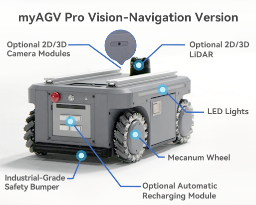
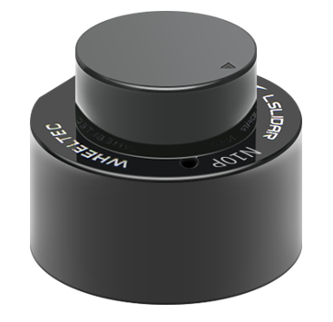
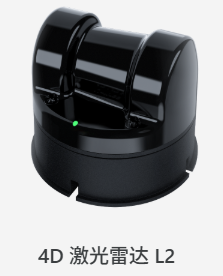

## 2.2 Visual-Navigation Edition

| Parameter Category | Details                                                                                         |
|-------------------|------------------------------------------------------------------------------------------------|
| Product Dimensions | 530*360*245mm                                                                                 |
| Weight            | 40KG                                                                                           |
| Maximum Load      | 50KG                                                                                           |
| Motion Mode       | Omnidirectional System Steering                                                               |
| Communication     | RS232                                                                                          |
| Speed (Full Load Test) | 1.5m/s                                                                                    |
| Minimum Turning Radius | 0m (In-place rotation)                                                                   |
| Maximum Climbing Angle | 10°                                                                                       |
| Battery           | 24V 20AH Lithium Iron Phosphate                                                               |
| Operating Time    | 5-6h (No load, 1m/s condition)                                                                |
| Charging Time     | 5-6h                                                                                           |
| Suspension Type   | Swing Arm Independent Suspension                                                               |
| Applicable Venue  | Indoor                                                                                         |
| Protection Level  | IP22                                                                                           |
| Operating Temperature | -10-40℃                                                                                   |
| External Interfaces | DC4017 charging port, XT60 24V5A power port*1, XT30 12V5A power port*1, USB-C serial port*1, Ethernet port*1, HDMI*1, INPUT IO*6, OUTPUT*6, USB3.0*2 |

### External Interface Description

| Interface Type    | Specifications      | Function Description                                                                                |
|-------------------|-------------------|------------------------------------------------------------------------------------------------------|
| DC4017 Charging Port | Diameter 4.0mm/Length 17mm | Connects 25.55V 2.8A charging adapter to charge 24V 20Ah lithium iron phosphate battery (Red light = charging, Green light on = fully charged). |
| XT60 Power Port   | 24V 5A           | Provides stable DC power for external devices (such as myCobot320, mrArm M750, Mercury A1 robotic arms), supports maximum 120W power output. |
| XT30 Power Port   | 12V 5A           | Powers low-voltage devices (such as Jetson Orin Nano), compatible with common 12V electronic modules. |
| USB-C Serial Port | USB3.0 Protocol   | High-speed data transmission, supports LED strip control command sending, sensor data collection (such as camera/Radar) |
| Ethernet Port (RJ45) | Gigabit Ethernet | High-speed network communication for vision/radar data transmission (such as 2D/3D camera images, point cloud data), remote monitoring or ROS node interconnection |
| HDMI              | Standard HDMI Interface | Outputs debugging images (such as system real-time images), supports external monitor real-time monitoring. |
| INPUT IO          | 6-channel Digital Input | Receives external signals (such as safety light curtain trigger signals) |
| OUTPUT            | 6-channel Digital Output | Controls external devices (such as indicator lights, buzzers, relays) |
| USB3.0            | 2 Standard Interfaces | Expands high-speed peripherals (such as 3D cameras, solid-state drives), meets large-capacity data storage and real-time transmission needs. |

---

### LiDAR and Camera Product Specifications (Optional)

### N10 Plus LiDAR Technical Specifications (Optional)

| Parameter | Specification |
|-----------|---------------|
| Model | N10 Plus |
| Type | Short Range |
| Scanning Angle | 360° |
| Emission Frequency | 5.4KHz |
| Angular Resolution | 0.4° ~0.8° |
| Scanning Frequency | 6Hz~12Hz |
| Measurement Accuracy | ±3cm@70% |
| Light Source | 905nm Laser |
| Range | 0m~15m@70% |
| Data Content | Angle, Distance, Intensity |
| Power Supply | 5VDC (4.75V~5.25V) |
| Environmental Temperature | Operating: -10℃~40℃, Storage: -30℃~70℃ |
| Anti-ambient Light | >60K Lux |
| Drive Method | Built-in Brushless Motor |
| Communication Interface | Standard Asynchronous Serial Port (Baud rate: 460800 bps) |
| Dimensions | Φ52*36.1mm |
| Weight | Approximately 60g |
| Protection Level | IPX-4 |
| Echo Count | Supports Dual Echo |
---

### Unilidar_L2 LiDAR Technical Specifications (Optional)

| Parameter | Specification |
|-----------|---------------|
| Model | L2 |
| Laser Class | 905nm |
| Eye Safety Class | Class 1(IEC60825-1:2014) Eye Safe |
| Maximum Range | 30M (@90% reflectivity) 15M (@10% reflectivity) |
| Distance Accuracy | 0.05m |
| FOV | 360°*90°/360°*30° configurable |
| System Frequency | 128000 points/second |
| Effective Frequency | 64000 points/second |
| Scanning Method | Wireless Coil Brushless Rotating Scan |
| 4D Information | 3D coordinates + 10 Reflection Intensity Information |
| High Frequency Clock Frequency | 5.5GHz Tunable System |
| Emission Clock Frequency | - MHz |
| Communication Interface | ENET UDP/TCP TL UART |
| Communication Baud Rate | 4000000 bps(TTL UART) |
| Ranging Accuracy | ±2.5cm |
| Angular Resolution | 0.2° |
| Distance Resolution | 4.5mm |
| IMU Sampling Rate | 1KHz |
| IMU Reporting Frequency | 500Hz |
| IMU Drive Frequency | 3-axis Gyroscope + 3-axis Accelerometer |
| LED Light Control Frequency | 60° |
| LED Ring Frequency | 5.5GHz |
| Anti-strong Light Capability | 100KLux |
| Operating Temperature | -10°C~50°C |
| Storage Temperature | -20°C~60°C |
| Protection Level | IP54 |
| Power | 10W (Ambient temperature 25°C) |
| Operating Voltage | 12V DC |
| Dimensions | 75 (diameter) ×75 (height) ×63 (width) mm |
| Weight | 235g |
---

# Monocular Camera Technical Specifications (Optional)

| Items | Parameters |
|-------|------------|
| Image Sensor | 1/4 inch cmos |
| Image pixels | 5 megapixels |
| Object Size | 1.5m 1.1-4m |
| Video output | MJPG/YUY2 |
| Focus | Fixed Focus |
| Lens Type | Low Distortion Lens, Parallel Light Lens, Fixed Focus |
| Field of view | - |
| Lens pixel current | <10 uA |
| working current | <360 mA |
| Storage Temperature | -20℃ to +75℃ |
| Working Temperature | -20℃ to +70℃ |
| SNR max | >40dB |
| White balance | auto, manual |
| camera control | Brightness, Saturation, Contrast, Sharpening, Tone, Clarity, Gamma, Backlight Compensation |
| exposure | auto, manual |
| Digital interface | 4-pin 2.0 spacing (2.0mm Spacing/4-pin pitch) |
| Data transfer rates | 480Mb/S |
| Operating voltage | DC5V |
| Disconnect | USB2.0 |
| system compatibility | Win XP, Win 7/8/10, EmbLinux, Android 2.2, iOS, Linux with UVC driver and other systems |
| Warranty | 1 years |
| MJPG Resolution | YUY Resolution |
| 2592@1944@30fps | 2592@1944@1fps |
| 2560@1440@30fps | 2560@1440@6fps |
| 2048@1536@30fps | 2048@1536@1fps |
| 1920@1080@30fps | 1920@1080@7fps |
| 1600@1200@30fps | 1600@1200@fps |
| 1280@960@30fps | 1280@960@1fps |
| 1280@720@30fps | 1280@720@1fps |
| 1024@768@30fps | 1024@768@10fps |
| 800@600@30fps | 800@600@10fps |
| 640@360@30fps | 640@360@30fps |
| 640@480@30fps | 640@480@30fps |
| 352@288@30fps | 352@288@30fps |
| 320@240@30fps | 320@240@30fps |
| 176@144@30fps | 176@144@30fps |
---

# Gemini 2 Camera Technical Specifications (Optional)

| Parameter Category | Parameter Name | Gemini 2 |
|--------------------|----------------|----------|
| **Basic Parameters** | Name | Gemini 2 |
| | Application Scenario | Indoor/Semi-outdoor |
| | Depth Measurement Range | 0.15m ~ 10m |
| | Ideal Working Range | 0.2m ~ 5m |
| | Camera Driver | UVC |
| | SDK | Orbbec SDK |
| | Camera Principle | Active Binocular Structured Light |
| | Baseline | 50mm |
| **Depth Parameters** | Depth Measurement Accuracy@2m | < 2% (1280 x 800 @ 2m & 81% ROI) |
| | Depth Working Mode | Unbinned Dense Default - High depth density Unbinned Sparse Default - Balanced depth density and power consumption Binned Sparse Default - Low power, low latency, high frame rate |
| | Depth Image Resolution@Frame Rate | 1280 x 800@30fps 640 x 400@60fps |
| | Depth FOV | H91°/ V66°/ D101° ± 3° @2m |
| | Depth Sensor Technology | Global Shutter |
| **Infrared Parameters** | Infrared Camera Resolution@Frame Rate | 1280 x 800@30fps 640 x 400@60fps |
| | Infrared Image FOV | H94°/ V68°/ D104° ± 3° |
| **Color Parameters** | Color Image Resolution@Frame Rate | 1920 x 1080@30fps 1280 x 720@60fps 640 x 360@60fps 640 x 360@60fps |
| | Color Image FOV | 16:9 H86°/ V55°/ D94° ± 3° 4:3 H63°/ V50°/ D75 ± 3° |
| | Color Sensor Technology | Rolling Shutter |
| **Functional Parameters** | D2C Post-Depth Image FOV | 16:9 H86°/ V55°/ D94±3° @2m 4:3 H63°/ V50°/ D75±3° @2m |
| | LDP | Support 9440nm Measurement distance: 1mm ~ 4000mm |
| | IMU | 6-axis Three-axis Gyro Acceleration + Three-axis Angular Velocity |
| | IR Pattern AE Function | Support |
| | UVC | Support |
| | RGB Function | Support |
| **Electrical Parameters** | Data Transfer Interface | USB 3.0 & USB 2.0 |
| | Power Consumption | Typical average< 2.5W Peak average< 2.5W Maximum peak< 7.0W |
| | Supply Voltage | DC 5V ±1.5A |
| | Operating Temperature | 0℃ ~ 40℃ |
| | Operating Humidity | < 95 %RH (Non-condensing) |
| | Storage Temperature | -20℃ ~ 60℃ |
| **Physical Parameters** | Multifunctional SB Interface | 8-Pin |
| | Data and Power Interface | Type-C |
| | Camera Dimensions | L90 x W25 x D30 mm ± 0.5mm |
| | Device Weight | 97g ± 3g |
| | Waterproof and Dustproof | Basic Dust Protection |
| | Camera Mounting Method | Bottom mount: 1 x 1/4-20unc screw hole Back mount: 2 x M3 screw holes |
| **Others** | Warranty | Overall Heat Dissipation |
| | Certification | Class 1, RoHS, FCC, CE, Reach, KC |
| | Service Life | 3 years |
---

[← 上一页](2.1-BasicEdition.md) | [下一页 →](2.3-StructuralDrawing.md)
