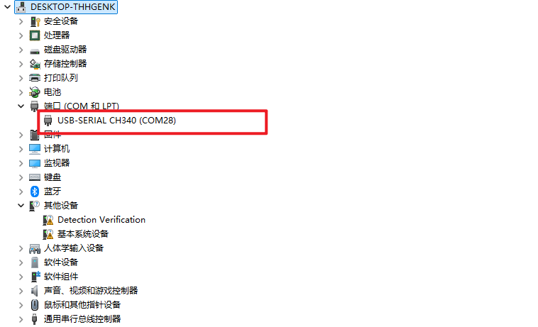

## 4.1 Basic Edition
### 4.1.1 Bill of Materials:
|            Name            | Quantity |
|:--------------------------:|:--------:|
| myAGV Pro Complete Machine |    1     |
|    Wireless Controller     |    1     |
|         USB Cable          |    1     |
|        Wrench Tool         |    1     |
|      Product Catalog       |    1     |

### 4.1.2 Quick Experience
You need to install the `python` environment on your computer and install the `pymycobot` library. For installation methods, please refer to [python installation and pymycobot](../6-SDKDevelopment/6.1-ApplicationBasePython/README.md). After configuring the environment, you can perform the following steps:

1. Place `myAGV Pro` on a horizontal plane, open the emergency stop of `myAGV Pro`, press the power button, and start `myAGV Pro`

2. Use the `TYPE-C` cable to connect `myAGV Pro` and Windows
 

3. Open the PC's device manager and find the `USB` device of `myAGV Pro`


4. Create a new `example.py` file in any directory of Windows and enter the following code
    ```python
   import time
   from pymycobot import MyAGVPro
     
     
   def main():
       agv = MyAGVPro(port="COM28", baudrate=1000000, debug=True)
       if agv.is_power_on() != 1:
             agv.power_on()
     
       agv.move_forward(0.1)
       time.sleep(2)
       agv.stop()
     
       agv.move_backward(0.1)
       time.sleep(2)
       agv.stop()
     
       agv.turn_left(0.1)
       time.sleep(2)
       agv.stop()
       time.sleep(1)
       
       agv.turn_right(0.2)
       time.sleep(2)
       agv.stop()
     
     
   if __name__ == '__main__':
       main()
    ```

5. Execute `python example.py` in the command line, and you can see `myAGV Pro` start to move

---

[← First Installation Page](README.md) | [Next Page →](4.2-NavigationVisualEdition.md)
