## System basic function description

### Robot system introduction

- **System introduction**

  - Ubuntu is the most widely used Linux operating system in personal desktop operating systems. For beginners, it is a good choice to be familiar with the Linux environment or some embedded hardware operating systems. The robot system here uses **Jetson Orin Nano Ubuntu 22.04 aarch64** system

<!-- 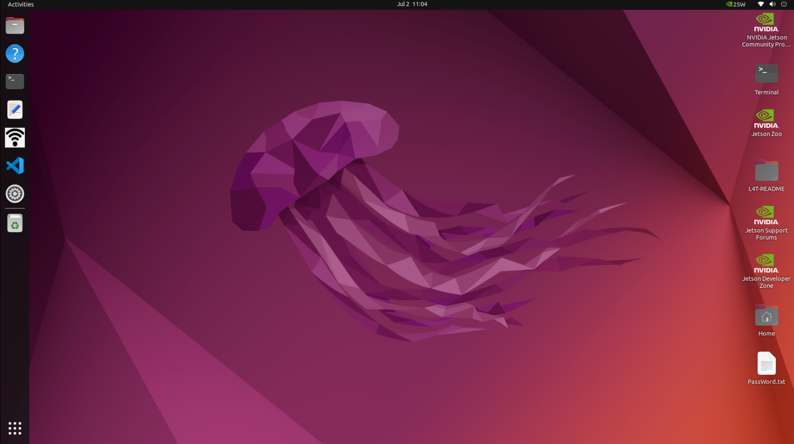 -->

  

- **System function introduction**

  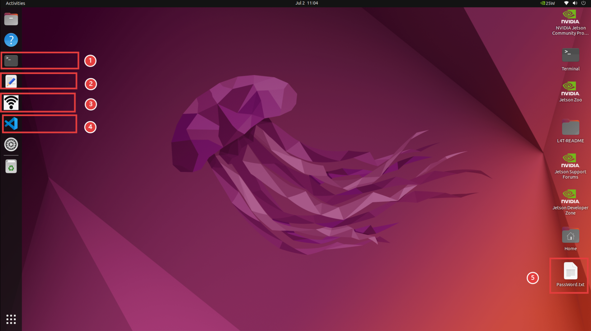

  - **①**: System console terminal, used for related command input.

  - **②**: Ordinary text editor.

  - **③**: WiFi-hotspot switch, click to turn on/off WiFi or hotspot function. After the hotspot is turned on, the name is **ElephantRobotics_AGVPro_AP_XXXX** (the hotspot function is enabled by default when the system is turned on)

  - **④**: `Visual Studio Code` IDE integrated development tool, used to edit text and code.

  - **⑤**: `PassWord.txt` system-related password instructions.

### System password description

- **Power-on account password & VNC connection password & SSH connection password & administrator account password & hotspot connection password**

  - Unified as: **Elephant**

- **How ​​to define a new password**

  - Change account password

    - Use the shortcut keys `ctrl + alt + T` to open the terminal

    - Enter `passwd` to modify the account password

    - Enter the new password twice

  - Change VNC connection password

    - Use the shortcut keys `ctrl + alt + T` to open the terminal

    - Enter `x11vnc -storepasswd` to modify the account password

    - Enter the new password twice

  - Change SSH connection password

    - The administrator account password is entered for SSH remote connection, and no separate modification is required

  - Change administrator account password

    - Use the shortcut keys `ctrl + alt + T` to open the terminal

    - Enter `sudo passwd` to modify the account password

    - Enter the new password twice
        

### VNC

- **VNC Function Introduction**

  - It is a remote control software, generally used to remotely solve computer problems or software debugging

- **VNC Port Description**

  - The robot arm and PC are connected to the same WiFi, the IP address of the robot arm is the port, and the default port is 5900

- **Connect VNC**

  - There are two ways to connect. The first way requires an external monitor to perform some operations on the system. The specific steps are as follows:

    First click the **"WiFi"** icon in the sidebar tool to turn off the default hotspot.

    

    Click on the upper right corner of the system

    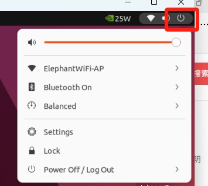

    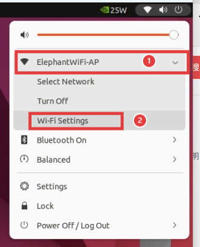

    Select **"Wi-Fi-Settings"** and wait for the currently available WiFi to be displayed

    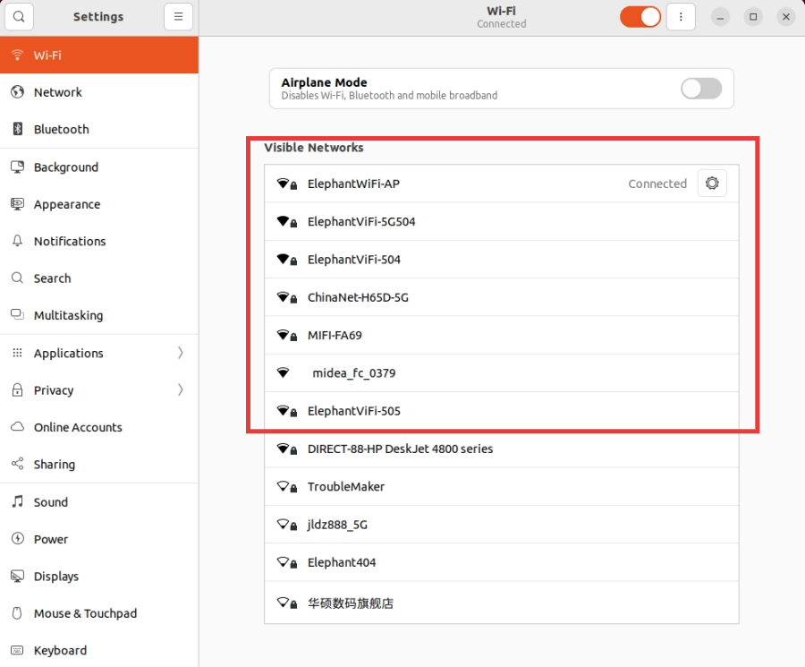

    Click on the WiFi you want to connect to and enter the WiFi password to connect.

    After the connection is successful, click **"Settings Icon"** to query the current IP address of the robot system

    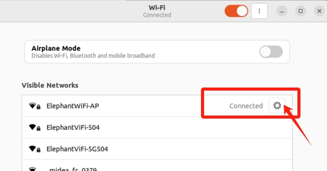

    As shown in the example, **"192.168.1.149"** is the current IP address of the robot system

    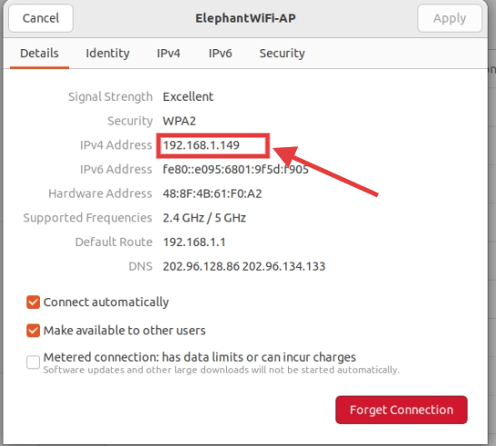

    Connect your computer and the robot system's WiFi to the same WiFi, open the VNC viewer software, enter this IP address (in the above case, enter **192.168.1.149**) and press Enter. The password is Elephant, and the user name is not filled in by default. The successful connection example is as follows:

    

  - The second method does not require connecting to a display, but requires connecting a virtual DP decoy to the HDMI port to avoid a black screen on the remotely connected desktop. Use a PC to connect to the Ubuntu system hotspot for remote control, but this connection method does not have the function of surfing the Internet, and can only remotely control the robot system. The specific steps are as follows:

    PC selects to connect to the Ubuntu system hotspot **ElephantRobotics_AGVPro_AP_XXXX**, and enters the password **Elephant**

    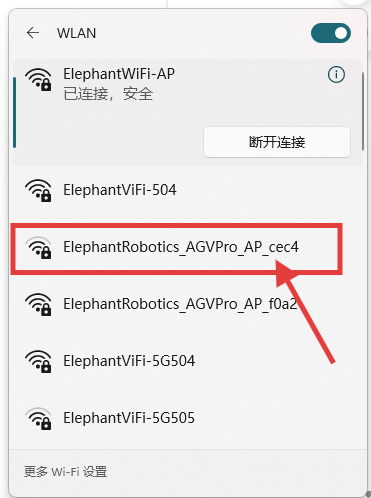

    Open the VNC viewer software, enter this IP address **10.42.0.1**, and then press Enter. The password is Elephant, and the user name is not filled in by default. The successful connection example is as follows:
      
      
  
- **How ​​to improve fluency**

  - The fluency of remote connection depends on the fluency of the connected WiFi. It is recommended to connect to a stable WiFi for remote control
  
  
### SSH

- **SSH 功能介绍**  
  
  - 简单说，SSH是一种网络协议，用于计算机之间的加密登录。如果一个用户从本地计算机，使用SSH协议登录另一台远程计算机，我们就可以认为，这种登录是安全的，即使被中途截获，密码也不会泄露。
  
- **SSH port description**

  - Default port 22, no need to change

- **SSH first connection**

  - Follow **VNC method** to confirm the robot system IP address

  - Press `win + R` on the PC to open the run interface, enter `cmd` in the input box

    

  - After entering, click Confirm to open the shell interface.
    
    

  - Enter `ssh elephant@IP address` and press Enter (the IP address is based on the robot system display, the picture is only an example)
    
    

  - Enter the password `Elephant`, (the password will not be displayed during the input process, just press Enter after entering)
    
    

  - As shown in the above picture, the remote SSH connection to the robot arm has been successfully completed

- **How ​​to improve the fluency**

  - The fluency of the remote connection depends on the fluency of the connected WiFi. It is recommended to connect to a stable WiFi for remote control
  
### System resolution switch

- Click the icon in the upper right corner of the screen, select **Settings**, and enter the system control panel

  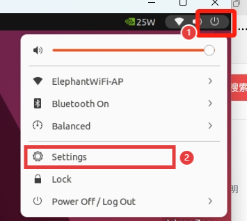

- Select **Displays** and enter the resolution selection page

  

- Switch to select resolution

  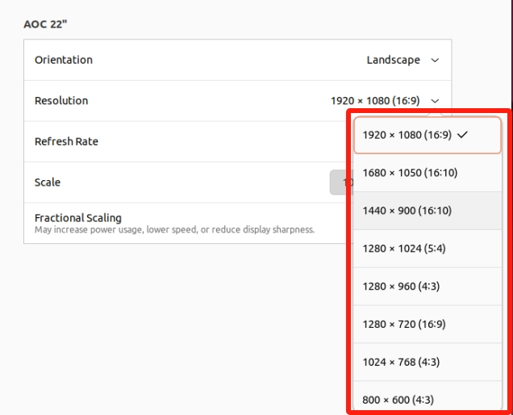

- Click **Apply** to view the display effect. If it meets the requirements, click **Keep Changes** 

  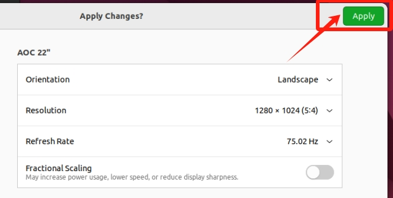 

  

### Python

- **Introduction to Python for the Robot System**

  **Python 3.10.12** is installed in the system, no need to install it yourself

  Python dependencies installed:

  | Package | Version|
  | :------: | :------: |
  | pymycobot | 3.9.9 |
  | pyserial | 3.5 |
  | esptool | 4.7.0|
  | ros2pkg | 0.18.12 |

- **First time using Python**
  
  Enter in the terminal

  ```python
  python3
  ```

  to enter the python compilation environment.

  The `>>> ` sign appears, which means you have entered the python environment.

  You can try this code in the input box:

  ```python
  print ("Hello World!")
  ```

  At this time, the terminal will respond with the words `Hello World`

  You can enter `pip list` in the terminal to view the existing python packages

- **Run the robot case code**

  For specific case codes, please refer to the Python chapter. Simply copy the code in the case and use it.

### ROS2

The system has a built-in installation of the **ROS2 Humble** version. You do not need to install it yourself. For specific case usage, please refer to the [ROS2 Development Chapter](../6-SDKDevelopment/6.2-ApplicationBaseROS2/6.2.1-ROS2_Introduction.md).

### Firmware burning

AGV Pro Advanced Edition has a built-in **firmware burning script**, which is used to update and burn the new version of the firmware. The burning method is as follows:

1. Open the `flash_agv_pro` folder.

    

2. Open the `agvpro_flash.py` script.

    

3. Edit the `agvpro_flash.py` script, replace the firmware script name here with the firmware script name to be updated, and save after modification.

    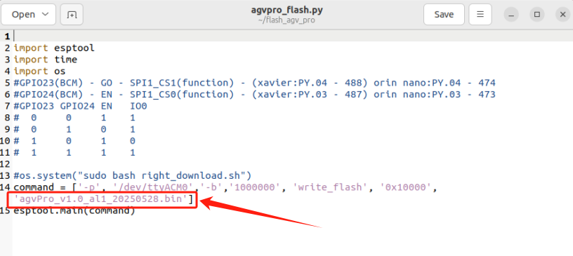

4. Use the shortcut keys `ctrl + alt + T` to open the terminal.

    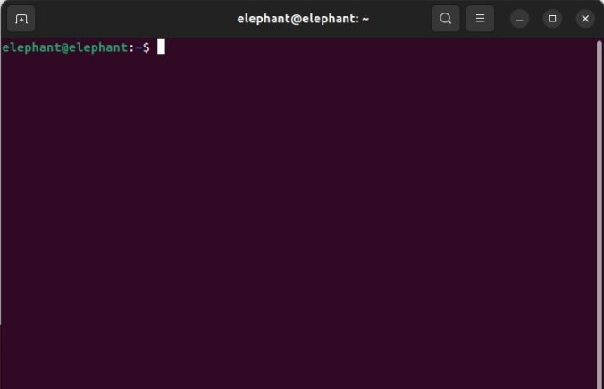

5. Enter the following command to execute the burning script.

    ```bash
    cd ~/flash_agv_pro/
    python3 agvpro_flash.py
    ```

    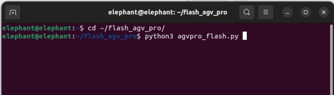