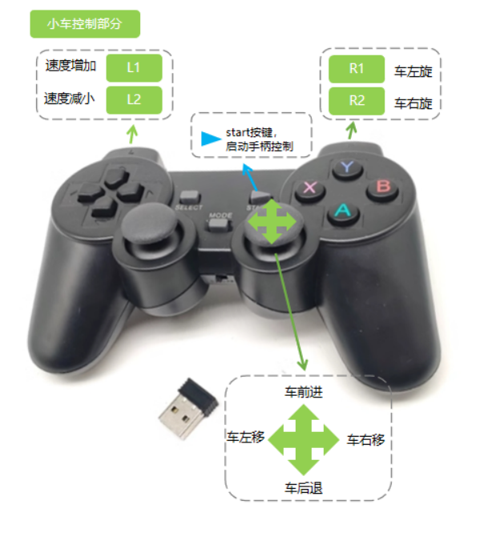
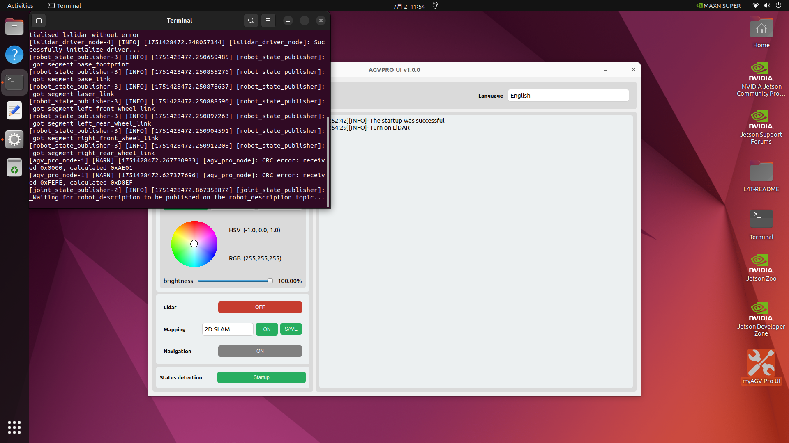
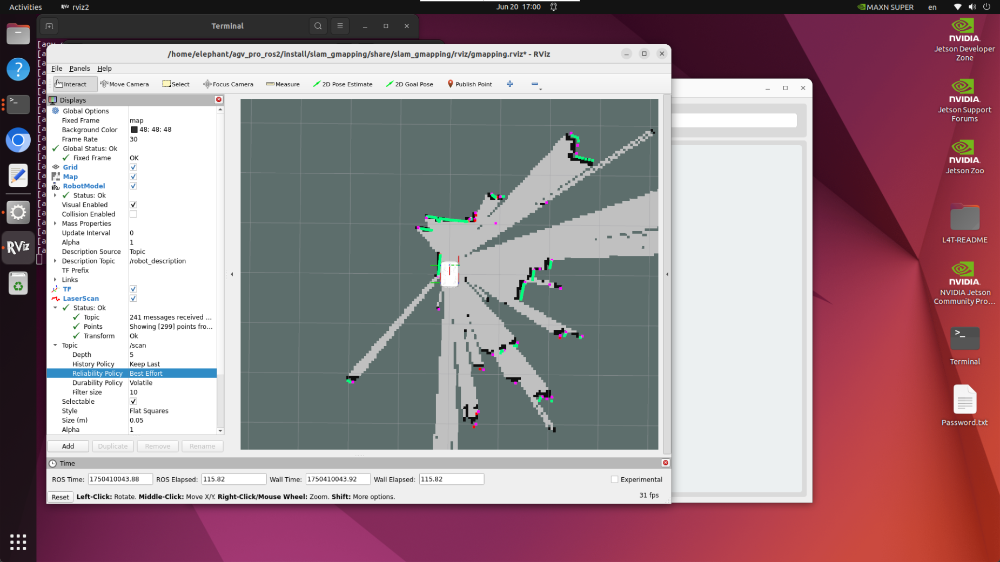
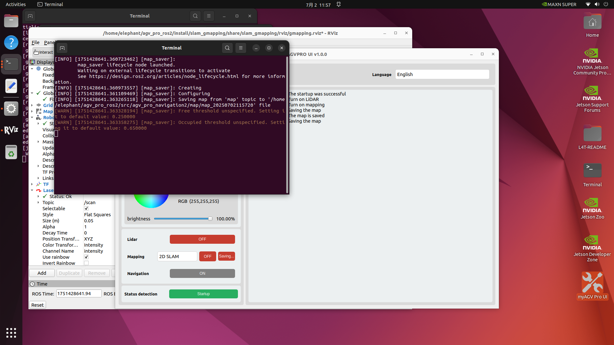
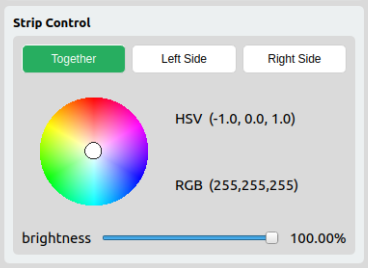

### 4.2.3 Quick Experience
AGVPRO_UI is a visual UI software, built into the jetson orin nano system, for customers to quickly experience myAGV Pro basic motor control, sensor control and other projects.

### 1. Battery Detection

When battery detection is turned on, the log bar displays the battery voltage and voltage percentage in real time every 1S.

### 2. Basic Control

Supports controlling the car to move by keyboard and handle.

#### 2.1 Keyboard Control

When `Keyboard Control` is selected, click the `ON` button to control the car to move by keyboard. The key functions are shown in the following table.

| Button | Direction                            |
|--------|--------------------------------------|
| i      | Move forward                         |
| ,      | Move backward                        |
| j      | Move left                            |
| i      | Move right                           |
| u      | Rotate counterclockwise              |
| o      | Rotate clockwise                     |
| k      | Stop                                 |
| m      | Rotate clockwise in reverse          |
| .      | Rotate counterclockwise in reverse   |
| q      | Increase linear and angular velocity |
| z      | Reduce linear and angular velocity   |

> Note: Currently only supports use when the laser radar is turned on. When the laser radar is turned off, it supports joystick control.

#### 2.2 Joystick control

When `joystick control` is selected, click the `ON` button to control the car to move with the joystick. The button functions are shown in the following table.

| Hotkey    | Direction           | Hotkey       | Direction                                                  |
|-----------|---------------------|--------------|------------------------------------------------------------|
| `L1`      | Increase speed      | `L2`         | Decrease speed                                             |
| `R1`      | Rotate the car left | `R2`         | Rotate the car right                                       |
| `Startup` | Reset the car       | `Joystick 2` | Control the car to move forward, backward, left, and right |

> Note: The reset button is used to restore the car speed. The car movement control is to press and move, and release to stop. It can only be used when the laser radar is turned off (use keyboard control when the laser radar is turned on). The handle supports the new Yabo handle, but not the old one.

### 3. 2D/3D Camera

Select 2D Camera or 3D Camera from the drop-down tab, and click the ON button to start the real-time camera screen of the corresponding camera

> Note: 3D camera needs to be connected to 3D camera, and 2D camera needs to be connected to 2D camera.

### 4. ROS2 Radar Mapping Navigation

#### 4.1 LiDAR:

Click the ON button to start the LiDAR odometer. Click the OFF button to turn off the LiDAR odometer.

#### 4.2 Lidar Mapping:

##### 4.2.1 2D Mapping:

When starting 2D mapping, you need to confirm whether the Lidar is started. If not, start the Lidar first. Select the `2D SLAM` mapping mode, click the `ON` button to start the 2D mapping RVIZ simulation interface, and you can control the car to build maps by turning on `Keyboard Control`.

##### 4.2.3 Save Mapping:
Click the `Save Map` button to save the current mapping data. The save path is `~/agv_pro_ros2/src/agv_pro_navigation2/map/`.
  

> Note: When saving the map, please make sure that the laser radar and mapping are started, otherwise the map cannot be saved.

#### 4.3 Radar navigation (not supported yet):
### 5. Light strip control

Control the light strips on both sides of the car in real time, adjust the color of the car by dragging the color wheel, and adjust the brightness of the light strips on both sides of the car by dragging the slider. The HSV/RGB color value of the current color is displayed in real time on the side.

### 6. Whole machine detection function

Click the ON button to start the whole machine detection function. The log bar prints the detection project information in real time. The main detection items are as follows:

1. Version reading

   1. System version

   2. Firmware version

   3. pymycobot version information

2. Motor status detection

   1. Read the motor enable status 

   2. Read the current communication mode

   3. Read the current motor temperature

   4. Read the current motor torque

   5. Read the current motor suspension forward speed change low, medium and high speed information

3. Anti-collision bar status detection (not supported yet)

4. Emergency stop status detection

> Real-time reading of the emergency stop status, display the emergency stop status information when the emergency stop status is switched

> Note: Before starting the whole machine detection function, please let the four wheels of the car hang in the air to avoid accidents.

### 7. Multi-language
Click the `Language` option box to switch the language. Currently Chinese and English are supported.

---

[← Previous page](4.2.2-SystemIntroduction.md) | [Next page →](../5-BasicApplication/README.md)
