# System image update instructions

>> **Note**: **Image update requires disassembling the system main control board inside the machine and taking out the SSD solid state drive on the back of the system main control board for update. Please do not disassemble the machine to update the image by yourself unless under special circumstances! ! !**

>> 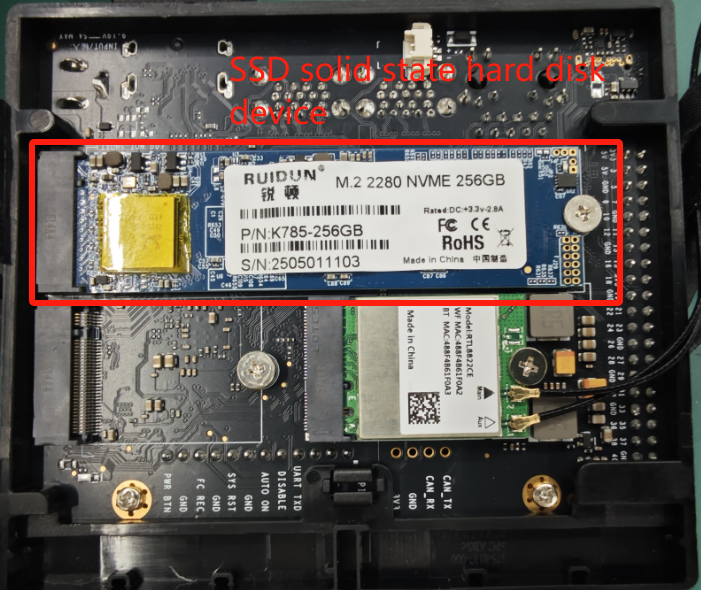

Here is mainly the method of burning the update image.

## 1 Image download address

[Click to download>>](https://download.elephantrobotics.com/Product_software/iMage-ISO/myAGV%20Pro/myAGVPro_v1.0.0_250624.zip)

## 2 Image burning steps

**Equipment environment**: PC Window system, SSD solid state drive device, USB Type-C cable, SSD adapter (M.2 NVMe solid state drive box)

1. Install the formatting software `DiskGenius`, [Click to download and install>>](https://www.diskgenius.com/dyna_download/?software=DGEngSetup6011645.exe)

2. Connect the SSD on the system main control board to the computer through the adapter. After connecting to the computer, many pop-up windows requiring formatting may appear. Cancel all of them.

3. Open the DiskGenius software, find the SSD device (the default size is 238G), right-click the mouse, and select "Delete all partitions"

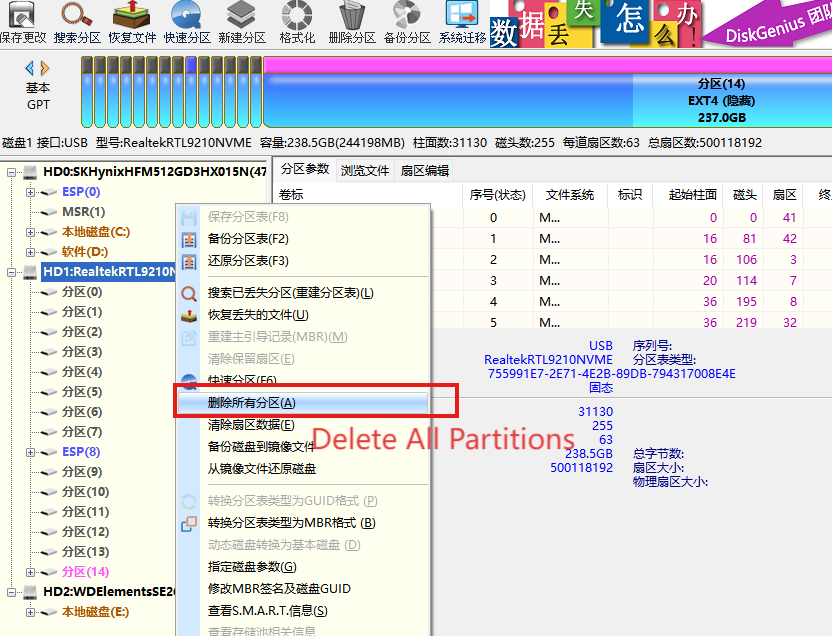

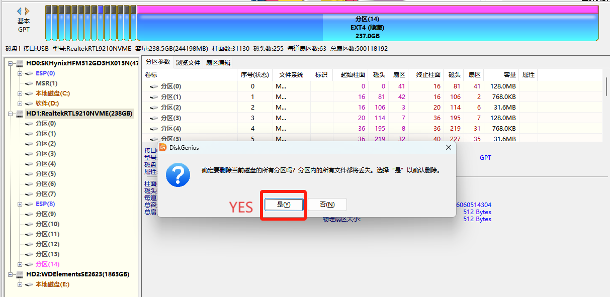

4. After deleting all partitions, select the SSD device (default is 238G) and click `Create New Partition`

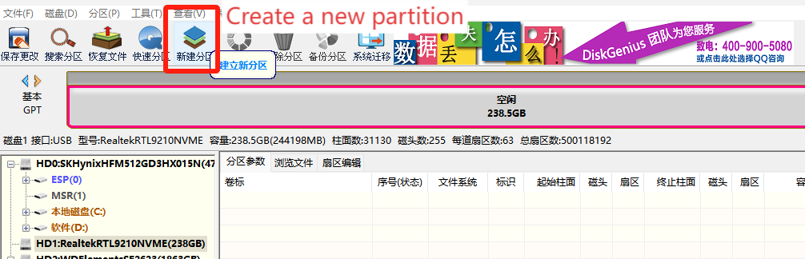

Default is OK, click "Cancel"

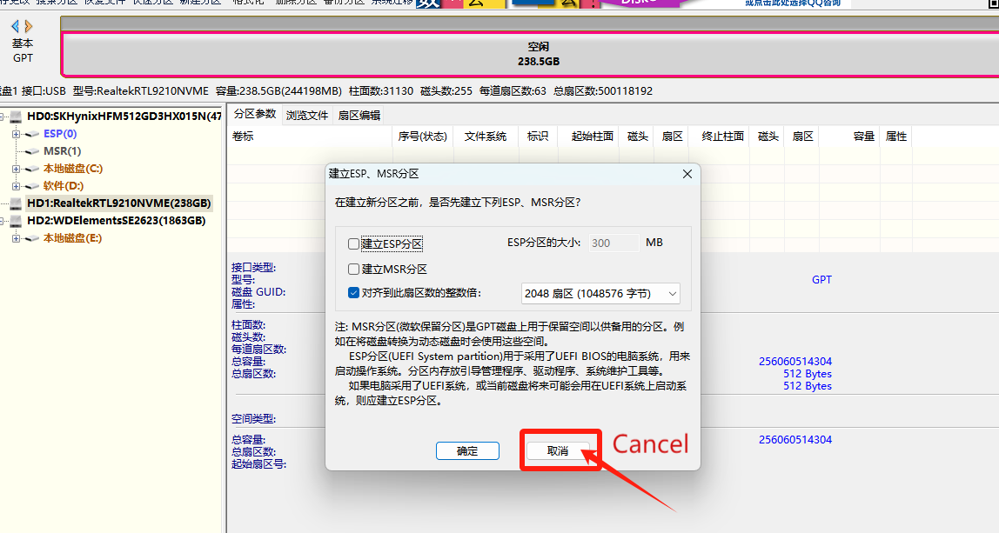

Default is OK, do not modify anything, click "OK"

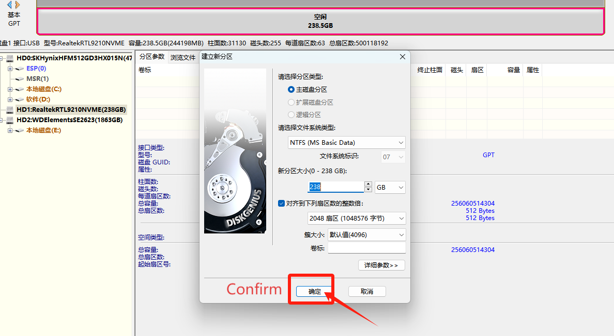

5. Also select the SSD device (default 238G), click "Save Changes"

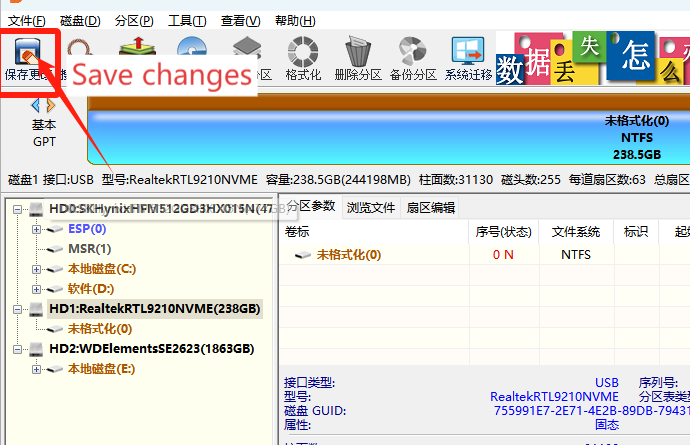

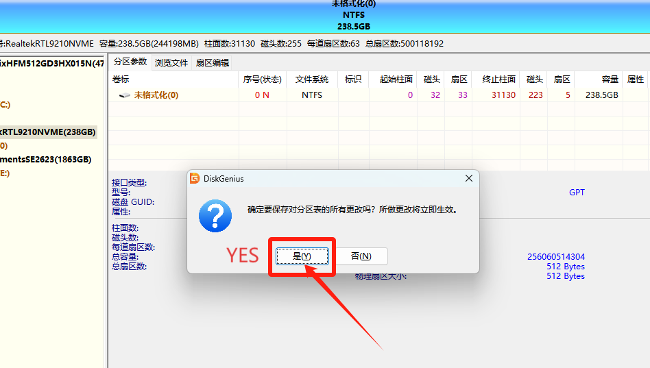

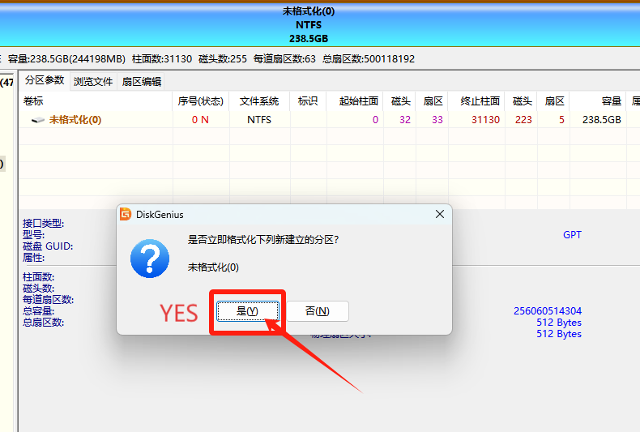

6. Wait for the above steps to complete, and formatting is complete.

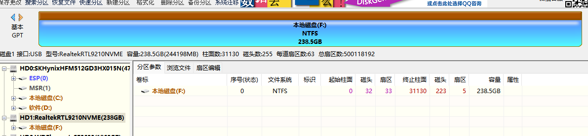

7. Install the burning tool: `balenaEtcher`, [Click to download and install>>](https://github.com/balena-io/etcher/releases/download/v2.1.2/balenaEtcher-2.1.2.Setup.exe)

8. Start burning, open the burning tool - balenaEtcher, select the `Flash from file` image file and select the corresponding system image file

9. Select the target disk, which is the SSD disk that you just formatted

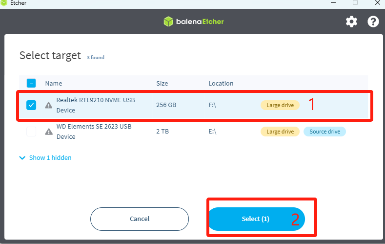

10. Select `Flash!`

11. Wait for the burning progress to 100% and it will prompt that the burning is complete. Then install the SSD back to the main control board.

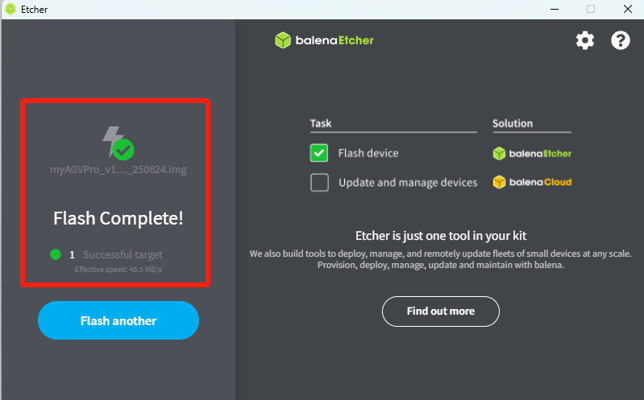

## 3 Verify the image

After burning the image to the NVME solid-state drive (SSD device), install it back to the main control board, connect the HDMI display, connect the development board power adapter (19V power supply), and then boot up. After successful booting, the system desktop is as follows:

If you want to verify the system version number, you can open a console terminal and execute the command: cat /etc/version. The terminal will output the system version number, for example: v1.0.0_250624
