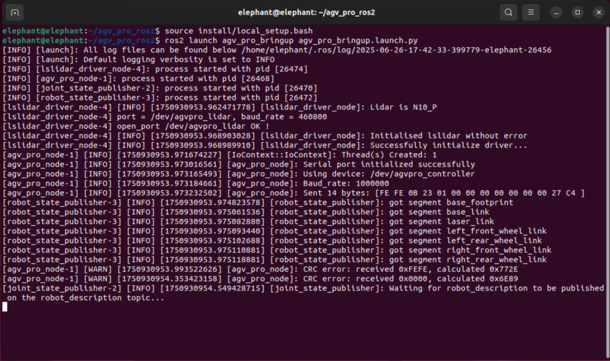
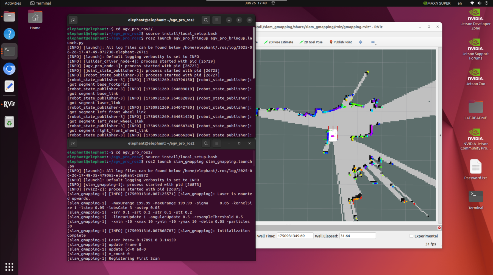
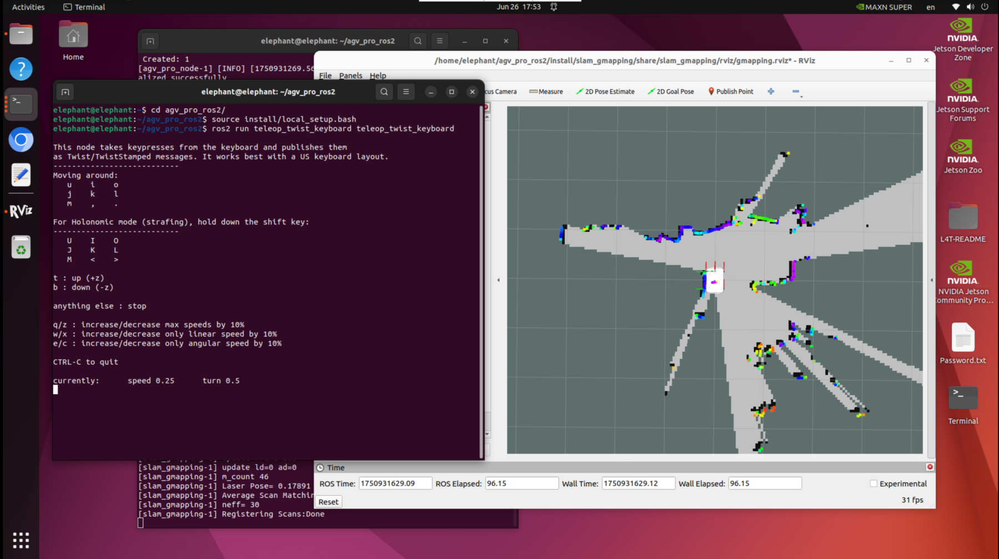

# Real-time mapping using Gmapping

Press Ctrl+Alt+T on the keyboard to open the first terminal and enter the command

```
ros2 launch agv_pro_bringup agv_pro_bringup.launch.py
```



Press Ctrl+Alt+T on the keyboard to open a second terminal and enter the command

```
ros2 launch slam_gmapping slam_gmapping.launch.py
```

At this time, an rviz interface will open



Press Ctrl+Alt+T on the keyboard to open the third terminal and enter the command

```
ros2 run teleop_twist_keyboard teleop_twist_keyboard
```

Make sure to select the terminal by clicking the mouse so that the keyboard control can control the AGV Pro.




> Notes:
> 1. To avoid damage to the machine, make sure that AGV Pro does not hit other objects before moving.
> 2. During the movement, the keyboard control of AGV Pro ros2 requires pressing the keyboard 'k' to stop AGV Pro from moving.

```
---------------------------
Moving around:
   u    i    o
   j    k    l
   m    ,    .

For Holonomic mode (strafing), hold down the shift key:
---------------------------
   U    I    O
   J    K    L
   M    <    >

t : up (+z)
b : down (-z)

anything else : stop

q/z : increase/decrease max speeds by 10%
w/x : increase/decrease only linear speed by 10%
e/c : increase/decrease only angular speed by 10%

CTRL-C to quit

currently:	speed 0.25	turn 0.5 
```

| Buttons | Button Description                            |
| :------ | :-------------------------------------------- |
| i       | Move forward                                  |
| ,       | Move backward                                 |
| j       | Rotate counterclockwise                       |
| l       | Rotate clockwise                              |
| u       | Turn left and move forward                    |
| o       | Turn right and move forward                   |
| k       | Stop moving                                   |
| m       | Turn left and move backward                   |
| .       | Turn right and move backward                  |
| I       | Move forward                                  |
| <       | Move backward                                 |
| J       | Move left                                     |
| L       | Move right                                    |
| U       | Move forward at an angle of 45° to the left   |
| O       | Move forward at an angle of 45° to the right  |
| M       | Move backward at an angle of 45° to the left  |
| >       | Move backward at an angle of 45° to the right |
| q       | Increase linear and angular speed             |
| z       | Reduce linear and angular speed               |
| w       | Increase linear speed                         |
| x       | Reduce linear velocity                        |
| e       | Increase angular velocity                     |
| c       | Reduce angular velocity                       |

It is recommended that you set the linear velocity to 0.25 and the angular velocity to 0.45 when using keyboard control when building a map with gmapping. While building the map, you can observe in the RVIZ space that as the AGV Pro moves, our map is gradually constructed.


After building the map you need, press Ctrl+Alt+T on the keyboard to open the fourth terminal and enter the command

```
ros2 run nav2_map_server map_saver_cli -f ~/map
```


-f parameter can be followed by the path and map file name to add a suffix to the map parameter file

> Note: The folder path with the suffix name must be written correctly, otherwise an error will be reported

```
ros2 run nav2_map_server map_saver_cli -f ~/agv_pro_ros2/src/agv_pro_navigation2/map/map_test
```


In this way, we will generate map parameter files map_test.yaml and map_test.pgm in the current path. The advantage of adding the suffix is ​​that it is easier to manage the maps you need and avoid overwriting the map files that you have worked hard to build.

After saving, you can view the saved map in the pgm format in the path `/home/elephant/agv_pro_ros2/src/agv_pro_navigation2/map`.


---

[← Previous Chapter](6.2.1-ROS2_Introduction.md) | [Next section →](6.2.3-Navigation2.md)
