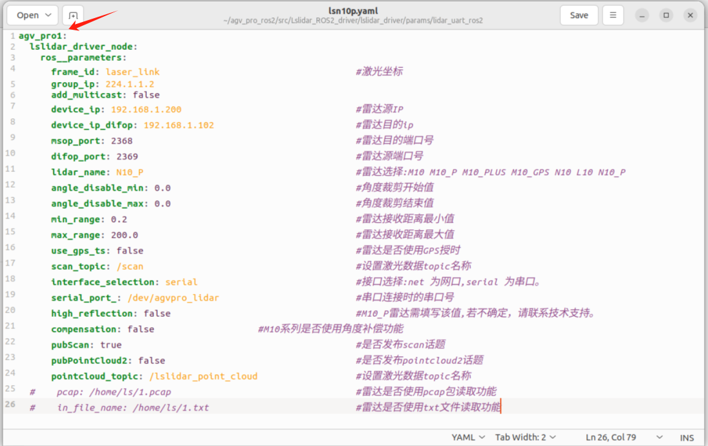
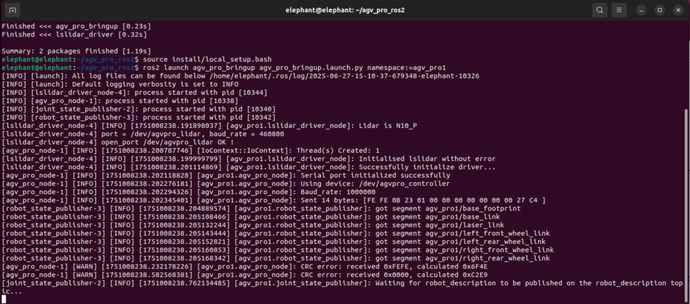
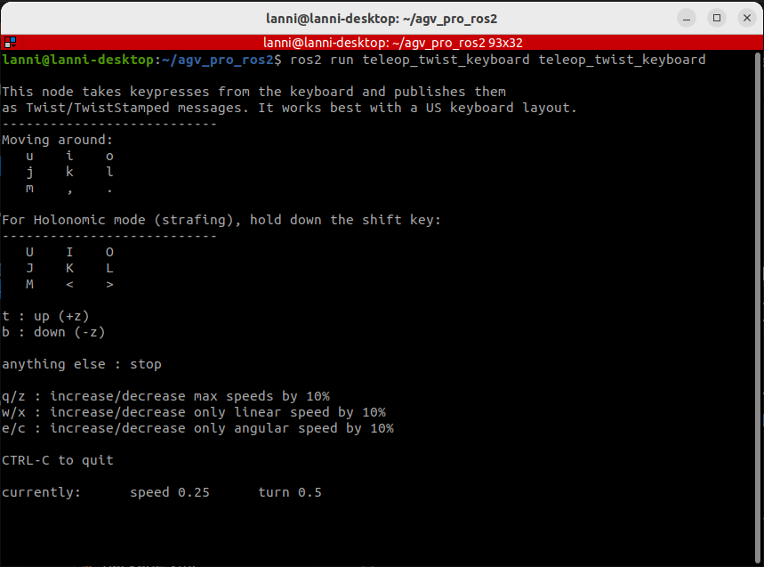
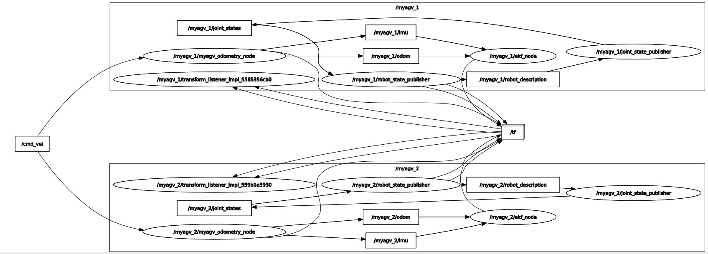

# Multi-machine control

Before using multi-machine control, you need to configure the ros2 multi-machine communication function.

Below, take two AGV Pro as an example. Before officially running, make sure that the two machines and the laptop can communicate with each other. That is, in the same LAN.

> Notes
>1. The computer needs to be installed with Ubuntu 22.04 and ros2
>2. If you use a virtual machine, you need to set the network configuration of the virtual machine, computer virtual machine settings-network adapter-network connection-bridge mode: directly connect to the physical network

```
Computer 192.168.123.68
AGV Pro1 192.168.123.3
AGV Pro2 192.168.123.42
```

Set up the ~/.bashrc file for the three devices and add the following two parameters:

```
export RMW_IMPLEMENTATION=rmw_fastrtps_cpp
export ROS_DOMAIN_ID=1
```

Three devices can communicate with multiple machines under ros2. For more information about ros2 dds communication middleware, you can check [here](https://docs.ros.org/en/humble/Concepts/Intermediate/About-Domain-ID.html).

## Start multi-machine control

1.Modify the file `~/agv_pro_ros2/src/Lslidar_ROS2_driver/lslidar_driver/params/lidar_uart_ros2/lsn10p.yaml` and add `agv_pro1:`



Pay attention to the indentation format

```yaml
agv_pro1:
  lslidar_driver_node:
    ros__parameters:
      frame_id: laser_link                                    # Laser coordinate frame
      group_ip: 224.1.1.2
      add_multicast: false
      device_ip: 192.168.1.200                                # LiDAR source IP
      device_ip_difop: 192.168.1.102                          # LiDAR destination IP
      msop_port: 2368                                         # LiDAR destination port
      difop_port: 2369                                        # LiDAR source port
      lidar_name: N10_P                                       # LiDAR model: M10, M10_P, M10_PLUS, M10_GPS, N10, L10, N10_P
      angle_disable_min: 0.0                                  # Start angle for angle cropping
      angle_disable_max: 0.0                                  # End angle for angle cropping
      min_range: 0.2                                          # Minimum detectable range
      max_range: 200.0                                        # Maximum detectable range
      use_gps_ts: false                                       # Whether to use GPS timestamp
      scan_topic: /scan                                       # Topic name for laser scan data
      interface_selection: serial                             # Interface type: 'net' for Ethernet, 'serial' for serial port
      serial_port_: /dev/agvpro_lidar                         # Serial port device when using serial connection
      high_reflection: false                                  # Required for M10_P model; consult support if unsure
      compensation: false                                     # Enable angle compensation for M10 series
      pubScan: true                                           # Whether to publish scan topic
      pubPointCloud2: false                                   # Whether to publish pointcloud2 topic
      pointcloud_topic: /lslidar_point_cloud                  # Topic name for point cloud data
  #    pcap: /home/ls/1.pcap                                  # Read LiDAR data from pcap file (optional)
  #    in_file_name: /home/ls/1.txt                           # Read LiDAR data from txt file (optional)
```

For example

```
For the first AGV Pro, change it to agv_pro1:
For the second AGV Pro, change it to agv_pro2:
```

2. Then execute the following command to compile the lidar function package. Remember to source the workspace after compiling.

```
cd agv_pro_ros2/
colcon build --packages-select lslidar_driver
source ~/agv_pro_ros2/install/local_setup.bash
```


3.Start the odometer and lidar nodes

When starting `agv_pro_bringup.launch.py`, add the `namespace:=` parameter to distinguish AGV Pro

```
First AGV Pro, start command: ros2 launch agv_pro_bringup agv_pro_bringup.launch.py ​​namespace:=agv_pro1

Second AGV Pro, start command: ros2 launch agv_pro_bringup agv_pro_bringup.launch.py ​​namespace:=agv_pro2
```



4. Start the keyboard control node on the computer

The computer needs to download the keyboard function package

```
sudo apt-get install ros-humble-teleop-twist-keyboard
```

Start the keyboard control node

```
ros2 run teleop_twist_keyboard teleop_twist_keyboard
```



Make sure to select the terminal with the mouse so that the keyboard control can control AGV Pro.

> Notes:
> 1. To avoid damage to the machine, make sure that AGV Pro does not hit other objects before movement
> 2. During the movement, the keyboard control of AGV Pro ros2 requires pressing the keyboard 'k' to stop AGV Pro from moving.

```
---------------------------
Moving around:
   u    i    o
   j    k    l
   m    ,    .

For Holonomic mode (strafing), hold down the shift key:
---------------------------
   U    I    O
   J    K    L
   M    <    >

t : up (+z)
b : down (-z)

anything else : stop

q/z : increase/decrease max speeds by 10%
w/x : increase/decrease only linear speed by 10%
e/c : increase/decrease only angular speed by 10%

CTRL-C to quit

currently:	speed 0.25	turn 0.5 
```

| Buttons | Button Description |
| :--- | :----------------- |
| i | Move forward |
| , | Move backward |
| j | Rotate counterclockwise |
| l | Rotate clockwise |
| u | Turn left and move forward |
| o | Turn right and move forward |
| k | Stop moving |
| m | Turn left and move backward |
| . | Turn right and move backward |
| I | Move forward |
| < | Move backward |
| J | Move left |
| L | Move right |
| U | Move forward at an angle of 45° to the left |
| O | Move forward at an angle of 45° to the right |
| M | Move backward at an angle of 45° to the left |
| > | Move backward at an angle of 45° to the right |
| q | Increase linear and angular speed |
| z | Reduce linear and angular speed |
| w | Increase linear speed |
| x | Reduce linear velocity |
| e | Increase angular velocity |
| c | Reduce angular velocity |

At the same time, you can input `rqt_graph` in the terminal to view the node information. In the same LAN, agv_pro1 and agv_pro2 simultaneously receive the `/cmd_vel` topic published by the notebook to realize the multi-machine control function.



---

[← Previous section](6.2.3-Navigation2.md) | [Next section →](6.2.5-Gazebo.md)