# POINT_LIO_ROS2----AGV_PRO based on Unilidar_L2 LiDAR for 3DSLAM and NAV2 Navigation Scheme

## Nodes Required for Mapping and Recording Rosbag:

- Open the first terminal under `~/agv_pro_ros2/`:

```bash
source ./install/setup.bash
ros2 launch agv_pro_bringup agv_pro_bringup.launch.py
# agv_pro driver node
```

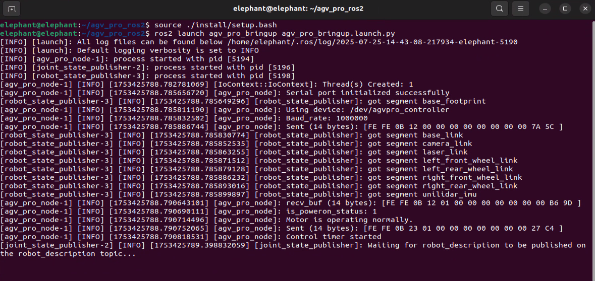

- Open the second terminal under `~/agv_pro_ros2/`:

```bash
source ./install/setup.bash
ros2 launch unitree_lidar_ros2 launch.py
# unilidar driver node
```

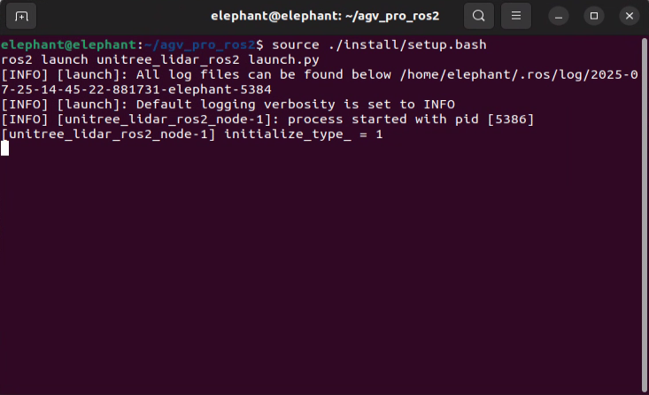

- Open the third terminal under `~/agv_pro_ros2/`:

```bash
source ./install/setup.bash
ros2 launch point_lio mapping_unilidar_l2.launch.py
# slam mapping node
```

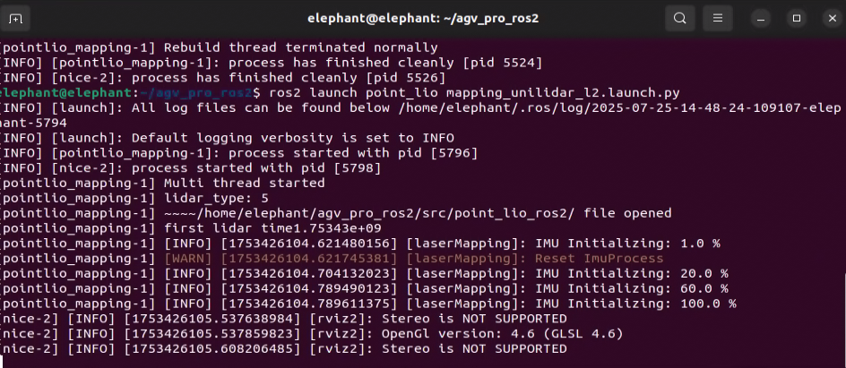

This command will start the rviz2 visualization interface, displaying LiDAR point cloud data and mapping results.

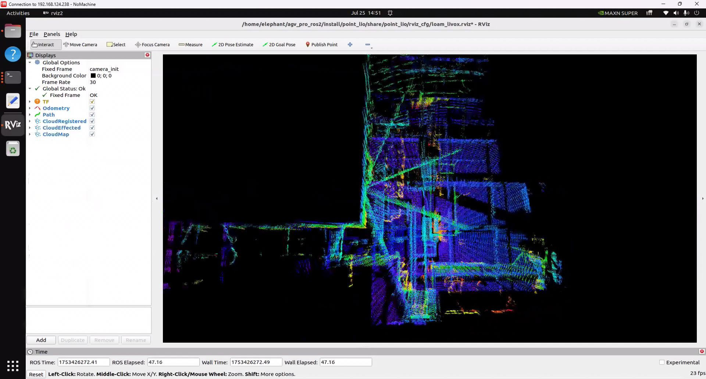

- Open the fourth terminal under `~/agv_pro_ros2/`:

```bash
source ./install/setup.bash
ros2 run teletop_twist_keyboard teletop_twist_keyboard
# keyboard control node
```


Note: By default, the point cloud data output from the mapping results is only temporarily displayed in rviz2. After 30 seconds, the completed point cloud data will disappear, leaving only the real-time scanned point cloud data and the robot's odometry path. If you need to keep the completed point cloud data for a longer time to observe the map, you can set the `Decay Time` of `CloudRegistered` in the left panel of rviz2 from 30 to `30000` or any infinite value. This way, the scanned and completed point cloud will remain in rviz2 for a long time.

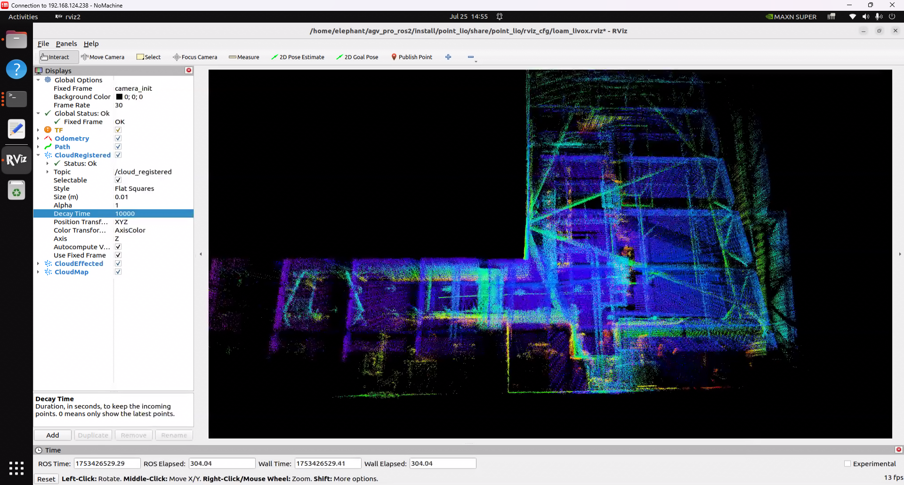


Press `Ctrl+C` to end all terminals after mapping is completed. The pcd map file will be automatically saved to the `point_lio_ros2/PCD` folder.

## Open the PCD Map

Navigate to the folder where the PCD is saved, `~/agv_pro_ros2/src/point_lio_ros2/PCD`, open a terminal, and enter the following command to open the map:


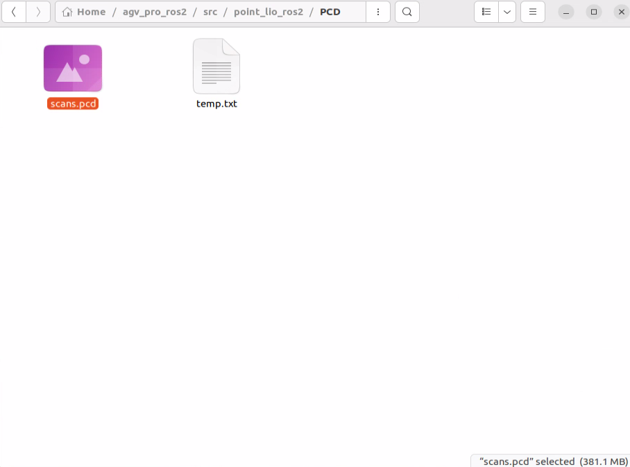

```bash
pcl_viewer scans.pcd
```

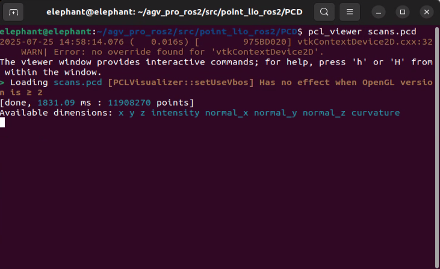

- Note: If you see the error `pcl_viewer: command not found`, please install pcl_viewer first. Use the following commands:

```bash
sudo apt update
sudo apt install libpcl-dev pcl-tools
```

Once `scans.pcd` is successfully opened, the map will be displayed in the window, and you can interact with it using the mouse and keyboard.


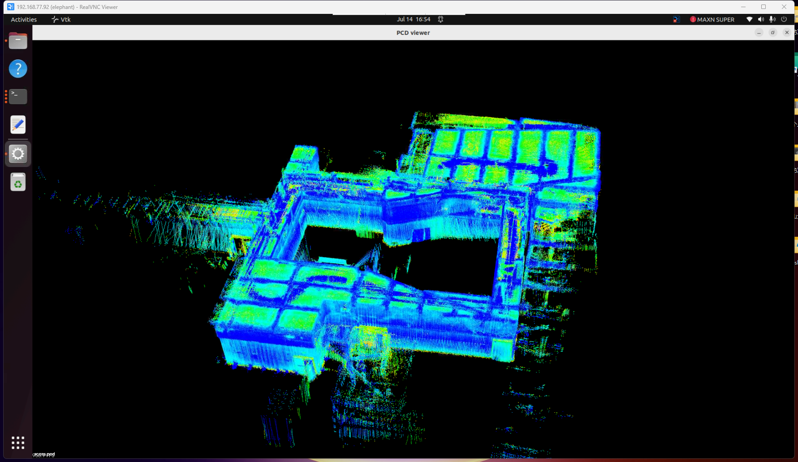

- Tip: Basic functionality of pcl_viewer:

View Control
| Key         | Description                  |
|-------------|------------------------------|
| Left Mouse  | Rotate view                  |
| Right Mouse | Pan view                     |
| Mouse Wheel | Zoom in/out                  |
| `r`         | Reset view to initial state  |
| `f`         | Enter/Exit fullscreen mode   |

Display Settings
| Key         | Description                  |
|-------------|------------------------------|
| `+`         | Increase point size          |
| `-`         | Decrease point size          |
| `b`         | Toggle background color      |
| `c`         | Show/Hide point cloud colors |
| `s`         | Toggle surface rendering mode|

Point Cloud Operations
| Key         | Description                  |
|-------------|------------------------------|
| `1`         | Assign random RGB colors to all points |
| `2`         | Map X-coordinate values to gradient colors |
| `3`         | Map Y-coordinate values to gradient colors |
| `4`         | Map Z-coordinate values (height) to gradient colors |
| `5`         | Map point cloud intensity to gradient colors |
| `u`         | Update point cloud display   |
| `j`         | Save current view as a screenshot |

## Convert PCD Point Cloud Map to PGM Grid Map

- Open a terminal under `~/agv_pro_ros2/`:

```bash
source ./install/setup.bash
ros2 launch pcd2pgm pcd2pgm.launch.py
```

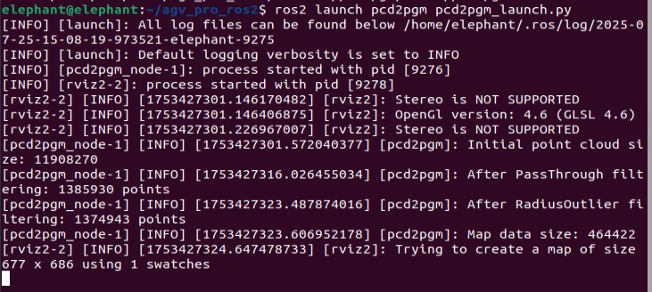

This command will run the node to convert the PCD to a PGM grid map. After running, the filtered 3D point cloud and the converted grid map will be displayed in rviz2.

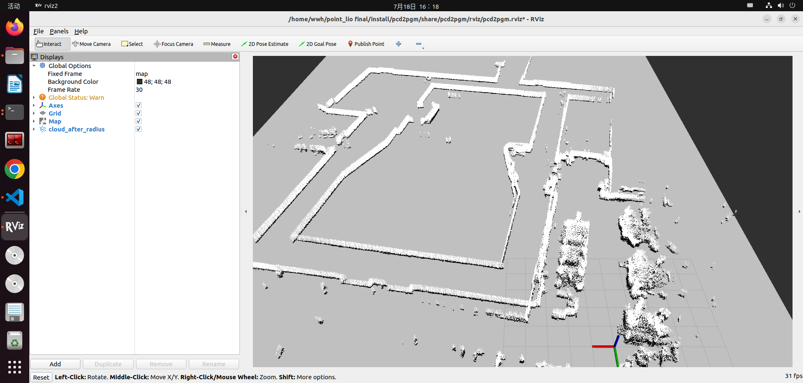

- Open a second terminal and execute the following command to save the map:

```bash
ros2 run nav2_map_server map_saver_cli -f <YOUR_MAP_NAME>
# Save the map node to the current terminal's working directory. Replace <YOUR_MAP_NAME> with your desired map name.
```

- Example:

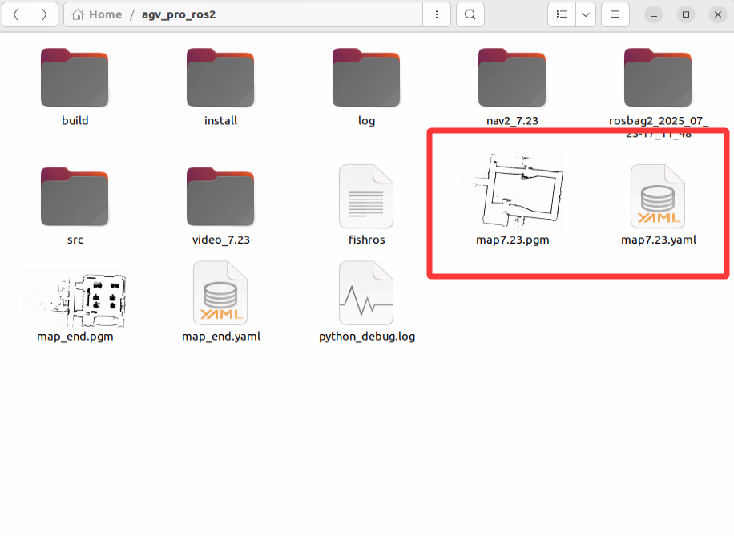

For better file management, you can save the map files to the map folder of the navigation function package.

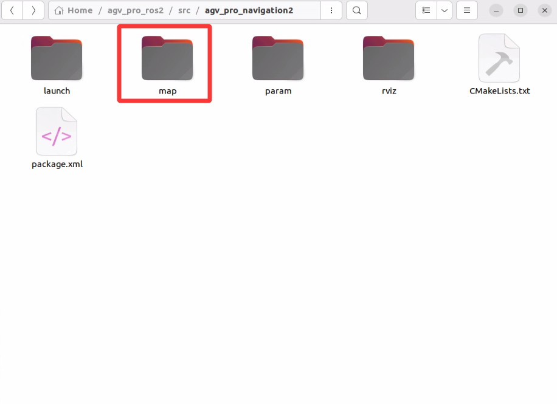

## Navigation Function Configuration and Usage

- First, modify the path to the map file required for navigation. Open the file `~/agv_pro_ros2/agv_pro_navigation/launch/navigation2_active.launch.py` and locate the following configuration:

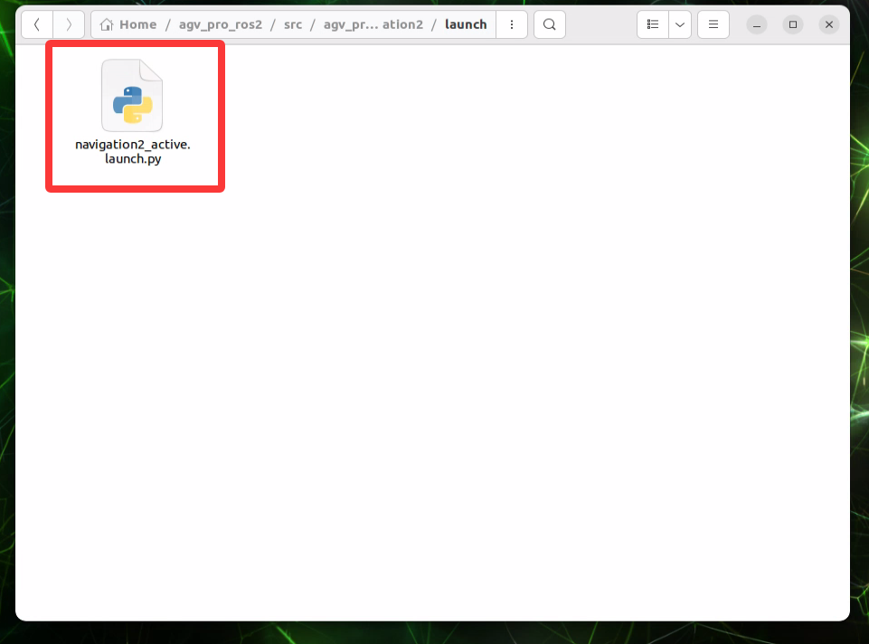

```yaml
def generate_launch_description():
    use_sim_time = LaunchConfiguration('use_sim_time', default='false')
    use_rviz = LaunchConfiguration('use_rviz', default='true')
    map_dir = LaunchConfiguration(
        'map',
        default=os.path.join(
            get_package_share_directory('agv_pro_navigation2'),  # Modify this folder to the folder where your map is saved
            'map',            # Modify this folder to the folder where your map is saved
            'map_end.yaml'))  # Modify this map file name to the name of your saved map file
```

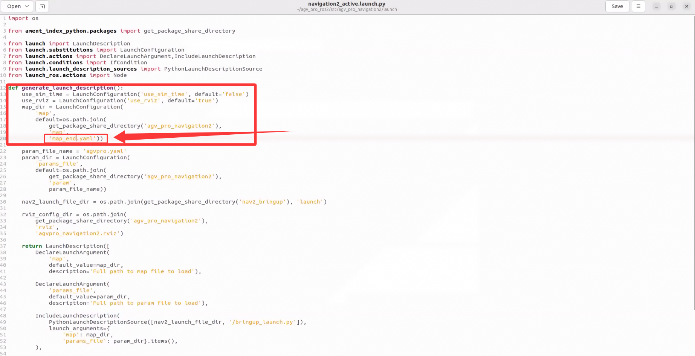

- Then save the file and recompile the workspace. Open a terminal and execute the following commands:

```bash
cd ~/agv_pro_ros2/
colcon build --packages-select agv_pro_navigation
source install/setup.bash
```

- You can then use the navigation mapping function. Open the first terminal under `~/agv_pro_ros2/` and execute the following command:

```bash
source ./install/setup.bash
ros2 launch agv_pro_bringup agv_pro_bringup.launch.py
# agv_pro driver node
```

- Open the second terminal under `~/agv_pro_ros2/` and execute the following command:

```bash
source ./install/setup.bash
ros2 launch unitree_lidar_ros2 launch.py 
# unilidar driver node
```

- Open the third terminal under `~/agv_pro_ros2/`:

```bash
source ./install/setup.bash
ros2 launch pointcloud_to_laserscan pointcloud_to_laserscan_launch.py 
# 3D point cloud to 2D point cloud node
```

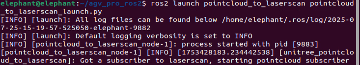

- Open the fourth terminal under `~/agv_pro_ros2/`:

```bash
source ./install/setup.bash
ros2 launch agv_pro_navigation2 navigation2_active.launch.py
# Navigation node
``` 

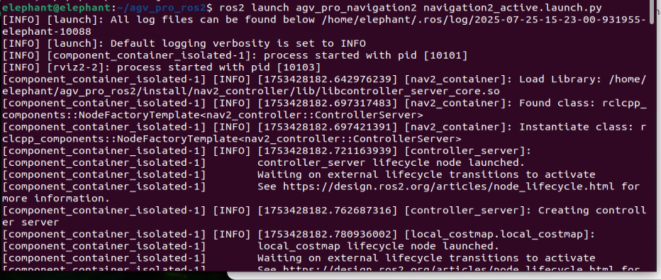


After this node is running, rviz2 will open and load the navigation-related content. Seeing a screen similar to the one below indicates that the navigation function is ready.

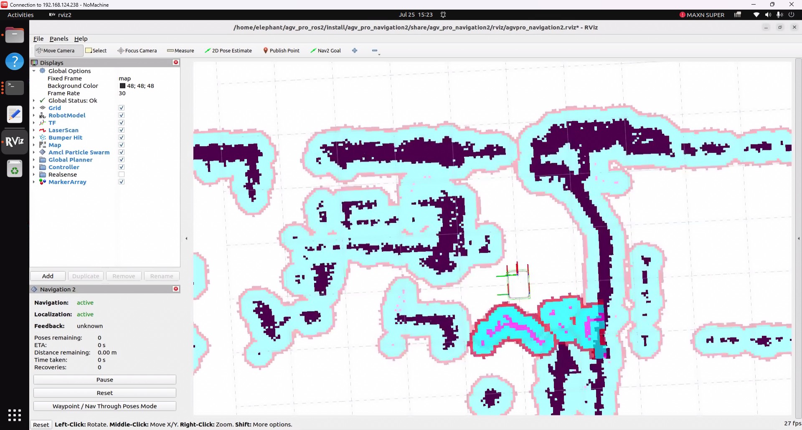

The usage of the navigation function is similar to section [6.2.3 of the NAV2 navigation function](6.2.3-Navigation2.md) in the user manual. You can refer to the relevant content for operation.

[← Previous section](6.2.5-Gazebo.md)