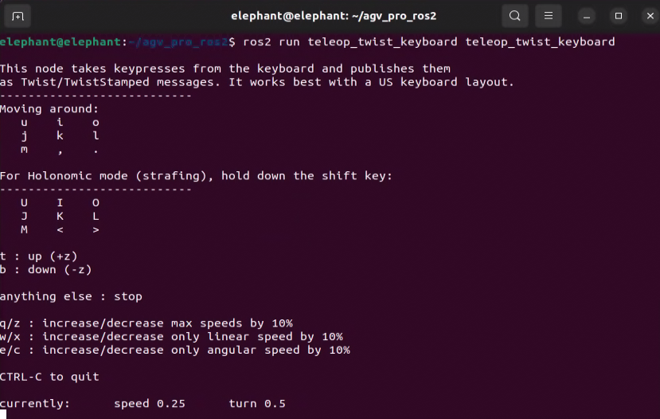

# POINT_LIO_ROS2----AGV_PRO 3D SLAM and NAV2 Navigation Solution Based on Unilidar_L2 LiDAR

## Running Mapping and Recording Rosbag Required Nodes:

- Open the first terminal in `~/agv_pro_ros2/`:

```bash
source ./install/setup.bash
ros2 launch agv_pro_bringup agv_pro_bringup.launch.py
# agv_pro driver node
```


- Open the second terminal in `~/agv_pro_ros2/`:

```bash
source ./install/setup.bash
ros2 launch unitree_lidar_ros2 launch.py
# unilidar driver node
```


- Open the third terminal in `~/agv_pro_ros2/`:

```bash
source ./install/setup.bash
ros2 launch point_lio mapping_unilidar_l2.launch.py
# slam mapping node
```


This command will launch the rviz2 visualization interface, displaying LiDAR point cloud data and mapping effects.


- Open the fourth terminal in `~/agv_pro_ros2/`:

```bash
source ./install/setup.bash
ros2 run teletop_twist_keyboard teletop_twist_keyboard
# keyboard control node
```



Note: To ensure mapping quality, when using keyboard control during the mapping process, try to keep the vehicle moving at a steady and stable speed. In some cases, sudden acceleration/deceleration, sharp turns, and prolonged spinning in place may cause decreased mapping accuracy or mapping failure. It is recommended to use the default control parameters of the keyboard node, i.e., speed 0.25, turn 0.5.


Note: By default, the point cloud data output from mapping is only temporarily displayed in rviz2. After 30 seconds, the completed mapping point cloud data will disappear, leaving only the real-time scanned point cloud data and the vehicle's odometry path. If you need to preserve the completed mapping point cloud data for a long time to observe the map effect, you can set the `Decay Time` of `CloudRegistered` in the left panel of rviz2 from 30 to `30000` or any infinitely large value, so that the scanned and mapped point cloud will be retained in rviz2 for a long time.

After mapping is complete, press `Ctrl+C` to terminate all terminals. The pcd map file will be automatically saved to the `point_lio_ros2/PCD` folder.

## Recording and Playing Rosbag2

- If you need to record rosbag2 while mapping, you can add the following operation during the mapping process:
Open a new terminal in `~/agv_pro_ros2/` and execute the following command:

```bash
source ./install/setup.bash
ros2 bag record -a
# record all topics
```

After mapping is complete, you can use the `ctrl`+`c` command in the terminal to stop recording. The recorded rosbag2 file will be saved in the `~/agv_pro_ros2/` directory.

Tip: It is recommended to run the rosbag2 recording node after the chassis, LiDAR, and slam node drivers are completed and stable, which can ensure that the recorded data is stable and valid.

- If you need to play rosbag2 and visualize it later, you can perform the following operations:

First run rviz2 visualization. A launch file that can directly open pre-configured rviz2 has been prepared:

```bash
source ./install/setup.bash
ros2 launch point_lio l2_mapping_rviz.launch.py
```

Then, open a terminal in the folder where the rosbag2 file is saved and execute the following command:

```bash
source ./install/setup.bash
ros2 bag play <your ros2bag>
# Replace <your ros2bag> with the name of your rosbag2 package
```

## Opening PCD Map

Enter the PCD save folder `~/agv_pro_ros2/src/point_lio_ros2/PCD`, open a terminal, and then enter the following command to open the map:


```bash
pcl_viewer scans.pcd
```


- Note: If you get `pcl_viewer: command not found`, please install pcl_viewer first. Operation as follows:

```bash
sudo apt update
sudo apt install libpcl-dev pcl-tools
```

After successfully opening scans.pcd, the scans.pcd map will be displayed in the window, and you can use mouse and keyboard for interactive operations.


- Tip: pcl_viewer Basic Function Key Instructions

View Control
| Key          | Function Description            |
| :-----------| :-------------------------------|
| Left mouse drag | Rotate view angle            |
| Right mouse drag | Pan view angle              |
| Mouse wheel     | Zoom view                    |
| r           | Reset view to initial state     |
| f        | Enter/exit fullscreen mode        |

Display Settings
| Key     | Function Description             |
| :--------| :-------------------------------|
| +        | Increase point size             |
| -        | Decrease point size             |
| b        | Toggle background color(black/white) |
| c        | Show/hide point cloud color     |
| s        | Toggle surface rendering mode   |

Point Cloud Operations
| Key      | Function Description            |
| :--------| --------------------------------|
| 1        | Randomly assign RGB colors to all points |
| 2        | Map points to gradient colors based on X coordinate values |
| 3        | Map points to gradient colors based on Y coordinate values |
| 4        | Map points to gradient colors based on Z coordinate values (height) |
| 5        | Map points to gradient colors based on point cloud intensity |
| j        | Save current view as screenshot |

## Converting PCD Point Cloud Map to PGM Grid Map

- Open a terminal in `~/agv_pro_ros2/`:

```bash
source ./install/setup.bash
ros2 launch pcd2pgm pcd2pgm.launch.py
```


This command will run the pcd to pgm grid map conversion node. After running, it will display the filtered 3D point cloud effect and the converted grid map in rviz2.


- Open a second terminal and execute the following command to save the map:

```bash
ros2 run nav2_map_server map_saver_cli -f <YOUR_MAP_NAME>
# Save map node to the folder where the current terminal is located, change <YOUR_MAP_NAME> to the map name you want to save
```

- For example:


For convenient file management, you can store the map files in the map folder of the navigation package.


## Navigation Function Configuration and Usage

- First, you need to modify the map file path that navigation needs to load. Open the `~/agv_pro_ros2/agv_pro_navigation/launch/navigation2_active.launch.py` file and find the following configuration:


```yaml
def generate_launch_description():
    use_sim_time = LaunchConfiguration('use_sim_time', default='false')
    use_rviz = LaunchConfiguration('use_rviz', default='true')
    map_dir = LaunchConfiguration(
        'map',
        default=os.path.join(
            get_package_share_directory('agv_pro_navigation2'),  # Modify the folder here to the folder where you saved the map
            'map',            # Modify the folder here to the folder where you saved the map
            'map_end.yaml'))  # Modify the map file name here to the map file name you saved
```


- Then save the file and recompile the workspace. Open a terminal and execute the following commands:

```bash
cd ~/agv_pro_ros2/
colcon build --packages-select agv_pro_navigation
source install/setup.bash
```

- Then you can use the navigation mapping function. Open the first terminal in `~/agv_pro_ros2/` and execute the following command:

```bash
source ./install/setup.bash
ros2 launch agv_pro_bringup agv_pro_bringup.launch.py
# agv_pro driver node
```

- Open the second terminal in `~/agv_pro_ros2/` and execute the following command:

```bash
source ./install/setup.bash
ros2 launch unitree_lidar_ros2 launch.py 
# unilidar driver node
```

- Open the third terminal in `~/agv_pro_ros2/`:

```bash
source ./install/setup.bash
ros2 launch pointcloud_to_laserscan pointcloud_to_laserscan_launch.py 
# 3D point cloud to 2D point cloud conversion node
```


- Open the fourth terminal in `~/agv_pro_ros2/`:

```bash
source ./install/setup.bash
ros2 launch agv_pro_navigation2 navigation2_active.launch.py
# navigation node
``` 


After this node runs, it will open rviz2 and load navigation-related content. Seeing a similar screen indicates that the navigation function is ready.


The usage of the navigation function is similar to the user manual [6.2.3-Navigation2.md](6.2.3-Navigation2.md) section. You can refer to the relevant content for operations.

[← Previous Page](6.2.5-Gazebo.md) |
