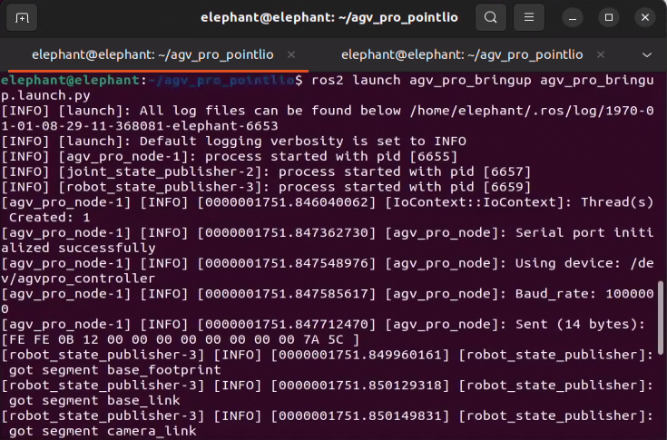
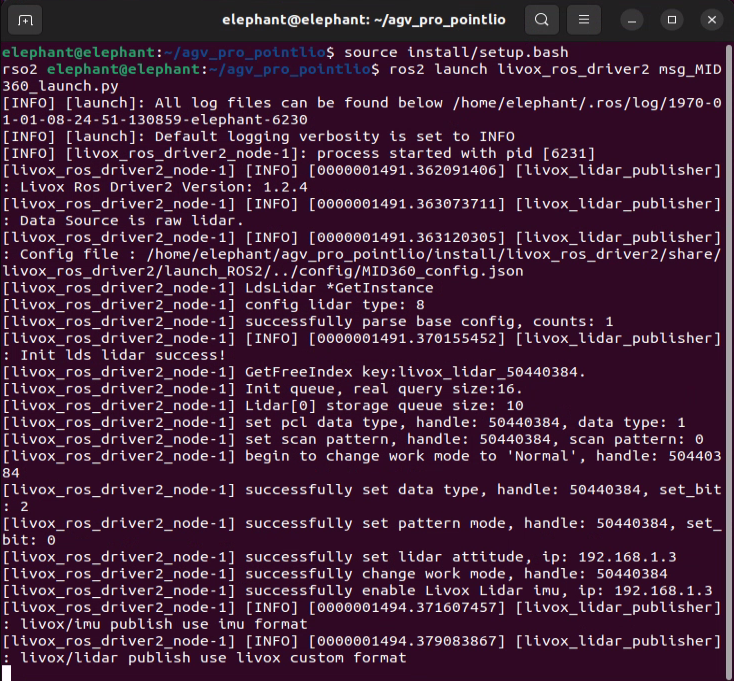
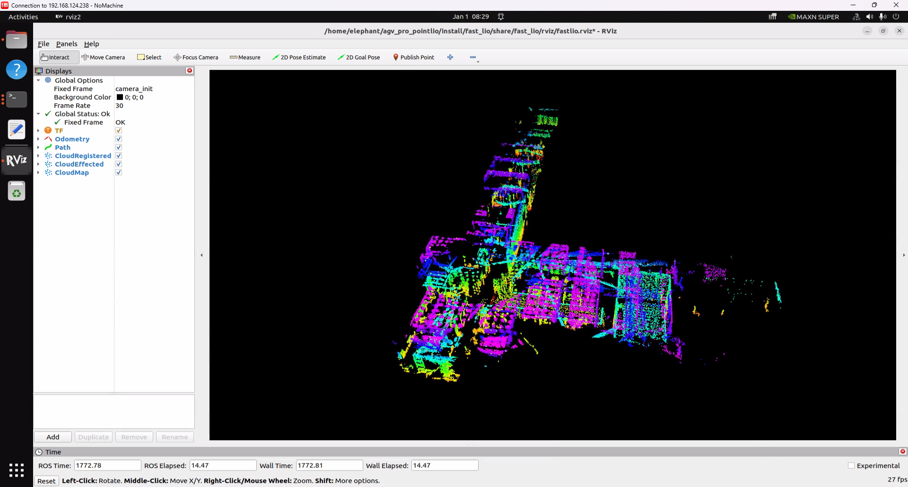
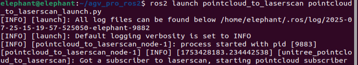

# FAST_LIO----AGV_PRO 3D SLAM and NAV2 Navigation Solution Based on MID360 LiDAR

## Required nodes for running mapping and recording rosbag:

- Open the first terminal in `~/agv_pro_ros2/`:

```bash
source ./install/setup.bash
ros2 launch agv_pro_bringup agv_pro_bringup.launch.py
# agv_pro driver node
```



- Open the second terminal in `~/agv_pro_ros2/`:

```bash
source ./install/setup.bash
ros2 launch livox_ros_driver2 msg_MID360_launch.py
# MID360 LiDAR driver node
```



- Open the third terminal in `~/agv_pro_ros2/`:

```bash
source ./install/setup.bash
ros2 launch fast_lio mapping.launch.py
# SLAM mapping node
```


This command will start the rviz2 visualization interface, displaying LiDAR point cloud data and mapping results.



- Open the fourth terminal in `~/agv_pro_ros2/`:

```bash
source ./install/setup.bash
ros2 run teletop_twist_keyboard teletop_twist_keyboard
# Keyboard control node
```


The mapping effect of FAST_LIO in rviz2 defaults to incremental mapping, and the point cloud effects of completed mapping areas will be continuously displayed in rviz2


After mapping is completed, press `Ctrl+C` to end each terminal, and the pcd map file will be automatically saved to the `FAST_LIO/PCD` folder.

## Opening the PCD Map

Enter the PCD save folder `~/agv_pro_ros2/src/FAST_LIO/PCD`, open a terminal, and then enter the following command to open the map:


```bash
pcl_viewer scans.pcd
```

- Note: If you get the message `pcl_viewer: command not found`, please install pcl_viewer first. Do the following:

```bash
sudo apt update
sudo apt install libpcl-dev pcl-tools
```

After successfully opening scans.pcd, the scans.pcd map will be displayed in the window, and you can use mouse and keyboard for interactive operations.


- Tips: pcl_viewer basic function key instructions

View Control
| Key              | Function Description        |
| :--------------- | :-------------------------- |
| Left mouse drag  | Rotate view angle           |
| Right mouse drag | Pan view angle              |
| Mouse wheel      | Zoom view                   |
| r                | Reset view to initial state |
| f                | Enter/exit fullscreen mode  |

Display Settings

| Key  | Function Description                 |
| :--- | :----------------------------------- |
| +    | Increase point size                  |
| -    | Decrease point size                  |
| b    | Toggle background color(black/white) |
| c    | Show/hide point cloud color          |
| s    | Toggle surface rendering mode        |

Point Cloud Operations

| Key  | Function Description                                         |
| :--- | :----------------------------------------------------------- |
| 1    | Randomly assign RGB colors to all points                     |
| 2    | Map points to gradient colors based on X coordinate values   |
| 3    | Map points to gradient colors based on Y coordinate values   |
| 4    | Map points to gradient colors based on Z coordinate values (height) |
| 5    | Map points to gradient colors based on point cloud intensity |
| j    | Save current view as screenshot                              |

## Converting PCD Point Cloud Map to PGM Grid Map

The use of navigation functionality is exactly the same as the PCD point cloud map processing section in User Manual 6.2.6 point_lio. You can refer to the relevant content for operations.

## Navigation Function Configuration and Usage

- First, you need to modify the map file path that navigation needs to load. Open the `~/agv_pro_ros2/agv_pro_navigation/launch/navigation2_active.launch.py` file and find the following configuration:


```yaml
def generate_launch_description():
    use_sim_time = LaunchConfiguration('use_sim_time', default='false')
    use_rviz = LaunchConfiguration('use_rviz', default='true')
    map_dir = LaunchConfiguration(
        'map',
        default=os.path.join(
            get_package_share_directory('agv_pro_navigation2'),  # Modify this folder to your map save folder
            'map',            # Modify this folder to your map save folder
            'map_end.yaml'))  # Modify this map file name to your saved map file name
```


- Then save the file and recompile the workspace. Open a terminal and execute the following commands:

```bash
cd ~/agv_pro_ros2/
colcon build --packages-select agv_pro_navigation
source install/setup.bash
```

- Then you can use the navigation mapping functionality. Open the first terminal in `~/agv_pro_ros2/` and execute the following command:

```bash
source ./install/setup.bash
ros2 launch agv_pro_bringup agv_pro_bringup.launch.py
# agv_pro driver node
```

- Open the second terminal in `~/agv_pro_ros2/` and execute the following command:

```bash
source ./install/setup.bash
ros2 launch livox_ros_driver2 rviz_MID360_launch.py
# MID360 LiDAR driver node
```

- Open the third terminal in `~/agv_pro_ros2/`:

```bash
source ./install/setup.bash
ros2 launch pointcloud_to_laserscan pointcloud_to_laserscan_launch.py 
# 3D point cloud to 2D point cloud conversion node
```



- Open the fourth terminal in `~/agv_pro_ros2/`:

```bash
source ./install/setup.bash
ros2 launch agv_pro_navigation2 navigation2_active.launch.py
# Navigation node
``` 


After this node runs, it will open rviz2 and load navigation-related content. Seeing a similar screen indicates that the navigation function is ready.


The use of navigation functionality is similar to the NAV2 navigation function section in User Manual 6.2.3. You can refer to the relevant content for operations.

[← Previous Page](6.2.6-Real_Time_Mapping_with_Point_lio.md) | [Next section →](6.2.8-Autocharge.md)