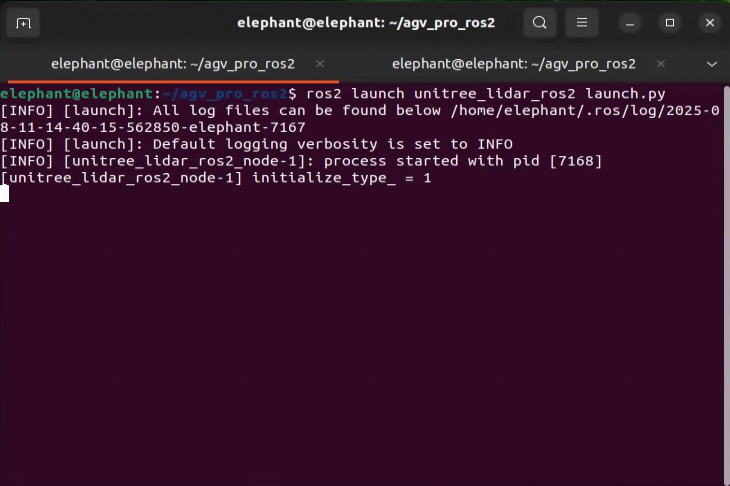
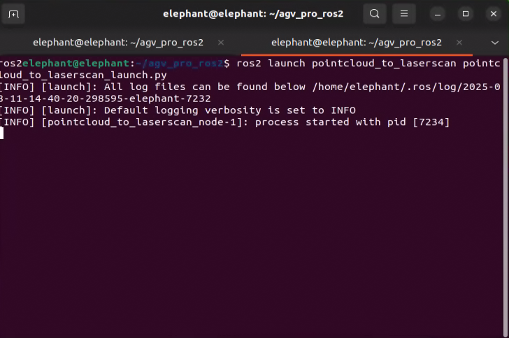
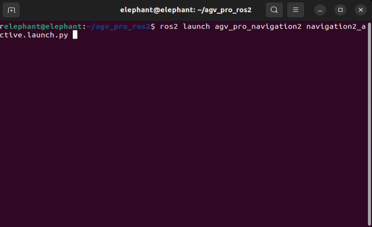
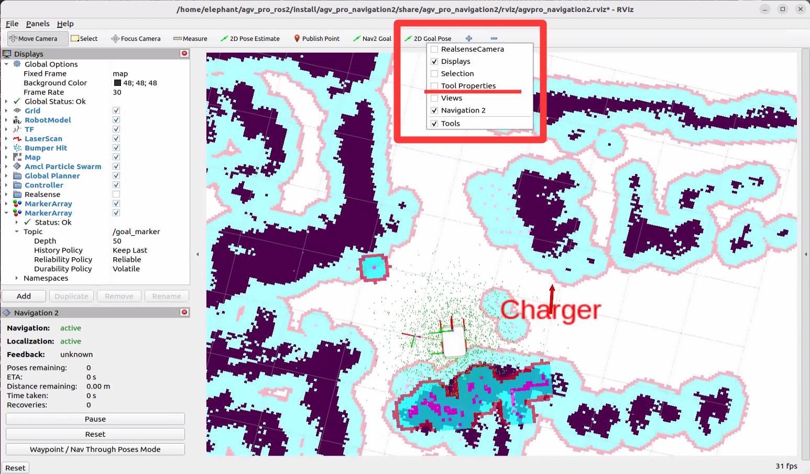
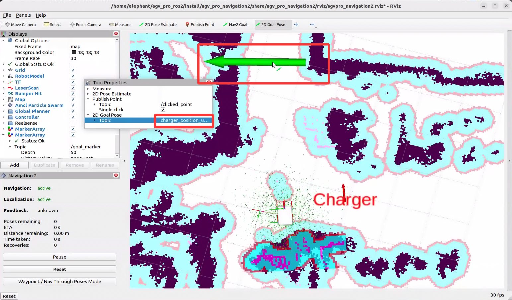
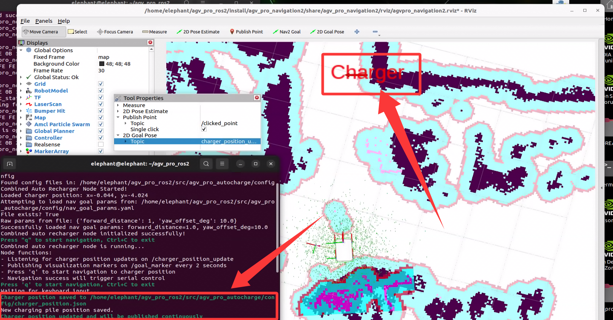
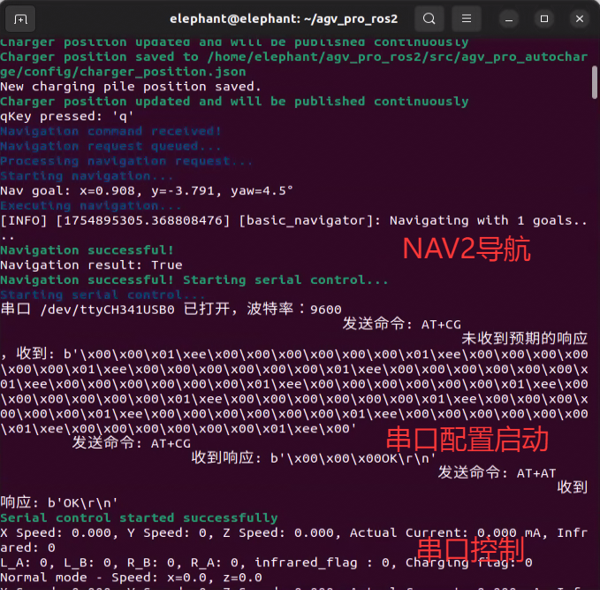
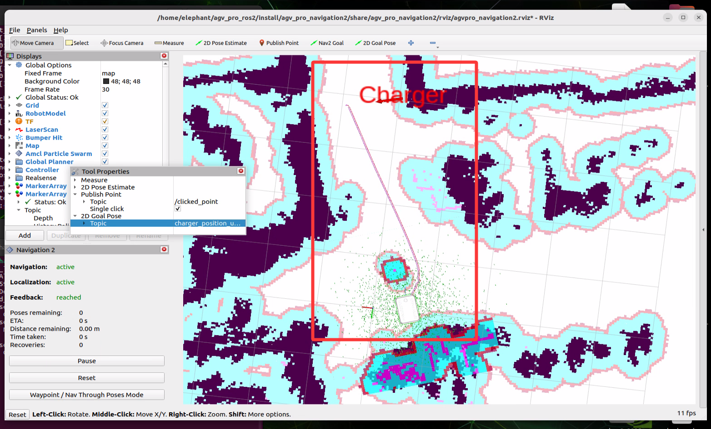

# AGVPRO Auto-Charging Navigation Manual

## 1. Overview

The AGVPRO auto-charging function combines long-distance NAV2 navigation with short-distance serial control based on infrared sensor feedback to enable automatic navigation to the charging station target point and docking with the charging port for charging.

## 2. Charging Station Position Management and NAV2 Navigation Relative Position Settings

- Charging Station Position Management: The charging station position is saved in the `config/charger_position.json` file in the package directory, and position updates are implemented by subscribing to the `/charger_position_update` topic.

The position information saved in the json file is the charging station position. The latest charger position is continuously published to the `/goal_marker` topic for visualization. Position information is represented using quaternions as follows:

```json
{
  "p_x": -0.04373347759246826,
  "p_y": -4.024151802062988,
  "orien_z": 0.09378381732290733,
  "orien_w": 0.9955925851513477
}
```

- NAV2 Navigation Position Settings: You can adjust the target point position and pose of nav2 navigation relative to the charging station, so that the robot switches to serial control after reaching the target position and pose.

- The relative position parameters between the navigation point and charging station can be configured in the config/nav_goal_params.yaml file. Default values are as follows:

```yaml
# Navigation parameter configuration
forward_distance: 1  # 1 meter in front of the charging station
yaw_offset_deg: 10.0   # Rotate clockwise 10 degrees
```


## 3. Function Usage

- 1. Open the first terminal and run the following command to start the robot chassis driver

    ```bash
    ros2 launch agv_pro_bringup agv_pro_bringup.launch.py 
    ```


- 2. Open the second terminal and run the following command to drive the 3D LiDAR

    ```bash
    ros2 launch unitree_lidar_ros2 launch.py
    ```



- 3. Open the third terminal and run the following command to convert LiDAR point cloud information to /laser_scan needed for nav2 navigation

    ```bash
    ros2 launch pointcloud_to_laserscan pointcloud_to_laserscan.launch.py
    ```



- 4. Open the fourth terminal and run the following command to start the navigation node

    ```bash
    ros2 launch agv_pro_navigation2 navigation2_active.launch.py
    ```



Running this command will open rviz2. First use `2D Pose Estimate` to adjust the robot's initial position in rviz2 to match the actual position.


- 5. Open the fifth terminal and run the following command to start the auto-charging control node

    ```bash
    ros2 run agv_pro_autocharge combined_auto_recharger
    ```


After running this command, you will see the default charging station position visualized in rviz2.


Note: rviz2 will display the default charging station position, which needs to be adjusted according to the actual situation. The specific operation method is as follows:

First find the `2D Goal Pose` tool in the rviz2 menu bar, right-click to open the dropdown menu, and select `Tool Properties` to open the customization interface



In the opened customization interface, find the Topic published by `2D Goal Pose`. The default published topic is `/goal_pose`


- By modifying this topic, manually input `/charger_position_update`, then place arrows in the rviz2 map using `2D Goal Pose` to publish the topic (similar method to using `2D Pose Estimate` to update the robot's initial position). This way you can update the charging station position.



- After that, the `charger` position will be updated to the position published by `2D Goal Pose`. The latest charging station position `charger` will be continuously published to the `/goal_marker` topic, and rviz2 will automatically update the display.



- The latest charging station position will be automatically saved to the json file. When running this program next time, it will load the last set position by default.

After confirming the charging station position and the relative position for navigation, you can press `q` to start auto-charging. After pressing the `q` key, the robot will start navigating.



Auto-charging will go through two processes:
1. Navigate to the charging station position.
2. After reaching the charging station position, switch to serial control for docking with the charging station.

Meanwhile, the terminal output is as follows:



After the robot completes auto-charging, i.e., when the rear charging port successfully docks with the charging station, the charging program will automatically exit.

[← Previous Page](6.2.7-Real_Time_Mapping_with_FAST_LIO.md)