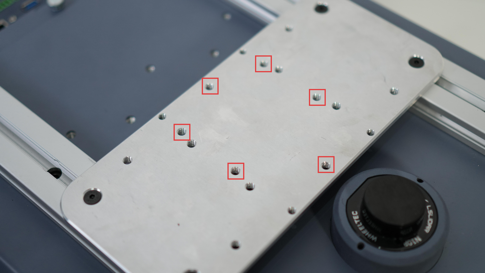
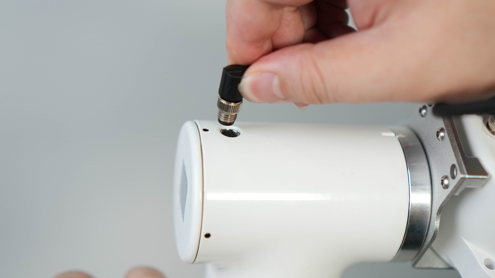
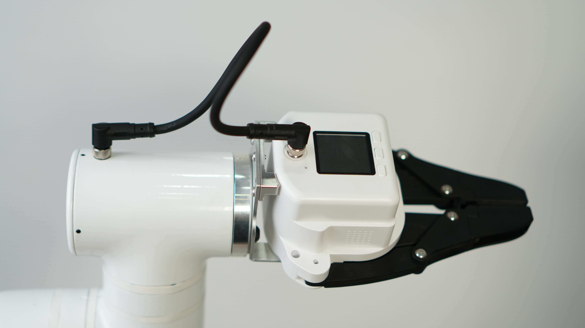
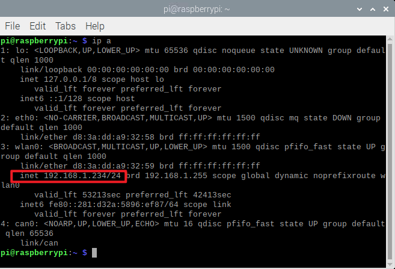

## MCU door opening training


## 1. Hardware deployment

### 1.1 Hardware list

| Name                                | Quantity | Remarks |
|-------------------------------------|----------|---------|
| External fixing plate               | 2        |         |
| M5 slider nut                       | 8        |         |
| M5*10 screw                         | 8        |         |
| MyCobot Pro630                      | 1        |         |
| MyCobot Pro630 power adapter        | 1        |         |
| Power bank                          | 1        |         |
| myAGV Pro navigation-visual version | 1        |         |
| Wireless handle                     | 1        |         |
| USB cable                           | 1        |         |
| Wrench tool                         | 1        |         |
| XT60 adapter cable                  | 1        |         |
| Force control gripper               | 1        |         |
| Emergency stop                      | 1        |         |

### 1.2 Hardware connection

1. Use M5*10 screws to fix the M5 slider nut on the external fixing plate
   

2. Connect the external fixing plate to the 2040 profile on myAGVPro
   

3. Align the MyCobot Pro630 base with the screw holes on the external fixing plate
   

4. Fix MyCobot Pro630 on the external fixing plate
   

5. Fix the force control gripper to the gripper interface of MyCobot Pro630
    1. Fix the force control gripper flange to the end
       
    2. Connect the force control gripper to the flange
       
    3. Use M8 cable to connect to the force control gripper
       
    4. Connect the M8 cable to the robot arm
       
    5. The finished product is shown below
       

6. Connect the emergency stop
   

7. Connect the power cord
   

8. Fix the mobile power supply to the 2040 profile on myAGVPro
    1. Use M5*10 screws to fix the M5 slider nut to the external fixing plate
       
    2. Divide the Velcro into three strips to fix the mobile power supply and insert it into the hole of the external
       fixing plate
       
    3. Fix the mobile power supply on the fixing plate
       
    4. Fix the fixed mobile power supply on the 2040 profile
       
    5. Arrange the line sequence and connect the robot power adapter plug to the mobile power supply
       

9. At this point, the hardware connection between MyCobot Pro630 and myAGV Pro is complete, and the finished product is
   as follows:
   

## 2. Software deployment

### 2.1 MyCobot Pro630 usage

Please
visit [Basic Function Usage](https://docs.elephantrobotics.com/docs/pro630-cn/5-BasicApplication/5-BasicApplication.html)
for learning

### 2.2 myAGVPro firmware burning

Burn the firmware by visiting
myAGVPro [How to Burn Firmware](../5-BasicApplication/5.3-FirmwareUse/5.3.2-HowToBurnFirmware.md) chapter

## 3. Source code download

Download the MyCobot Pro630MCU door opening training handle control case source code to your local computer

### 3.1 Download source code

1. Use git tool to download source code to local
    ```shell
    git clone https://github.com/elephantrobotics/pymycobot.git
    ```
2. Use browser to visit the URL to download source code compressed package
   

- Visit [https://github.com/elephantrobotics/pymycobot.git](https://github.com/elephantrobotics/pymycobot.git)

- Click the `Code` button
- Click the `Download ZIP` button
- After downloading, unzip to any folder

### 3.2 Enter the `myAGVPro_Composite_Kit` directory

Use the `cd` command to enter the `pymycobot/demo/myAGVPro_Composite_Kit` directory

```shell
cd pymycobot/demo/myAGVPro_Composite_Kit
```

### 3.3 Download dependencies

Use the `pip` command to download dependencies

```shell
pip install -r requirements.txt
```

### 3.4 Modify configuration

1. Open the `main.py` file and change the value of `COMPOSITE_KIT_TYPE` to `MyCobotPro630`

    ```python
    ...
    # ##############################################################################################
    # Composite kit configuration
    # ##############################################################################################
    COMPOSITE_KIT_TYPE = "MyCobotPro630"  # MyCobotPro630, MyCobot320, MyArmM750, Undefined
    DEBUG = False
    ...
    ```

2. Configure `MyCobot Pro630` TCP IP and port, change `COMPOSITE_KIT_HOST` to the IP address of MyCobot Pro630, the
   default port is 5001

   > *Note:* This case uses the remote control function of MyCobot Pro630, pay attention to the following issues:
   > 1. Make sure MyCobot Pro630 and myAGvPro are in the same LAN
   > 2. Make sure the roboflow program in MyCobot Pro630 has been started
   > 3. Make sure the IP address and port number of MyCobot Pro630 are correct

   ```python
   ...
   # ##############################################################################################
   # MyCobot Pro630 Configuration
   # ##############################################################################################
   COMPOSITE_KIT_HOST = "192.168.1.234"
   COMPOSITE_KIT_PORT = 5001
   ...
   ```

    - **How to get the IP address of MyCobot Pro630**
        1. You can get the IP address of MyCobot Pro630 by using the `ip a` command in the system
           
           
      
        2. You can get it through the roboflow program
      
           

### 3.5 Run source code

Use the `python` command to run the source code

```shell
python main.py
```

## 4. Quick experience

The myAGVPro+MyCobotPro630 handle control function is defined as follows:


> **Note:** Before starting the program, you need to connect the handle receiver to the `USB` port of myAGV Pro. After the program is started, when the handle receiver is disconnected, the program will automatically exit

